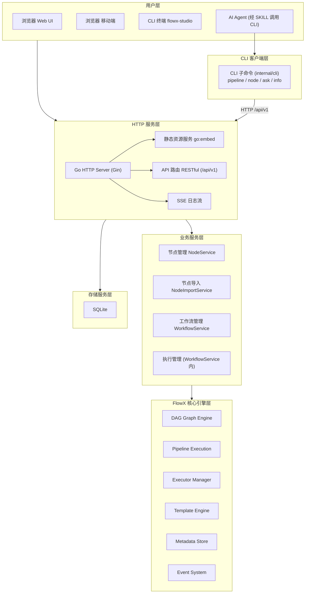
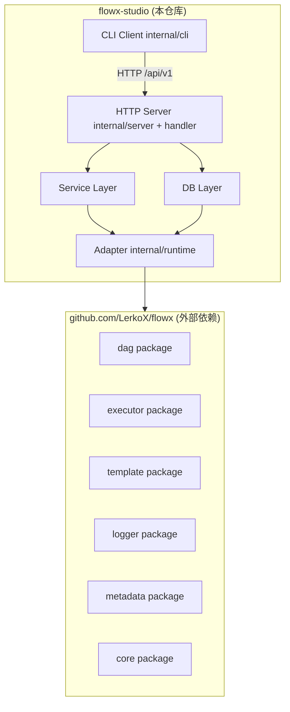
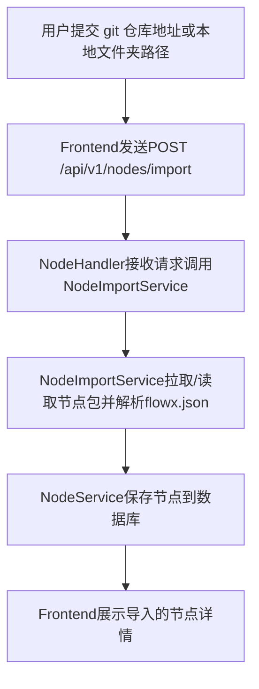
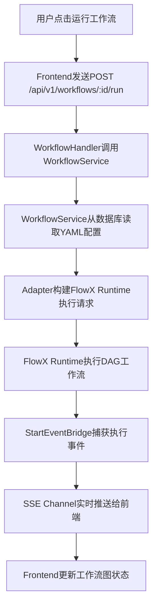
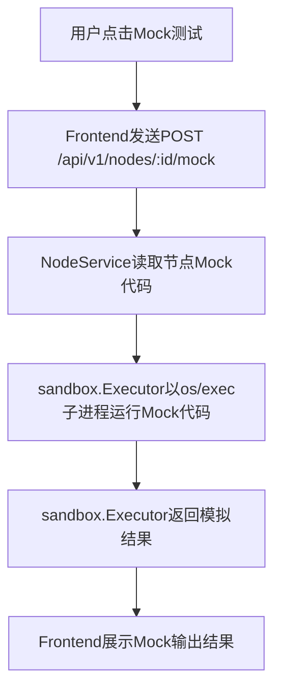

# 2. 系统架构设计

## 2.1 项目组织

本项目（FlowX Studio）是一个**独立仓库**，通过 Go Module 引入 FlowX 核心引擎库。

```
┌─────────────────────────────────────────────────────────────┐
│                     独立仓库                                  │
├─────────────────────────────────────────────────────────────┤
│  github.com/LerkoX/flowx-studio                              │
│  ├── cmd/flowx-studio/     # CLI 入口                       │
│  ├── internal/             # 业务逻辑                       │
│  │   ├── config/           # 配置加载                       │
│  │   ├── db/               # sqlx 封装 + SQL 迁移           │
│  │   ├── event/            # 进程内事件总线                  │
│  │   ├── handler/          # HTTP 路由处理器                 │
│  │   ├── cli/              # CLI 客户端（HTTP client 子命令） │
│  │   ├── model/            # 数据模型                       │
│  │   ├── runtime/          # FlowX 运行时适配层              │
│  │   ├── sandbox/          # Mock 子进程执行                 │
│  │   ├── server/           # gin 引擎 / 静态资源 / CORS      │
│  │   ├── service/          # 业务服务层                     │
│  │   ├── singleton/        # PID 单实例锁                   │
│  │   └── validator/        # 工作流 YAML 校验                │
│  ├── web/                  # React 前端                     │
│  └── go.mod                # require github.com/LerkoX/flowx │
├─────────────────────────────────────────────────────────────┤
│  外部依赖（Go Module）                                        │
│  github.com/LerkoX/flowx v0.0.0-20260527104758-c693505dcf32 │
│  （go.mod 中通过 replace => ../flowx 指向本地仓库）           │
│  ├── dag/                  # DAG 引擎                       │
│  ├── executor/             # 执行器（local/docker/k8s）     │
│  ├── template/             # 模板引擎                      │
│  ├── metadata/             # 元数据存储                    │
│  ├── logger/               # 日志系统                      │
│  └── core/                 # 核心模型                      │
└─────────────────────────────────────────────────────────────┘
```

## 2.2 整体架构



## 2.2 模块划分

### 2.2.1 HTTP 服务层 (internal/server + internal/handler)

**职责**：提供 Web API 和静态资源服务

**核心组件**：
- `Server`（internal/server）：基于 Gin 的 HTTP 服务器主结构体，暴露 `Router()` 供注册路由
- `Handler`（internal/handler）：API 路由处理器，按功能域拆分（ConfigHandler / WorkflowHandler / NodeHandler / EventHandler），在 `cmd/flowx-studio/main.go` 中统一注册到 `/api/v1` 分组
- 中间件：仅 `gin.Recovery()`（panic 恢复）和 `corsMiddleware()`（跨域），无日志、无请求限流
- `Server.RegisterStatic()`：前端构建产物静态文件服务（通过 `go:embed` 嵌入）

**设计要点**：
- 使用 Gin 框架（`github.com/gin-gonic/gin`），路由分组与中间件管理更便捷
- 静态资源通过 `//go:embed all:web/dist` 嵌入二进制（`internal/server/web/dist`，构建时从 `web/dist` 拷贝），无需外部文件
- SSE（Server-Sent Events）用于实时推送执行日志和状态变更

### 2.2.2 业务服务层 (internal/service)

**职责**：处理核心业务逻辑，协调各子系统

**核心服务**：
- `NodeService`：节点注册、查询、Mock 测试执行（`MockTest`）
- `NodeImportService`：从 git 仓库或本地文件夹导入节点包（读取 flowx.json）
- `WorkflowService`：工作流 CRUD、执行触发，同时承担执行管理（`ListExecutions` / `GetExecution` / `GetExecutionLogs`）

**设计要点**：
- 采用依赖注入模式，各服务在 `main.go` 中组装
- 无 Repository 抽象层，服务直接持有 `*db.DB`（sqlx 封装）操作数据库；系统配置由 `handler.ConfigHandler` 直连 db
- 所有业务操作通过上下文 `context.Context` 传递，支持超时和取消

### 2.2.3 CLI 客户端层 (internal/cli)

**职责**：为 AI Agent 与终端用户提供命令行入口，作为 `flowx-studio server` 的 HTTP 客户端完成节点与工作流管理

**核心组件**：
- `cli.NewHTTPClient`：基于全局 `--server` flag / `FLOWX_STUDIO_SERVER_URL` 环境变量构造 REST 客户端
- 流水线命令组：`pipeline list / create / update / delete / run`
- 节点命令组：`node list / create / delete / import / mock`
- 终端交互命令：`ask`（向用户提问）、`info`（展示信息卡片），承接原 FAP 动作语义，不访问 HTTP server

**设计要点**：
- 每个数据写入类子命令支持 `--schema` 输出参数 JSON Schema，配合 `skills/flowx-studio/SKILL.md` 实现渐进式披露
- 所有查询类子命令支持 `--json` 输出机器可读结果
- 校验失败以非零退出码退出，stderr 输出含重试指引的错误文本
- CLI 不持有单例锁、不直接访问数据库，一切读写经由 HTTP server，保证事件总线单一来源

### 2.2.4 存储服务层 (internal/db)

**职责**：SQLite 数据库操作和迁移管理

**核心组件**：
- `DB`：数据库连接管理（`sqlx` 封装）
- 嵌入式 SQL 迁移：`//go:embed migrations/*.sql`，启动时由 `runMigrations` 按版本顺序执行

**设计要点**：
- 使用 `modernc.org/sqlite` 纯 Go SQLite 驱动，无需 CGO
- 数据库文件默认存储在用户 home 目录 `~/.flowx-studio/studio.db`
- 支持通过配置自定义数据库路径

### 2.2.5 核心引擎层 (复用现有)

**职责**：保持现有 FlowX 引擎不变，通过适配层集成

**集成点**：
- `Adapter`（构造 `NewAdapter`）：将 Web 层的执行请求转换为 FlowX `Runtime` 调用
- `WorkflowService.StartEventBridge` + `event.Bus`：将 FlowX 执行事件桥接到 Web 层的 SSE 推送。FlowX 事件系统共 11 种事件，`studioListener` 实际订阅其中 5 种（PipelineStart / PipelineFinish / PipelineNodeStart / PipelineNodeFinish / PipelineNodeFailed）
- `ExpandNodeToConfig`（internal/runtime/node_expander.go）：将数据库存储的 `model.Node` 展开为 FlowX `core.NodeConfig`

## 2.3 模块依赖关系



**依赖规则**：
- 上层可依赖下层，下层不可反向依赖上层
- 同层模块之间通过接口解耦，避免直接依赖
- **FlowX 核心库作为外部依赖，不感知 flowx-studio 的存在**
- flowx-studio 通过 `go.mod` 的 `require` 引入 FlowX 特定版本

## 2.4 数据流设计

### 2.4.1 节点导入数据流



### 2.4.2 工作流执行数据流



### 2.4.3 Mock 测试数据流



> 说明：`sandbox.Executor`（internal/sandbox/executor.go）由 `NodeService.MockTest` 调用，通过本地 `os/exec` 启动子进程并配合字符串黑名单做基础防护，**并非强隔离沙箱**。

## 2.5 关键技术选型

| 层次 | 技术 | 选择理由 |
|------|------|---------|
| 后端语言 | Go 1.25 | 复用现有代码库，单二进制编译 |
| HTTP 服务 | Gin (`github.com/gin-gonic/gin`) | 路由分组与中间件机制成熟，生态完善 |
| 数据库 | SQLite (`modernc.org/sqlite`) + `sqlx` | 纯 Go 实现，无需 CGO，零配置 |
| 前端框架 | React 18 + TypeScript | 生态成熟，类型安全 |
| 构建工具 | Vite | 快速构建，热更新 |
| 图可视化 | `@xyflow/react`（React Flow 12） | 专业的工作流图渲染 |
| 代码查看 | `react-syntax-highlighter` | 只读代码高亮，轻量无编辑器开销 |
| CLI 框架 | Cobra (`github.com/spf13/cobra`) | 子命令管理（server / pipeline / node / ask / info） |
| 进程管理 | `os/exec` + Docker API | 复用现有执行器能力 |
| 实时通信 | SSE (Server-Sent Events) | 单向推送足够，比 WebSocket 简单 |

## 2.6 与 FlowX 核心库的集成策略

### 2.6.1 FlowX 核心库作为外部依赖

FlowX 核心库（`github.com/LerkoX/flowx`）作为独立 Go Module，通过 `go.mod` 引入：

```go
// flowx-studio/go.mod
module github.com/LerkoX/flowx-studio

go 1.25.0

replace github.com/LerkoX/flowx => ../flowx

require (
    github.com/LerkoX/flowx v0.0.0-20260527104758-c693505dcf32
    // ... 其他依赖
)
```

当前通过 `replace` 指令指向本地 `../flowx` 仓库（伪版本号）。

**依赖原则**：
- FlowX 核心库保持完全独立，不引入任何 Web/AI 相关代码
- flowx-studio 只使用 FlowX 公开的 API（`Runtime`、`Pipeline`、`Listener` 等接口）
- 通过 Go Module 版本管理，锁定依赖的 FlowX 版本

### 2.6.2 适配层设计

在 `internal/runtime/` 创建适配层，桥接 FlowX 核心库与 flowx-studio 业务层：

```go
package runtime

import (
    "context"
    "fmt"

    "github.com/LerkoX/flowx"
    "github.com/LerkoX/flowx/dag"
)

// Adapter FlowX 运行时适配器
type Adapter struct {
    runtime   flowx.Runtime
    eventCh   chan ExecutionEvent
    logPusher *LogPusher
    mu        sync.RWMutex
}

// ExecutionEvent 执行事件（推送给前端的统一事件结构）
type ExecutionEvent struct {
    Type        string                 `json:"type"`
    ExecutionID int64                  `json:"execution_id"`
    NodeID      string                 `json:"node_id,omitempty"`
    Status      string                 `json:"status,omitempty"`
    Timestamp   time.Time              `json:"timestamp"`
    Data        map[string]interface{} `json:"data,omitempty"`
}

// NewAdapter 创建运行时适配器
func NewAdapter() *Adapter {
    rt := flowx.NewRuntime(context.Background())
    rt.StartBackground()

    adapter := &Adapter{
        runtime:   rt,
        eventCh:   make(chan ExecutionEvent, 100),
        logPusher: NewLogPusher(),
    }

    // 设置日志推送器
    rt.SetPusher(adapter.logPusher)

    return adapter
}

// ExecuteWorkflow 执行工作流并实时推送事件
func (a *Adapter) ExecuteWorkflow(ctx context.Context, executionID int64, configYAML string) error {
    id := fmt.Sprintf("exec-%d", executionID)

    // 创建监听器
    listener := &studioListener{
        adapter:     a,
        executionID: executionID,
    }

    // 异步执行
    pipeline, err := a.runtime.RunAsync(ctx, id, configYAML, listener)
    if err != nil {
        return fmt.Errorf("failed to start workflow: %w", err)
    }

    // 将 pipeline 内部 ID 映射到 execution ID，便于日志推送器定位
    if pipeline != nil {
        a.logPusher.RegisterPipeline(pipeline.Id(), executionID)
    }

    return nil
}

// studioListener 实现 dag.Listener 接口
type studioListener struct {
    adapter     *Adapter
    executionID int64
}

func (l *studioListener) Handle(p dag.Pipeline, event dag.Event) {
    // 将 FlowX 事件转换为 ExecutionEvent 推入事件通道
    // PipelineStart → execution_start，PipelineFinish → execution_complete，
    // PipelineNodeStart → node_start，PipelineNodeFinish/Failed → node_complete
    l.adapter.PushEvent(ExecutionEvent{ /* ... */ })
}

// Events 返回订阅的事件列表（共 5 种）
func (l *studioListener) Events() []dag.Event {
    return []dag.Event{
        dag.PipelineStart,
        dag.PipelineFinish,
        dag.PipelineNodeStart,
        dag.PipelineNodeFinish,
        dag.PipelineNodeFailed,
    }
}
```

### 2.6.3 命令行入口

flowx-studio 的 CLI 入口基于 Cobra，包含服务端子命令与客户端子命令两组：

```go
// cmd/flowx-studio/main.go
func main() {
    rootCmd := &cobra.Command{
        Use:   "flowx-studio",
        Short: "FlowX Studio - FlowX runtime viewer with CLI client",
    }
    rootCmd.PersistentFlags().String("server", "http://127.0.0.1:8080", "HTTP server address (env: FLOWX_STUDIO_SERVER_URL)")

    serverCmd := &cobra.Command{
        Use:   "server",
        Short: "Start the HTTP server",
        RunE:  runServer,
    }
    serverCmd.Flags().Int("port", 8080, "HTTP server port")
    serverCmd.Flags().String("host", "0.0.0.0", "HTTP server host")
    rootCmd.AddCommand(serverCmd)

    // 客户端子命令（HTTP client，见 internal/cli）
    rootCmd.AddCommand(cli.NewPipelineCmd()) // pipeline list/create/update/delete/run
    rootCmd.AddCommand(cli.NewNodeCmd())     // node list/create/delete/import/mock
    rootCmd.AddCommand(cli.NewAskCmd())      // ask（原 FAP ask_input）
    rootCmd.AddCommand(cli.NewInfoCmd())     // info（原 FAP show_info）

    if err := rootCmd.Execute(); err != nil {
        log.Fatal(err)
    }
}
```

- `flowx-studio server [--port 8080] [--host 0.0.0.0]`：启动 HTTP server（Web UI + RESTful API）
- `flowx-studio pipeline ...` / `flowx-studio node ...`：HTTP 客户端子命令，供 AI Agent（经 SKILL）与终端用户调用
- `flowx-studio ask` / `flowx-studio info`：终端交互命令，承接原 FAP 动作语义
- 裸运行 `flowx-studio`（不带子命令）仅打印帮助信息；无 `version` 子命令

**注意**：FlowX 核心库（`github.com/LerkoX/flowx`）为纯库，不包含 `cmd/` 目录与 CLI 入口。
