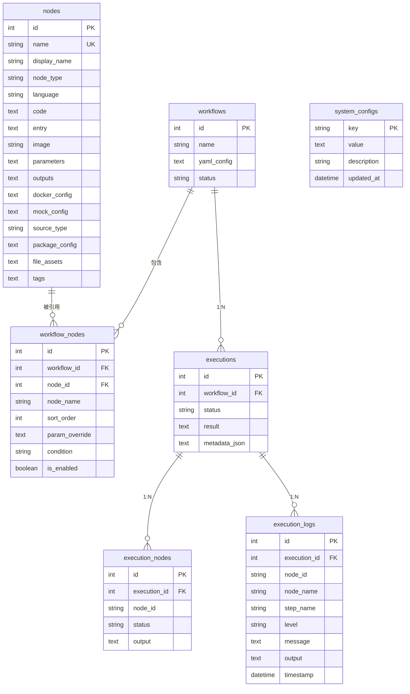

# 3. 数据库设计

## 3.1 设计原则

- **单文件 SQLite**：所有数据存储在一个 `.db` 文件中，零配置
- **纯 Go 驱动**：使用 `modernc.org/sqlite`，无需 CGO
- **自动迁移**：应用启动时自动执行数据库迁移
- **外键约束**：启用 SQLite 外键约束保证数据完整性

## 3.2 数据库配置

```go
// 默认路径
~/.flowx/flowx.db

// 环境变量覆盖
FLOWX_DB_PATH=/custom/path/flowx.db
```

## 3.3 Schema 设计

### 3.3.1 节点注册中心 (nodes)

存储 AI 生成的可复用节点。

```sql
CREATE TABLE nodes (
    id              INTEGER PRIMARY KEY AUTOINCREMENT,
    name            TEXT NOT NULL,                   -- 节点包名（蛇形命名）
    display_name    TEXT,                            -- 显示名称
    description     TEXT,                            -- 节点功能描述
    version         TEXT NOT NULL DEFAULT '0',       -- 版本号（空版本归一为 '0'）
    author          TEXT,                            -- 作者
    icon            TEXT,                            -- 图标
    node_type       TEXT NOT NULL DEFAULT 'code',    -- 节点类型: code | image
    language        TEXT,                            -- 编程语言: python | go | bash | node（镜像节点可空）
    code            TEXT,                            -- 节点实现代码（镜像节点可空）
    entry           TEXT,                            -- 入口文件
    requirements    TEXT,                            -- 可选：依赖列表（如 requirements.txt）
    image           TEXT,                            -- 镜像节点：容器镜像
    parameters      TEXT NOT NULL DEFAULT '[]',      -- JSON: 参数定义列表
    outputs         TEXT DEFAULT '[]',               -- JSON: 输出定义列表
    docker_config   TEXT,                            -- JSON: {image, workdir}
    mock_config     TEXT,                            -- JSON: NodeMockConfig{enabled, entry, code}
    source_type     TEXT DEFAULT 'manual',           -- 来源类型: git | manual
    source_url      TEXT,                            -- 来源 Git 仓库地址
    source_path     TEXT,                            -- 来源本地路径
    package_config  TEXT,                            -- JSON: 完整 flowx.json 包配置（迁移 006）
    file_assets     TEXT,                            -- JSON: 文件资产索引（迁移 008；内容在 assets store，不入库）
    tags            TEXT DEFAULT '[]',               -- 标签，JSON 数组
    created_at      DATETIME DEFAULT CURRENT_TIMESTAMP,
    updated_at      DATETIME DEFAULT CURRENT_TIMESTAMP,
    UNIQUE(name, version)                            -- 多版本并存（迁移 012）
);

-- 索引
CREATE INDEX idx_nodes_node_type ON nodes(node_type);
CREATE INDEX idx_nodes_language ON nodes(language);
CREATE INDEX idx_nodes_source_type ON nodes(source_type);
```

**parameters JSON 结构示例**：
```json
[
  {
    "name": "url",
    "type": "string",
    "description": "图片下载地址",
    "required": true,
    "default": null
  },
  {
    "name": "timeout",
    "type": "integer",
    "description": "下载超时时间（秒）",
    "required": false,
    "default": 30
  }
]
```

### 3.3.2 工作流 (workflows)

存储 AI 生成的工作流定义。

```sql
CREATE TABLE workflows (
    id              INTEGER PRIMARY KEY AUTOINCREMENT,
    name            TEXT NOT NULL,                   -- 工作流名称
    description     TEXT,                            -- 工作流描述
    intent          TEXT,                            -- 用户需求原文
    yaml_config     TEXT NOT NULL,                   -- 完整 FlowX YAML 配置
    status          TEXT DEFAULT 'draft',            -- draft | active | archived
    created_at      DATETIME DEFAULT CURRENT_TIMESTAMP,
    updated_at      DATETIME DEFAULT CURRENT_TIMESTAMP
);

-- 索引
CREATE INDEX idx_workflows_status ON workflows(status);
CREATE INDEX idx_workflows_created ON workflows(created_at);
```

工作流与节点的关联通过 `workflow_nodes` 表维护（见 3.3.3）。

**yaml_config 示例**：
```yaml
name: image_processing
version: "1.0"
graph: |
  stateDiagram-v2
    [*] --> download
    download --> compress
    compress --> upload
    upload --> [*]
nodes:
  download:
    steps:
      - name: download_image
        executor: local
        commands:
          - python {{.node.code}}
  compress:
    steps:
      - name: compress_image
        executor: local
        commands:
          - python {{.node.code}}
```

### 3.3.3 工作流节点关联 (workflow_nodes)

维护工作流与节点之间的多对多关联及节点级配置。

```sql
CREATE TABLE workflow_nodes (
    id              INTEGER PRIMARY KEY AUTOINCREMENT,
    workflow_id     INTEGER NOT NULL,                -- 关联的工作流 ID
    node_id         INTEGER NOT NULL,                -- 关联的节点 ID
    node_name       TEXT NOT NULL,                   -- 节点在工作流中的名称
    sort_order      INTEGER DEFAULT 0,               -- 排序序号
    param_override  TEXT DEFAULT '{}',               -- JSON: 参数覆盖
    condition       TEXT,                            -- 执行条件
    is_enabled      BOOLEAN DEFAULT 1,               -- 是否启用

    FOREIGN KEY (workflow_id) REFERENCES workflows(id) ON DELETE CASCADE,
    FOREIGN KEY (node_id) REFERENCES nodes(id) ON DELETE RESTRICT,
    UNIQUE(workflow_id, node_name)
);

-- 索引
CREATE INDEX idx_wf_nodes_workflow ON workflow_nodes(workflow_id);
CREATE INDEX idx_wf_nodes_node ON workflow_nodes(node_id);
CREATE INDEX idx_wf_nodes_order ON workflow_nodes(workflow_id, sort_order);
```

> 注：该表当前在 Go 代码中暂无读写引用，属预留设计。

### 3.3.4 执行记录 (executions)

存储工作流执行历史和结果。

```sql
CREATE TABLE executions (
    id              INTEGER PRIMARY KEY AUTOINCREMENT,
    workflow_id     INTEGER NOT NULL,
    status          TEXT DEFAULT 'pending',          -- pending | running | success | failed | cancelled
    trigger         TEXT DEFAULT 'manual',           -- manual | schedule | api
    started_at      DATETIME,
    completed_at    DATETIME,
    duration_ms     INTEGER,
    result          TEXT,                            -- 执行结果摘要（JSON）
    error_message   TEXT,                            -- 错误信息
    error_node_id   TEXT,                            -- 失败节点 ID
    metadata_json   TEXT,                            -- 运行时元数据快照（JSON）：渲染后参数、节点输出、状态等
    created_at      DATETIME DEFAULT CURRENT_TIMESTAMP,
    
    FOREIGN KEY (workflow_id) REFERENCES workflows(id) ON DELETE CASCADE
);

-- 索引
CREATE INDEX idx_executions_workflow ON executions(workflow_id);
CREATE INDEX idx_executions_status ON executions(status);
CREATE INDEX idx_executions_created ON executions(created_at);
```

**result JSON 结构示例**：
```json
{
  "summary": "所有节点执行成功",
  "node_count": 3,
  "completed_nodes": ["download", "compress", "upload"],
  "outputs": {
    "upload": {
      "s3_url": "https://bucket.s3.amazonaws.com/image_thumb.jpg"
    }
  }
}
```

### 3.3.5 执行节点状态 (execution_nodes)

存储每次执行中各节点的详细状态（用于支持运行时监控）。

```sql
CREATE TABLE execution_nodes (
    id              INTEGER PRIMARY KEY AUTOINCREMENT,
    execution_id    INTEGER NOT NULL,
    node_id         TEXT NOT NULL,                   -- 工作流中的节点 ID
    node_name       TEXT,                            -- 节点名称
    status          TEXT DEFAULT 'pending',          -- pending | running | success | failed | skipped
    started_at      DATETIME,
    completed_at    DATETIME,
    duration_ms     INTEGER,
    output          TEXT,                            -- 节点输出结果
    error           TEXT,                            -- 错误信息
    
    FOREIGN KEY (execution_id) REFERENCES executions(id) ON DELETE CASCADE
);

-- 索引
CREATE INDEX idx_exec_nodes_execution ON execution_nodes(execution_id);
CREATE INDEX idx_exec_nodes_status ON execution_nodes(status);
CREATE UNIQUE INDEX idx_exec_nodes_unique ON execution_nodes(execution_id, node_id);
```

### 3.3.6 执行日志 (execution_logs)

存储执行过程中的详细日志条目，支持实时推送和历史查询。

```sql
CREATE TABLE execution_logs (
    id              INTEGER PRIMARY KEY AUTOINCREMENT,
    execution_id    INTEGER NOT NULL,                   -- 关联的执行记录 ID
    node_id         TEXT,                                -- 节点 ID（可为空，表示系统级日志）
    node_name       TEXT,                                -- 节点名称
    step_name       TEXT,                                -- 步骤名称
    level           TEXT DEFAULT 'info',                 -- debug | info | warn | error | fatal
    message         TEXT NOT NULL,                       -- 日志内容
    output          TEXT,                                -- 命令标准输出/错误
    timestamp       DATETIME DEFAULT CURRENT_TIMESTAMP,  -- 日志时间
    
    FOREIGN KEY (execution_id) REFERENCES executions(id) ON DELETE CASCADE
);

-- 索引
CREATE INDEX idx_exec_logs_execution ON execution_logs(execution_id);
CREATE INDEX idx_exec_logs_node ON execution_logs(execution_id, node_id);
CREATE INDEX idx_exec_logs_level ON execution_logs(level);
CREATE INDEX idx_exec_logs_timestamp ON execution_logs(timestamp);
```

**日志级别说明**：
- `debug`：开发调试信息
- `info`：正常运行信息（节点开始、完成等）
- `warn`：警告信息（超时、降级等）
- `error`：错误信息（节点执行失败）
- `fatal`：致命错误（系统级异常）

### 3.3.7 系统配置 (system_configs)

存储系统级配置参数。

```sql
CREATE TABLE system_configs (
    key             TEXT PRIMARY KEY,
    value           TEXT NOT NULL,
    description     TEXT,
    updated_at      DATETIME DEFAULT CURRENT_TIMESTAMP
);

-- 默认配置
INSERT INTO system_configs (key, value, description) VALUES
('theme', 'dark', '主题: dark | light | system'),
('language', 'zh-CN', '界面语言'),
('auto_save', 'true', '是否自动保存'),
('auto_save_interval', '30', '自动保存间隔（秒）'),
('show_notifications', 'true', '是否显示通知'),
('confirm_before_delete', 'true', '删除前是否确认'),
('default_node_timeout', '300', '默认节点超时（秒）'),
('max_concurrent_executions', '5', '最大并发执行数'),
('log_retention_days', '30', '执行日志保留天数'),
('server_port', '8080', 'HTTP 服务端口');
```

## 3.4 实体关系图



## 3.5 数据迁移策略

### 3.5.1 迁移框架

使用简单的版本化迁移机制：

```
migrations/
├── 001_init.sql                     -- 初始 Schema
├── 002_remove_ai_mcp.sql            -- 移除 AI/MCP 相关表
├── 003_execution_nodes_unique.sql   -- execution_nodes 增加唯一索引
├── 004_execution_metadata.sql       -- executions 增加 metadata_json 字段
├── 005_add_node_files.sql           -- nodes 增加 files 字段（已被 009 删除）
├── 006_add_node_package_config.sql  -- nodes 增加 package_config 字段
├── 007_audit_logs.sql               -- 审计日志表
├── 008_add_node_file_assets.sql     -- nodes 增加 file_assets 资产索引字段
└── 009_drop_node_files.sql          -- 删除 nodes.files（文件内容统一入 assets store）
    010_executors.sql                -- 执行器实例表
    011_execution_runtime_yaml.sql   -- executions 增加 runtime_yaml 快照字段
    012_node_versions.sql            -- nodes 重建：name 唯一放宽为 UNIQUE(name, version)
```

### 3.5.2 迁移执行逻辑

1. 应用启动时检查 `schema_migrations` 表
2. 按顺序执行未应用的迁移脚本
3. 每个迁移在独立事务中执行
4. 迁移失败时回滚并记录错误

```sql
CREATE TABLE schema_migrations (
    version     INTEGER PRIMARY KEY,
    applied_at  DATETIME DEFAULT CURRENT_TIMESTAMP
);
```

## 3.6 数据备份与恢复

- **自动备份**：每次应用启动时，如果数据库文件存在，自动创建 `.backup` 副本
- **手动导出**：提供 API 导出所有数据为 JSON 格式
- **恢复**：通过替换数据库文件实现
