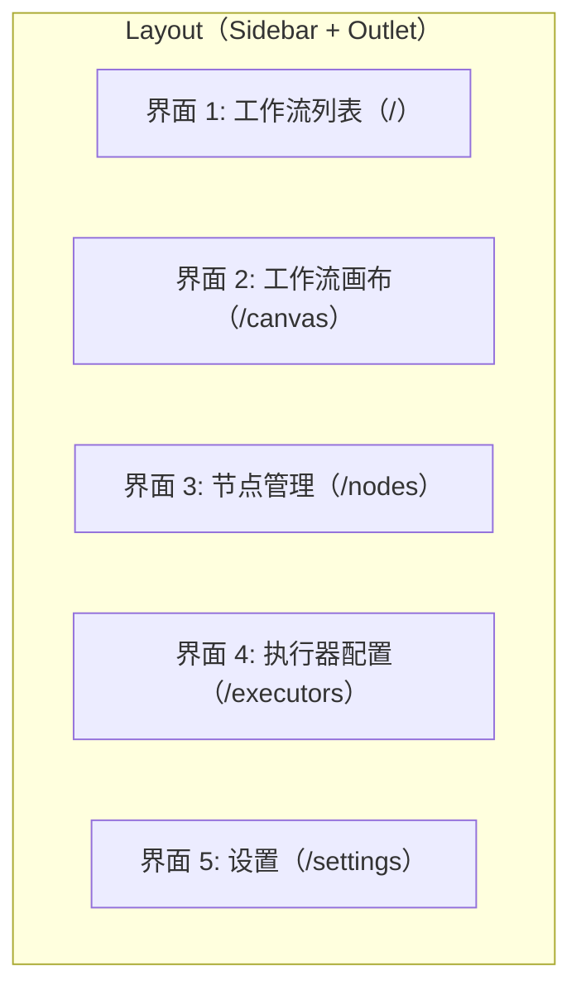

# 5. 前端设计（详细实现方案）

## 5.1 设计哲学

FlowX Studio 当前定位为**可视化工作流查看器 + 节点管理 + 执行器配置 + 系统设置**的管理台。核心交互模式为：在工作流列表中选择并运行工作流，在画布页面实时查看节点执行状态、参数、元数据、执行历史与日志。

> 注：早期"AI 对话驱动"设计（底部 AI 输入栏、ChatPanel、节点生成页等）已移除，见 5.16 节。

界面设计参考 **Taskade** 和 **n8n** 的视觉风格，追求"未来感、丝滑、精致"的交互体验。

---

## 5.2 技术栈

| 技术 | 版本 | 用途 |
|------|------|------|
| React | 18.x | UI 框架 |
| TypeScript | 5.x | 类型系统 |
| Vite | 5.x | 构建工具 |
| Tailwind CSS | 3.x | 样式方案 |
| @xyflow/react | 12.x | 工作流画布（React Flow v12） |
| Framer Motion | 11.x | 动画系统 |
| Lucide React | 最新 | 图标库 |
| Zustand | 4.x | 状态管理 |
| React Query | 5.x | 遗留依赖，代码中未实际使用（服务端状态由 Zustand stores + axios service 层管理） |
| Axios | 1.x | HTTP 客户端（`services/api.ts` 统一实例） |
| React Router DOM | 6.x | 路由（`createBrowserRouter`） |
| `js-yaml` | 4.x | YAML 解析（工作流配置、参数同步） |
| `react-markdown` | 9.x | 已安装，暂未使用 |
| `react-syntax-highlighter` | 15.x | 已安装，暂未使用（仅 `vite-env.d.ts` 中有类型声明） |
| `dagre` | 0.8.x | DAG 自动布局算法 |

---

## 5.3 界面架构（5 个页面）

### 5.3.1 界面总览



- **界面 1（工作流列表）**：工作流卡片列表，支持运行、删除、进入画布
- **界面 2（工作流画布）**：左侧 Sidebar + 中央 React Flow 画布 + 右侧 400px 可收起面板（移动端为底部抽屉）
- **界面 3（节点管理）**：节点卡片网格 + 搜索/标签/语言/类型筛选 + 导入/详情/测试弹窗
- **界面 4（执行器配置）**：执行器类型列表 + 配置表单 + 监控面板
- **界面 5（设置）**：系统设置表单

### 5.3.2 路由设计

使用 React Router v6 的 `createBrowserRouter` 配置五个路由（`web/src/router.tsx`），所有路由共享一个 Layout 布局组件，全部静态导入：

- **`/`（首页）**：工作流列表（`WorkflowListPage`）
- **`/canvas`**：工作流画布（`WorkflowCanvasPage`）
- **`/nodes`**：节点管理（`NodeManagerPage`）
- **`/executors`**：执行器配置（`ExecutorConfigPage`）
- **`/settings`**：系统设置（`SettingsPage`）

Layout 组件（`components/Layout.tsx`）仅包含 Sidebar 和 `<Outlet />` 主内容区，无顶部工具栏或底部输入栏。

---

## 5.4 视觉设计系统

### 5.4.1 色彩系统

采用深色主题，以 Indigo 和 Purple 作为品牌渐变色：

- **主题色**：Indigo (#6366f1) 到 Purple (#a855f7) 的 135deg 线性渐变
- **状态色**：
  - 运行中：Cyan (#22d3ee)
  - 成功：Emerald (#34d399)
  - 失败：Rose (#fb7185)
  - 空闲：Slate (#94a3b8)
- **文字色**：三级透明度白色（90%/60%/40%）实现视觉层级
- **背景色**：深蓝紫三色渐变背景 + 5% 透明度白色面板
- **边框**：10% 透明度白色作为默认边框，Hover 时提升至 20%

### 5.4.2 毛玻璃（Glassmorphism）规范

所有浮动面板统一使用毛玻璃效果：

- 背景为 5% 透明度的白色
- `backdrop-filter: blur(24px)` 高斯模糊
- 1px 半透明边框（10% 透明度白色）
- 20px 大圆角
- Hover 时背景透明度提升至 8%，边框变亮（20%），添加品牌色阴影（`0 8px 32px rgba(99, 102, 241, 0.15)`）

### 5.4.3 节点设计规范（n8n 风格）

节点卡片设计要点：

- 圆角 20px，半透明背景（8% 白色），内阴影营造凹陷感
- 顶部 2px 彩色条（根据节点类型变化，默认使用品牌渐变）
- 左侧 40px 圆形图标容器，品牌渐变背景，白色图标
- 最小宽度 200px，内边距 16px
- **选中态**：节点外叠加一层状态色 `linear-gradient` + `blur(4px)` 的静态发光层，边框提亮并加状态色阴影
- **Hover**：当前未实现额外 Hover 效果（无缩放/边框高亮）

### 5.4.4 连线设计规范

- **默认状态**：半透明白色（20%）2px 线条
- **激活状态**：Cyan 到 Purple 的 SVG 线性渐变，添加发光滤镜（`drop-shadow(0 0 4px cyan)`）
- **流动动画**：虚线（10px 实线 + 5px 间隙）配合 1s 线性无限偏移动画，模拟数据流动效果

### 5.4.5 画布背景

多层背景叠加营造星空感：

- **底层**：三个径向渐变（Indigo/Purple/Cyan 分别位于不同位置），极低透明度
- **中层**：深蓝紫三色线性渐变（135deg）
- **上层**：24px 间距的点阵网格（1px 圆点，3% 透明度白色）

---

## 5.5 项目结构

```
web/
├── public/
├── src/
│   ├── main.tsx                    # 应用入口
│   ├── App.tsx                     # 根组件
│   ├── index.css                   # 全局样式 + CSS 变量
│   ├── router.tsx                  # 路由配置（5 个静态路由）
│   ├── vite-env.d.ts               # Vite 类型声明
│   │
│   ├── components/                 # 通用组件
│   │   ├── Layout.tsx              # 页面布局（Sidebar + Outlet）
│   │   ├── Sidebar.tsx             # 左侧导航栏（桌面 hover 展开 / 移动端抽屉）
│   │   ├── GlassPanel.tsx          # 毛玻璃面板容器
│   │   ├── SpotlightCard.tsx       # 鼠标跟随高光卡片
│   │   ├── GlowNode.tsx            # 自定义节点（React Flow）
│   │   ├── TerminalNode.tsx        # Start / End 圆形终端节点
│   │   ├── GradientEdge.tsx        # 渐变流动连线
│   │   └── LogViewer.tsx           # 日志查看器
│   │
│   ├── pages/                      # 页面组件（5 个页面）
│   │   ├── WorkflowListPage.tsx        # 工作流列表（/）
│   │   ├── WorkflowCanvasPage.tsx      # 工作流画布（/canvas）
│   │   ├── NodeManagerPage.tsx         # 节点管理（/nodes）
│   │   ├── ExecutorConfigPage.tsx      # 执行器配置（/executors）
│   │   └── SettingsPage.tsx            # 设置（/settings）
│   │
│   ├── features/                   # 功能模块
│   │   ├── workflow-canvas/        # 工作流画布模块
│   │   │   ├── WorkflowCanvas.tsx      # 画布主组件
│   │   │   ├── WorkflowConfigPanel.tsx # 参数/YAML/元数据/历史面板
│   │   │   ├── ExecutionHistoryPanel.tsx # 执行历史列表
│   │   │   └── AutoLayout.ts           # DAG 自动布局（dagre）
│   │   │
│   │   ├── node-manager/           # 节点管理模块
│   │   │   ├── NodeCard.tsx            # 节点卡片
│   │   │   ├── NodeDetailModal.tsx     # 节点详情弹窗
│   │   │   ├── NodeImportModal.tsx     # 节点导入弹窗（git/folder）
│   │   │   └── NodeTestPanel.tsx       # 节点测试面板
│   │   │
│   │   ├── executor-config/        # 执行器配置模块
│   │   │   ├── ExecutorList.tsx        # 执行器列表
│   │   │   ├── ExecutorForm.tsx        # 执行器配置表单
│   │   │   └── ExecutorMonitor.tsx     # 执行器监控面板
│   │   │
│   │   └── settings/               # 设置模块
│   │       └── SystemSettingsTab.tsx   # 系统设置表单
│   │
│   ├── hooks/                      # 自定义 Hooks
│   │   ├── useMediaQuery.ts        # 响应式断点（useIsMobile）
│   │   └── useSSE.ts               # 通用 SSE Hook
│   │
│   ├── stores/                     # 状态管理 (Zustand)
│   │   ├── appStore.ts             # 应用级 UI 状态（面板折叠、移动端抽屉等）
│   │   ├── workflowStore.ts        # 工作流状态（当前工作流、节点状态、参数）
│   │   ├── nodeStore.ts            # 节点状态（列表、筛选、增删）
│   │   ├── executionStore.ts       # 执行状态（执行历史、日志、过滤）
│   │   └── settingsStore.ts        # 系统设置状态
│   │
│   ├── types/                      # TypeScript 类型定义
│   │   ├── api.ts
│   │   ├── execution.ts
│   │   ├── node.ts
│   │   ├── settings.ts
│   │   └── workflow.ts
│   │
│   ├── utils/                      # 工具函数
│   │   ├── animations.ts           # Framer Motion 弹簧/变体预设
│   │   ├── cn.ts                   # className 合并
│   │   ├── constants.ts
│   │   ├── formatters.ts
│   │   └── mermaidParser.ts        # stateDiagram-v2 图解析
│   │
│   └── services/                   # 业务服务层（见 5.5.1）
│       ├── api.ts                  # axios 实例 + 统一响应拦截器
│       ├── workflowService.ts      # 工作流/执行相关 REST API
│       ├── nodeService.ts          # 节点相关 REST API
│       ├── configService.ts        # 系统配置 REST API
│       └── eventService.ts         # SSE 全局事件流（useEventStream / EventBusClient）
│
├── index.html
├── package.json
├── tsconfig.json
├── vite.config.ts
└── tailwind.config.js
```

### 5.5.1 服务层（services）说明

前端不依赖 React Query，服务端状态由 **Zustand stores + axios service 层**管理：

- `api.ts`：创建统一 `apiClient`（相对路径、JSON 头），响应拦截器检查业务 `code !== 200` 时直接 reject，并统一错误消息。
- `workflowService.ts` / `nodeService.ts` / `configService.ts`：按领域封装的 REST 调用，返回 `ApiResponse<T>`。
- `eventService.ts`：SSE 实时事件。`useEventStream(url, handler)` 为 React Hook 封装；`EventBusClient` 提供订阅/退订式的全局事件总线（单例连接 `/api/v1/events`）。
- 数据流：组件 → store action → service → 后端；实时事件经 SSE 推送到 store，组件订阅 store 自动刷新。

---

## 5.6 核心组件实现

### 5.6.1 Layout 布局组件

Layout 是整个应用的根布局（`components/Layout.tsx`），结构非常精简：全屏深色渐变背景 + Sidebar + `<Outlet />` 主内容区。

- **左侧 Sidebar**：固定定位；桌面端折叠态宽 48px，主内容区通过 `md:ml-12` 留出空间；移动端无左侧 margin
- **主内容区**：`h-full overflow-hidden`，渲染当前路由页面

> 注：无顶部悬浮工具栏、无底部 AI 对话输入栏。

### 5.6.2 Sidebar 侧边栏组件

左侧导航栏（`components/Sidebar.tsx`），核心功能：

- **导航项**：四个路由入口——工作流（`/`）、节点管理（`/nodes`）、执行器（`/executors`）、设置（`/settings`），使用 Lucide 图标
- **桌面端**：固定定位，宽度 48px（折叠）/ 160px（展开），鼠标 hover 自动展开、移出自动收起（`onMouseEnter/onMouseLeave`），宽度变化使用 spring 动画（stiffness: 300, damping: 25, mass: 0.8）；无手动折叠按钮
- **移动端**：左上角汉堡按钮 + 全屏抽屉（220px 宽，含遮罩层，点击遮罩或导航项关闭）
- **激活态高亮**：当前路由项显示白色背景 + 左侧 3px 圆角指示条，使用 Framer Motion 的 `layoutId` 实现指示条在不同项之间平滑滑动切换（桌面与移动端各有一个 layoutId）
- **Logo 区域**：渐变背景的 FX 图标 + FlowX 文字，折叠时文字渐隐

### 5.6.3 SpotlightCard 组件（鼠标跟随高光）

实现鼠标跟随的径向渐变高光效果，技术要点：

- 使用 `useRef` 获取卡片 DOM 引用，`useState` 记录鼠标坐标和悬停状态
- 监听 `onMouseMove` 事件，通过 `getBoundingClientRect` 计算鼠标相对于卡片的局部坐标
- 在卡片上叠加一层绝对定位的 `radial-gradient`（600px 圆形，Indigo 15% 透明度），中心点实时跟随鼠标位置
- 鼠标离开时（`onMouseLeave`）渐变透明度渐变为 0，实现平滑消失
- 使用 Framer Motion 的 `whileHover` 实现整体缩放效果（scale 1.02）

### 5.6.4 GlowNode 组件（霓虹发光节点）

React Flow 的自定义节点组件，核心特性：

- **选中发光层**：选中时在节点外叠加一层绝对定位的静态发光层（状态色 `linear-gradient(135deg, color/60, color/20)` + `blur(4px)`，透明度 0.6），同时边框提亮、阴影变为状态色；无 conic-gradient 旋转动画
- **状态系统**：idle/running/success/failed/skipped 五种状态，每种状态映射不同的颜色和发光效果：
  - running：Cyan 色，状态标签带脉冲圆点
  - success：Emerald 色
  - failed：Rose 色
  - idle/skipped：Slate 灰色，无发光
- **节点内容结构**：
  - 顶部 2px 彩色条（`accentColor` 纯色，默认 #6366f1）
  - 左侧圆形图标容器（`accentColor` 渐变背景）
  - 名称（白色 90%，单行截断）+ 描述（白色 40%，单行截断）
  - 底部标签行：语言标签 + 状态标签（running 状态带脉冲圆点动画）
  - 运行时数据区：入参标签 + 返回键值对；桌面端完整显示，移动端折叠为摘要行（入参/返回计数 + 展开按钮）
- **连接点**：输入 Handle（target）和输出 Handle（source），位置随画布方向（TB/LR）自适应；移动端尺寸更小
- **入场动画**：spring 动画从 scale 0.85 + 下移 10px 过渡到正常状态
- **响应式**：移动端节点更窄（min-w 140px / max-w 200px），桌面端 min-w 200px / max-w 280px

### 5.6.5 GradientEdge 组件（渐变流动连线）

React Flow 的自定义边组件：

- 使用 `getBezierPath` 计算贝塞尔曲线路径（基于源节点和目标节点的坐标及连接点位置）
- 在 SVG `defs` 中定义线性渐变（Cyan 到 Purple），每条边使用独立 ID 避免冲突
- 根据 `data` 属性动态切换样式：
  - `data.animated` 为 true 时：显示虚线（10px 实线 + 5px 间隙）并启用流动动画
  - `data.status` 为 active 时：使用渐变描边 + 发光滤镜
  - 默认状态：半透明白色实线

### 5.6.6 TerminalNode 组件（终端节点）

Mermaid `stateDiagram-v2` 中的 `[*]` 渲染为圆形 Start / End 节点（`components/TerminalNode.tsx`）：

- 36px 圆形，半透明背景 + 品牌色微光阴影，内部为 Play（Start）/ Flag（End）图标
- Start 节点只有输出 Handle，End 节点只有输入 Handle，位置随画布方向自适应
- 解析层将 `[*] --> A` / `A --> [*]` 转换为 `__start__` / `__end__` 虚拟节点，移除断线

---

## 5.7 五大界面详细设计

### 5.7.1 界面 1: 工作流列表 (WorkflowListPage)

- 从 `workflowService.getWorkflows` 加载工作流列表，卡片网格展示
- 每张卡片支持：点击进入 `/canvas`（设为当前工作流）、运行（`runWorkflow`）、删除
- 入场使用 Framer Motion 动画

### 5.7.2 界面 2: 工作流画布 (WorkflowCanvasPage)

桌面端两栏布局（左侧为全局 Sidebar）：

- **中央**：`WorkflowCanvas` 组件（React Flow 画布），占据剩余全部空间
- **右侧**：400px 宽可收起面板，通过边缘按钮收起/展开（spring 宽度动画）：
  - 顶部 5 个标签：`参数` / `YAML` / `元数据` / `历史` / `日志`，使用 `layoutId` 实现下划线平滑滑动动画
  - 内容区使用 `AnimatePresence mode="wait"` 实现标签切换时的淡入淡出过渡
  - `参数` / `YAML` / `元数据` / `历史` 由 `WorkflowConfigPanel` 按 view 渲染；`日志` 渲染 `LogViewer`

移动端：右侧面板变为底部抽屉（75vh），底部固定 Tab 栏；点击当前已激活 Tab 可关闭抽屉。

> 注：无左侧 AI 对话历史面板。

### 5.7.3 界面 3: 节点管理 (NodeManagerPage)

节点浏览与管理页面，数据来自 `nodeStore`：

- **顶部工具栏**：搜索框（匹配名称/显示名/描述）+ 标签筛选 + 语言筛选 + 类型筛选（全部/code/image）+ 导入按钮
- **节点网格**：`NodeCard` 卡片列表，支持删除
- **导入弹窗** `NodeImportModal`：支持 git 仓库 URL 或本地 folder 两种导入方式，调用 `nodeService.importNode`
- **详情弹窗** `NodeDetailModal`：展示节点完整定义
- **测试面板** `NodeTestPanel`：节点 Mock 测试

### 5.7.4 界面 4: 执行器配置 (ExecutorConfigPage)

两栏布局（移动端为纵向滚动 + 横向类型卡片）：

- **左侧**：执行器类型列表，三种类型：
  - Local（本地 Shell 执行器）
  - Docker（Docker 容器执行器）
  - Kubernetes（K8s Pod 执行器）
  - 每项包含图标、名称、描述，选中项高亮
- **右侧**：上下两部分：
  - 上部：`ExecutorForm` 配置表单（根据选中的执行器类型渲染不同表单字段）
  - 下部：`ExecutorMonitor` 监控面板（显示状态和资源使用）

### 5.7.5 界面 5: 设置 (SettingsPage)

- 单栏窄布局（max-w-4xl），渲染 `SystemSettingsTab` 系统设置表单
- 数据由 `settingsStore` 管理，通过 `configService` 读写后端系统配置（主题、语言、自动保存、通知、删除确认、节点超时、并发执行数、日志保留天数等）

---

## 5.8 工作流画布模块

### 5.8.1 WorkflowCanvas 主组件

基于 React Flow 的工作流可视化画布，核心逻辑：

- **数据初始化**：从 `workflowStore` 获取当前工作流的 YAML 配置，调用 `parseWorkflowGraph`（`utils/mermaidParser.ts`）解析：
  - 内部使用 `js-yaml` 解析 YAML，提取 `Graph` 字段中的 `stateDiagram-v2` 语法
  - 图结构解析使用**官方 `mermaid` npm 库**（`mermaidAPI.getDiagramFromText` + stateDb 的 `getStates()/getRelations()`），完整支持 stateDiagram-v2 语法；`[*]` 伪状态由官方解析器表示为 `root_start`/`root_end`，转换为 `__start__` / `__end__`
  - mermaid 体积较大，通过动态 `import()` 按需加载（独立 chunk，不拖慢首屏）
  - 转换为 React Flow 的 nodes/edges 格式；`__start__` / `__end__` 渲染为 `terminalNode`，其余为 `glowNode`
  - 节点状态从 `nodeStatuses` 注入到每个节点的 `data` 中，运行时入参/返回从 `nodeRuntimeData` 注入
- **自动布局**：使用 `dagre` 算法进行 DAG 自动布局（默认 TB 垂直方向，可切换 LR），将计算后的坐标应用到节点
- **实时状态同步**：订阅全局事件流 `/api/v1/events`（`eventService.useEventStream`），处理 `execution_start` / `node_start` / `node_complete` / `execution.log` / `execution_complete` 等事件；监听 `nodeStatuses` 变化，使用函数式 `setNodes/setEdges` 更新：
  - 节点：根据状态更新颜色配置
  - 边：源节点 running 时启用流动动画
  - 注：目标节点 failed 时虽写入 `data.status = 'failed'`，但 `GradientEdge` 只识别 `'active'`，"边变红"未实际生效
- **交互功能**：
  - 节点可拖拽（`nodesDraggable: !isMobile`，移动端禁止拖拽）
  - 节点可点击选中（触发外部状态更新）
  - 支持缩放（0.1x ~ 2x）和平移（`panOnScroll` + `panOnDrag`）
  - 自动适配视图（`fitView`，移动端 padding 0.1 / 桌面端 0.2）
  - 禁止连线（`nodesConnectable: false`）
- **视觉元素**：
  - `Background`：点阵网格背景（桌面 24px / 移动端 16px 间距，1px 圆点）
  - `Controls`：自定义毛玻璃样式（仅桌面端显示）
  - `MiniMap`：小地图，节点颜色根据状态动态映射（仅桌面端显示）
  - `Panel`：右上角状态面板，显示当前工作流名称 + 横向/竖向布局切换按钮

### 5.8.2 自动布局算法

使用 `dagre` 库实现 DAG 自动布局，流程：

- 创建 `dagre.graphlib.Graph` 实例，设置默认边标签
- 配置图属性：`rankdir` 为 TB（垂直）或 LR（水平），节点间距 60px，层间距 100px
- 遍历所有节点，设置固定宽高（220x100）
- 遍历所有边，建立源节点到目标节点的连接关系
- 调用 `dagre.layout()` 执行布局计算
- 将计算结果转换为 React Flow 的 position 格式（坐标居中偏移：减去节点宽高的一半）
- 返回布局后的 nodes 和 edges

---

## 5.9 节点管理模块

节点管理功能位于 `/nodes` 页面（`NodeManagerPage`）+ `features/node-manager/` 模块：

- **NodeCard**：节点卡片，展示图标、名称、描述、语言/标签等元信息，点击进入详情
- **NodeDetailModal**：节点详情全屏弹窗，展示节点完整定义；外层容器 `pointer-events-none` + 内部卡片 `pointer-events-auto`，点击遮罩可关闭（见 5.16.4）
- **NodeImportModal**：节点导入弹窗，支持 `git`（仓库 URL）和 `folder`（本地目录）两种方式，提交后调用 `nodeService.importNode`，后端读取 `flowx.json` 完成导入
- **NodeTestPanel**：节点测试面板，用于对节点进行 Mock 测试
- **筛选与搜索**：由 `nodeStore` 提供 `getFilteredNodes`（搜索词 + 标签多选 + 语言 + 节点类型组合过滤）、`getAllTags`、`getAllLanguages`

---

## 5.10 日志查看器（LogViewer）

### 5.10.1 LogViewer 组件

日志查看器（`components/LogViewer.tsx`）用于展示执行过程中的实时日志和历史日志，嵌入 WorkflowCanvasPage 右侧面板的"日志"标签（移动端为底部抽屉）。

**核心功能**：

- **实时日志流**：
  - 实时日志经全局事件流 `/api/v1/events` 的 `execution.log` 事件推送（`eventService.ts`），由 WorkflowCanvas 转发到 `executionStore.appendRealtimeLog`
  - 历史日志通过 REST `getExecutionLogs` 加载（固定 `limit: 200`）
  - 日志自动追加到底部，保持滚动条在底部（可手动暂停自动滚动，回滚到底部附近自动恢复）
  - 新日志条目入场动画：从右侧淡入（100ms）

- **日志级别过滤**：
  - 顶部工具栏提供五个级别多选按钮：`INFO` / `WARN` / `ERROR` / `DEBUG` / `FATAL`（无"全部"按钮，默认选中前四个）
  - 选中的级别高亮显示（对应级别彩色背景）

- **节点过滤**：
  - 下拉选择框列出当前日志中出现过的所有节点
  - 选择节点后只显示该节点的日志，可点击"清除"按钮重置

- **日志条目样式**：
  - 时间戳：等宽字体，灰色（40% 透明度），格式 `HH:MM:SS.ms`
  - 级别标签：彩色文字（INFO-绿色、WARN-黄色、ERROR-红色、DEBUG-灰色、FATAL-紫色）
  - 节点名：Indigo 色等宽字体
  - 消息内容：白色 80%，自动换行
  - 错误日志：左侧 2px 红色竖线 + 浅红背景标识

- **搜索高亮**：
  - 顶部搜索框输入关键词（匹配消息内容和节点名）
  - 匹配片段以黄色背景高亮（`<mark>`）

- **日志导出**：
  - store 层已实现 `exportLogs(format)`，支持导出为 JSON / TXT / Markdown 字符串
  - 注：当前 UI 未渲染导出按钮

- **性能说明（当前实现）**：
  - 直接渲染全部 `filteredLogs`，未实现虚拟滚动
  - 无 IndexedDB 持久化、无历史日志懒加载；历史日志固定拉取最近 200 条

**UI 结构**：

```
┌─────────────────────────────────┐
│ 🔍 [搜索框...] [级别x5] [节点▼] │  ← 工具栏
├─────────────────────────────────┤
│ 10:00:01  INFO  [download]      │
│           开始下载图片...        │
│ 10:00:02  INFO  [download]      │
│           下载完成，2048 bytes   │
│ 10:00:03  WARN  [compress]      │
│           图片质量降级           │
│ 10:00:04  ERROR [upload]        │
│ ┃ 上传失败：连接超时            │  ← 左侧红色竖线
├─────────────────────────────────┤
│ ● 自动滚动      共 156 条日志    │  ← 底部状态栏
└─────────────────────────────────┘
```

---

## 5.11 动效规范

### 5.11.1 Framer Motion Spring 配置

统一提取动画配置到独立文件，避免各处硬编码：

定义四种弹簧效果预设：
- **default**（通用交互）：stiffness 300, damping 25, mass 0.8 —— 用于大多数 UI 过渡
- **gentle**（柔和过渡）：stiffness 200, damping 20, mass 1 —— 用于较大面积的动画
- **bouncy**（弹性效果）：stiffness 400, damping 15, mass 0.6 —— 用于需要弹性的元素
- **stiff**（快速响应）：stiffness 500, damping 30, mass 0.5 —— 用于快速反馈

同时封装常用动画变体供复用：
- `fadeInUp`：从下方 10px 淡入
- `scaleIn`：从 0.85 缩放到 1 并淡入
- `slideInRight`：从右侧 100% 滑入
- `slideInLeft`：从左侧 -20px 滑入并淡入

### 5.11.2 CSS 动画

全局 CSS 关键帧动画定义：

- **rotate**：360度旋转（3s 线性无限），用于霓虹边框的 conic-gradient 旋转
- **flowDash**：虚线偏移（-15px），1s 线性无限，用于连线流动效果
- **pulse-glow**：脉冲发光（2s ease-in-out 无限），品牌色阴影从 20px 扩散到 40px 再收缩
- **float**：上下浮动（3s ease-in-out 无限），-5px 到 0px 位移

自定义滚动条样式：
- 宽度 6px，高度 6px
- 轨道透明
- 滑块为 10% 透明度白色，圆角 3px，Hover 时提升至 20%

选中文本样式：品牌色 Indigo 30% 透明度背景，白色文字。

---

## 5.12 Tailwind 配置

在 Tailwind 默认配置基础上扩展自定义主题：

- **自定义颜色**：
  - `brand.indigo`: #6366f1
  - `brand.purple`: #a855f7
  - `status.running`: #22d3ee
  - `status.success`: #34d399
  - `status.error`: #fb7185
  - `status.idle`: #94a3b8
- **字体**：monospace 字体栈（SF Mono, Monaco, Cascadia Code）
- **自定义动画**：
  - `flow-dash`：1s 线性无限，对应虚线流动
  - `pulse-glow`：2s ease-in-out 无限，对应脉冲发光
  - `float`：3s ease-in-out 无限，对应上下浮动
- **backdropBlur**：扩展 2xl 为 24px

---

## 5.13 状态管理（Zustand）

### 5.13.1 应用状态（appStore）

管理应用级 UI 状态：

- `sidebarCollapsed`：侧边栏折叠状态（布尔值，默认 false；桌面端实际由 Sidebar 内部 hover 状态控制）
- `theme`：当前主题（固定为 'dark'）
- `paramsPanelCollapsed`：画布页右侧参数面板收起状态
- `mobileParamsOpen`：移动端底部抽屉打开状态
- `mobileSidebarOpen`：移动端侧边栏抽屉打开状态
- `toggleSidebar` / `toggleParamsPanel` / `setMobileParamsOpen` / `setMobileSidebarOpen`：对应动作

### 5.13.2 工作流状态（workflowStore）

- `currentWorkflow` / `workflows`：当前工作流与列表
- `nodeStatuses`：节点执行状态映射（驱动画布节点/边着色）
- `params`：从 YAML `Param` 段解析出的流水线参数；`updateParam` 修改后会同步写回 YAML
- `nodeRuntimeData`：节点运行时入参/返回数据
- `syncParamsFromYAML` / `updateParam` / `updateNodeStatus` / `setNodeStatuses` / `setNodeRuntimeData`

### 5.13.3 执行状态（executionStore）

- `executions` / `selectedExecutionId` / `selectedExecution`：执行历史列表与当前选中执行（`selectExecution` 会调用 `getExecution(id)` 加载详情，并并行加载节点与日志）
- `executionNodes` / `executionLog`：当前执行的节点与日志
- `logFilter`：日志过滤状态（`levels` 多选、`searchQuery`、`nodeFilter`、`autoScroll`）
- `isExecuting` / `startExecution` / `stopExecution` / `updateExecutionStatus` / `updateExecutionMetadata`：实时执行生命周期（由 SSE 事件驱动，见 5.16.5）
- `appendRealtimeLog` / `clearLogs` / `setLogFilter`
- `exportLogs(format)`：导出日志为 JSON / TXT / Markdown 字符串（UI 暂未接入）
- `loadExecutions` / `loadExecutionNodes` / `loadExecutionLogs`：REST 加载（日志固定 `limit: 200`）

### 5.13.4 节点状态（nodeStore）

- `nodes`：节点列表；`loadNodes` / `createNode` / `deleteNode` 经 `nodeService` 读写后端
- 筛选状态：`searchQuery` / `selectedTags` / `selectedLanguage` / `selectedNodeType`
- `isAdding` / `addError` / `isLoading`：导入与加载状态
- `getFilteredNodes` / `getAllTags` / `getAllLanguages`：派生查询

### 5.13.5 设置状态（settingsStore）

- `systemSettings`：系统设置（主题、语言、自动保存、通知、删除确认、节点超时、并发执行数、日志保留天数）
- `loadSystemSettings` / `updateSystemSettings`：经 `configService` 读写后端系统配置（后端以 string map 存储，前端负责类型转换）

---

## 5.14 性能优化

1. **React.memo**: 自定义节点（GlowNode、TerminalNode）和边（GradientEdge）使用 memo 包裹，避免不必要的重渲染
2. **ReactFlow 优化**:
   - 自定义节点/边使用 `memo`
   - 状态更新使用函数式 `setNodes` 避免闭包问题
   - 注：`onlyRenderVisibleElements` 当前未设置
3. **Framer Motion**: 使用 `layoutId` 避免不必要的布局重渲染
4. **代码分割**: 路由级懒加载为计划项（当前 `router.tsx` 全部静态 import）
5. **图片优化**: 全部使用 SVG 图标（Lucide），避免位图资源
6. **CSS 优化**: 使用 CSS 变量减少运行时计算，关键动画使用 GPU 加速属性

---

## 5.15 特别组件清单

| 组件 | 文件 | 说明 |
|------|------|------|
| **GlowNode** | `components/GlowNode.tsx` | 自定义节点，选中时叠加状态色静态发光层 |
| **TerminalNode** | `components/TerminalNode.tsx` | 圆形 Start / End 终端节点 |
| **GradientEdge** | `components/GradientEdge.tsx` | 渐变连线，支持动态颜色流动动画 |
| **SpotlightCard** | `components/SpotlightCard.tsx` | 鼠标跟随 radial-gradient 高光效果 |
| **GlassPanel** | `components/GlassPanel.tsx` | 毛玻璃面板容器 |
| **LogViewer** | `components/LogViewer.tsx` | 日志查看器（级别/节点过滤 + 搜索高亮） |
| **Sidebar** | `components/Sidebar.tsx` | 桌面 hover 展开 / 移动端抽屉导航，带激活指示条动画 |

---

## 5.16 当前 UI 演进与近期调整

### 5.16.1 功能范围调整
- 已从“AI 对话驱动”界面简化为 **可视化工作流查看器 + 节点管理 + 设置**。
- 已移除底部 AI 对话输入栏、ChatPanel、节点生成页面等组件。
- 工作流画布页面路由为 `/canvas`，节点管理页面为 `/nodes`。

### 5.16.2 工作流画布页面（WorkflowCanvasPage）
- **布局**：桌面端为“左侧 Sidebar + 中央画布 + 右侧面板”；移动端右侧面板变为底部抽屉。
- **右侧面板 / 底部抽屉 Tab**：`参数` / `YAML` / `元数据` / `历史` / `日志`。
  - `元数据`：默认展示当前选中的执行记录（或最新执行）的运行时元数据，包括渲染后参数、状态、节点输出；无执行时回退为静态工作流信息。
  - `历史`：展示执行历史列表，点击执行后可在画布上回显该次执行的节点状态，点击节点可过滤日志。
  - `日志`：默认展示整条流水线日志，支持节点过滤和清除过滤。
- **画布方向切换**：右上角状态面板提供横向/竖向布局切换按钮，React Flow 自动重新布局，节点连接点（Handle）随方向自适应。
- **终端节点**：Mermaid `stateDiagram-v2` 中的 `[*]` 不再渲染为普通节点，而是渲染为圆形 `Start` / `End` 节点，移除断线。

### 5.16.3 移动端适配
- `Layout` 主内容区在桌面端保留 `md:ml-12`（48px）给折叠侧边栏留空，移动端无左侧 margin，避免画布左侧出现空白边框。
- 底部 Tab 栏点击当前已激活 Tab 可关闭抽屉，再次点击重新打开。
- 底部抽屉内容区增加 `pb-14` 避免最后一项被 Tab 栏遮挡。

### 5.16.4 弹窗交互修复
- `NodeImportModal`、`NodeDetailModal` 等全屏弹窗的外层容器使用 `pointer-events-none`，内部卡片使用 `pointer-events-auto`，确保关闭弹窗时透明容器不会继续拦截主界面点击，同时点击黑色遮罩层可关闭弹窗。

### 5.16.5 状态管理演进
- `executionStore` 新增 `selectedExecution` 完整对象，`selectExecution` 会调用 `getExecution(id)` 加载详情。
- 新增 `updateExecutionMetadata`，根据 SSE 的 `execution_start` / `execution_complete` 实时合并运行时参数和元数据。
- 运行时事件到达时自动选中当前执行，保证元数据面板切换到运行视图。

---
*主要变更: 从"AI 对话驱动"设计稿修订为与代码一致的现状文档——5 页面架构（工作流列表/画布/节点管理/执行器/设置），Zustand + axios service 层 + SSE 事件流，Taskade/n8n 深色主题风格*
