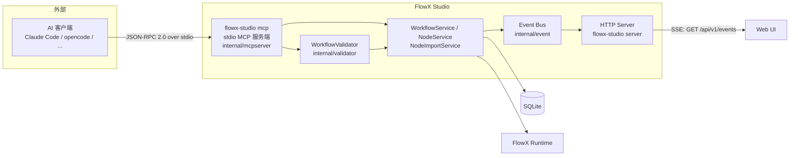
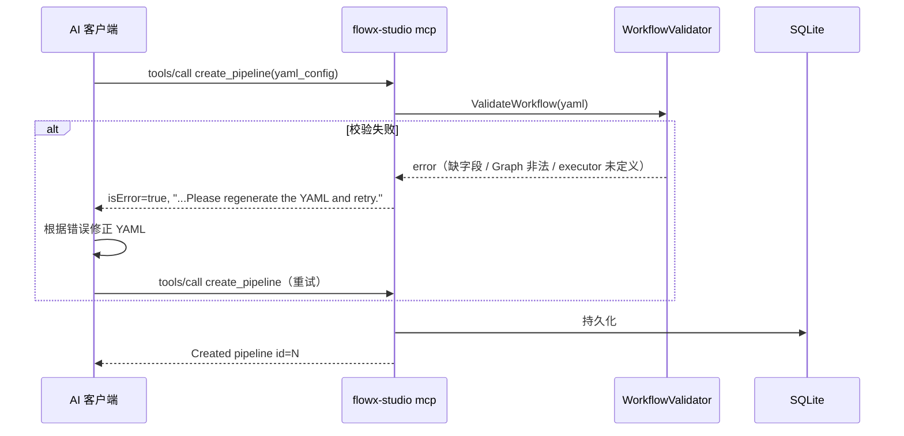
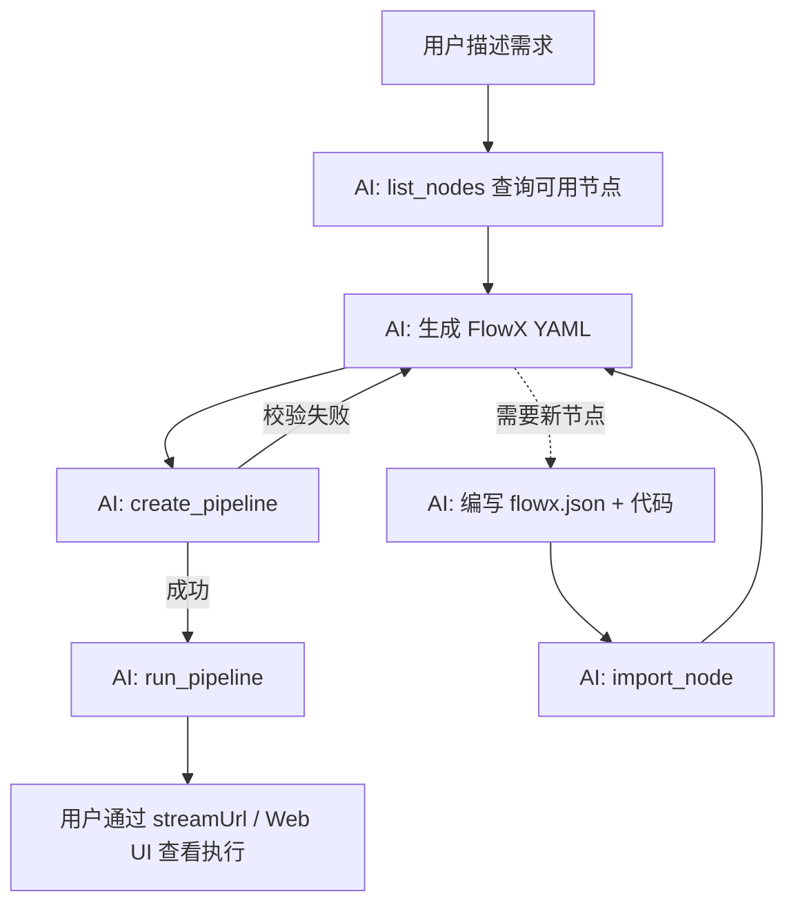

# 6. AI 集成（MCP 服务端）

> 本文档描述 FlowX Studio 当前的 AI 集成方式：FlowX Studio 自身作为 **stdio MCP 服务端**，由外部 AI 客户端（Claude Code、opencode 等）驱动流水线与节点的生成、校验、执行。

## 6.1 设计演变

早期版本（2026-07-12 之前）曾内置一套后端 AI 服务层，包含：

- 多 Provider 抽象（OpenAI / Anthropic / Ollama）
- Prompt 工程模板、NodeGenerator / WorkflowGenerator
- API Key 的 AES-GCM 加密存储、`ai_call_logs` 调用审计
- FAP（FlowX Action Protocol）动作协议与对话式交互

这套方案要求服务端持有各家 AI 的密钥、维护 Prompt 模板并承担重试与会话管理，复杂度高且与「可视化查看器」的定位不符。**2026-07-12 架构调整中该服务层被整体移除**：

- `internal/db/migrations/002_remove_ai_mcp.sql` 删除 `ai_configs`、`chat_history`、`mcp_configs` 表
- `internal/ai` 包与 `/api/v1/ai` 路由全部移除

当前架构为「**外部 AI 客户端 + FlowX Studio stdio MCP 服务端**」，职责划分清晰：

| 职责 | 承担方 |
| --- | --- |
| 需求理解、YAML/节点包生成、失败重试、会话管理 | 外部 AI 客户端（Claude Code、opencode 等） |
| YAML 校验、持久化、节点导入、流水线执行、事件推送 | FlowX Studio（MCP 服务端） |

服务端不再感知任何 AI Provider，不存储密钥，不维护 Prompt。AI 能力完全来自用户自己选择的客户端。

## 6.2 总体架构



要点：

- **AI 客户端**通过标准 MCP 配置拉起 `flowx-studio mcp` 子进程，以 stdio 进行 JSON-RPC 2.0 通信。
- **MCP 服务端**只暴露 8 个工具，所有写操作先经 `WorkflowValidator` / `NodeImportService` 校验，失败时返回错误文本引导 AI 重新生成。
- **HTTP Server**（`flowx-studio server`）与 MCP 服务端相互独立；Web UI 通过 SSE 订阅事件总线，实时感知 AI 客户端造成的流水线/节点变更。

## 6.3 传输与协议

### 6.3.1 stdio + JSON-RPC 2.0

MCP 服务端实现位于 `internal/mcpserver/server.go`：

- 传输层为 **stdio**：逐行读取 stdin（每行一个 JSON 消息），响应逐行写入 stdout（`server.go:63-105`）。
- 消息格式为 **JSON-RPC 2.0**，`jsonrpc` 字段必须为 `"2.0"`，否则返回 `-32600`；无法解析的输入返回 `-32700`；未知方法返回 `-32601`；参数非法返回 `-32602`。
- `initialize` 握手返回 `protocolVersion: "2024-11-05"`，`serverInfo: {name: "flowx-studio", version: "1.0.0"}`，能力声明仅包含 `tools`（`server.go:123-138`）。
- 支持的方法：`initialize`、`initialized`（通知，无响应）、`tools/list`、`tools/call`。
- `tools/call` 优先读取标准 MCP 的 `params.arguments` 字段；若为空则兼容把参数直接放在 `params` 顶层的客户端（`server.go:159-163`）。
- 工具结果统一包装为 `{content: [{type: "text", text: ...}], isError: bool}`，业务错误**不使用 JSON-RPC error**，而是通过 `isError: true` + 错误文本返回，便于 AI 读取后自行修正重试。

### 6.3.2 启动方式与并发模型

```bash
flowx-studio mcp
```

`cmd/flowx-studio/main.go:51-56` 注册 `mcp` 子命令，`main.go:157-178` 的 `runMCP` 实现有以下特点：

- **不持有单例 PID 锁**：与 `server` 子命令不同（`server` 通过 `singleton.New(...flowx-studio.pid)` 保证单实例，`main.go:107-112`），MCP 进程允许每个 AI 会话独立启动一个实例，天然支持多客户端并发。
- **不启动 HTTP server**：只初始化数据库、事件总线、Runtime Adapter 和各 Service，然后在 stdio 上阻塞监听。
- 同样启动 `StartEventBridge`，执行事件会照常进入事件总线（仅对同进程订阅者可见；Web UI 实时刷新依赖的是 `server` 进程内的事件总线，见 6.7 节的边界说明）。

## 6.4 工具清单

`tools/list` 返回 8 个工具（定义见 `internal/mcpserver/tools.go:18-184`）。所有工具调用结果均为文本；失败时 `isError: true` 且文本中包含可供 AI 修正的错误详情。

### 6.4.1 create_pipeline

创建流水线。YAML 非法时返回校验错误，AI 应修正后重试。

| 参数 | 类型 | 必填 | 说明 |
| --- | --- | --- | --- |
| `name` | string | 是 | 流水线名称 |
| `yaml_config` | string | 是 | FlowX YAML 配置（必须是合法 YAML） |
| `description` | string | 否 | 描述 |
| `intent` | string | 否 | 意图说明 |
| `status` | string | 否 | `draft`（默认）/ `active` / `archived` |

返回：成功 `Created pipeline id=<id> name=<name>`；失败 `Failed to create pipeline: <err>. Please regenerate the YAML and retry.`（`tools.go:186-213`）。

### 6.4.2 update_pipeline

按 ID 更新流水线，YAML 同样会被校验，非法即拒绝。

| 参数 | 类型 | 必填 | 说明 |
| --- | --- | --- | --- |
| `id` | integer | 是 | 流水线 ID |
| `name` | string | 是 | 名称 |
| `yaml_config` | string | 是 | FlowX YAML 配置 |
| `description` / `intent` / `status` | string | 否 | 同 create |

返回：`Updated pipeline id=<id>` 或带 `Please regenerate the YAML and retry.` 的错误（`tools.go:215-239`）。

### 6.4.3 delete_pipeline

按 ID 删除流水线。参数：`id`（integer，必填）。返回 `Deleted pipeline id=<id>`。

### 6.4.4 list_pipelines

分页列出流水线，供 AI 查询已有资源。参数均可选：

| 参数 | 类型 | 默认 | 说明 |
| --- | --- | --- | --- |
| `status` | string | - | 按状态过滤 |
| `search` | string | - | 关键字搜索 |
| `page` | integer | 1 | 页码 |
| `page_size` | integer | 20 | 每页数量 |

返回：分页结果的 JSON 字符串。

### 6.4.5 run_pipeline

按 ID 触发执行。参数：`id`（integer，必填）。

返回：`Started execution id=<execID> streamUrl=/api/v1/executions/<execID>/stream`。`streamUrl` 指向 HTTP server 上的 SSE 日志流，AI 可把它交给用户查看实时日志（`tools.go:270-282`、`internal/service/workflow.go:199`）。

### 6.4.6 import_node

从 Git 仓库或本地文件夹导入节点包（读取 `flowx.json`）。**这是通过 MCP 新增节点的唯一途径**（`tools.go:127-147`）。

| 参数 | 类型 | 必填 | 说明 |
| --- | --- | --- | --- |
| `source_type` | string | 是 | `git` 或 `folder` |
| `source_url` | string | `git` 时必填 | Git 仓库 URL |
| `source_path` | string | `folder` 时必填 | 本地目录路径 |

返回：导入成功的节点摘要 JSON（`id`、`name`、`display_name`、`version`、`language`、`node_type`、`image`、`parameters`、`outputs`）。详见 6.6 节。

### 6.4.7 delete_node

按 ID 删除节点。参数：`id`（integer，必填）。返回 `Deleted node id=<id>`。

### 6.4.8 list_nodes

分页列出节点，供 AI 在生成 YAML 前查询可用节点名（用于 `nodeRef`）。参数均可选：`language`、`tag`、`search`、`node_type`、`page`（默认 1）、`page_size`（默认 20）。返回分页结果 JSON。

## 6.5 YAML 生成与校验约定

### 6.5.1 校验规则

`create_pipeline` / `update_pipeline` 落库前都会经过 `WorkflowValidator`（`internal/validator/workflow.go`），规则如下：

1. `yaml_config` 非空且能被 YAML 解析。
2. 必须包含非空字符串字段 `Name`。
3. `Nodes` 必须是非空 map。
4. `Graph` 必须是非空字符串，且：
   - 以 `stateDiagram`（即 Mermaid `stateDiagram-v2`）开头；
   - 至少包含一条状态迁移（形如 `A --> B`，支持 `[*]` 起止节点）。
5. 若存在 `Executors`，其必须是 map，且每个节点声明的 `executor` 必须在 `Executors` 中有定义。

校验失败时工具返回如 `Failed to create pipeline: 'Graph' must start with 'stateDiagram-v2'. Please regenerate the YAML and retry.`，**错误文本即重试指令**，AI 客户端应修正 YAML 后再次调用同一工具。

### 6.5.2 校验-重试循环



### 6.5.3 nodeRef 引用与展开

YAML 的节点可通过 `config.nodeRef` 引用已导入的节点包，而不必内联代码：

```yaml
Name: demo
Graph: |
  stateDiagram-v2
    [*] --> download
    download --> [*]
Nodes:
  download:
    executor: download-image-executor
    config:
      nodeRef: download-image
Executors:
  download-image-executor:
    type: docker
```

执行前 `ExpandWorkflowConfig`（`internal/runtime/node_expander.go:103-164`）会：

1. 按 `nodeRef` 名称查找节点（`list_nodes` 可查可用名称）；
2. 用 `ExpandNodeToConfig` 把节点包展开为 FlowX 核心 `NodeConfig`：注入环境变量（`env` 映射或默认 `FLOWX_PARAM_<NAME>` 模板）、写入入口文件与附属文件、拼接运行命令（`run` 或按语言默认）；
3. 自动补充 `<node名>-executor` 的 Executor 定义（`image` 存在时默认 `docker`，否则 `local`）。

因此 AI 生成 YAML 时通常只需关心 `Graph` 拓扑和 `nodeRef` 引用，节点实现细节由节点包承载。

## 6.6 节点包导入

`import_node` 的背后是 `NodeImportService`（`internal/service/node_import.go`）：

- **git**：`git clone --depth 1` 到临时目录后导入，导入完成即清理（`node_import.go:27-48`）。
- **folder**：直接读取本地目录（`node_import.go:51-66`）。

两种来源最终都读取目录下的 `flowx.json` 清单并做完整校验（`validatePackage`，`node_import.go:99-162`）：

- `name` 必填，须以字母开头、仅含字母数字/下划线/连字符；
- `language` 必填且受沙箱支持；
- `entry` 入口文件必须存在，`files` 列出的每个文件必须存在；
- `parameters` 不允许重名，类型限定为 `string/integer/float/boolean/array/object`；
- `executor.type` 若提供，限定为 `local/docker/k8s`；
- 启用 mock 时 `mock.entry` 文件必须存在。

校验通过后读取入口/附属文件内容、依赖列表（`requirements` 字段或 `requirements.txt`）、mock 与 docker 配置，组装为 `model.Node` 落库，并保留 `source_type/source_url/source_path` 溯源信息。

`flowx.json` 的完整字段规范见 [11. FlowX 节点包规范](./11-node-package.md)。

## 6.7 事件推送与 Web UI 联动

所有 Service 层变更都会发布到内存事件总线（`internal/event/bus.go`），事件类型包括：

- `workflow.created` / `workflow.updated` / `workflow.deleted`
- `node.created` / `node.updated` / `node.deleted`
- `execution.started` / `execution.completed` / `execution.log`

HTTP server 通过 `GET /api/v1/events`（`internal/handler/event_handler.go`）以 SSE 向 Web UI 推送：

```
event: workflow.created
data: {"Type":"workflow.created","Data":{...}}
```

Web UI 订阅该流即可在 AI 客户端创建/修改/运行流水线时实时刷新界面。

> **边界说明**：事件总线是进程内的。`flowx-studio mcp` 进程产生的事件只在其自身进程内广播；若需要 Web UI 实时感知 AI 的操作，通常的部署方式是同时运行 `flowx-studio server`（提供 REST API + SSE），两者共享同一 SQLite 数据库——Web UI 通过 SSE 收到的是 `server` 进程内的事件，AI 通过 MCP 写入的数据则在其下次查询或 `server` 侧操作触发的刷新中可见。

## 6.8 客户端配置示例

任意支持 stdio MCP 的客户端，只需把 `flowx-studio mcp` 注册为一个 MCP server。通用 JSON 配置：

```json
{
  "mcpServers": {
    "flowx-studio": {
      "command": "flowx-studio",
      "args": ["mcp"]
    }
  }
}
```

配置后，AI 客户端会在会话开始时自动拉起 `flowx-studio mcp` 子进程，完成 `initialize` 握手并通过 `tools/list` 发现 8 个工具。典型协作流程：


