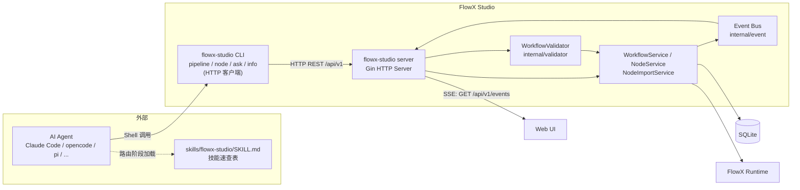
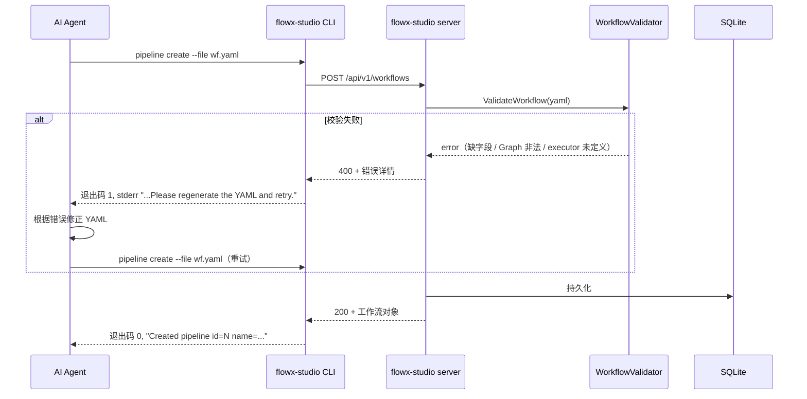
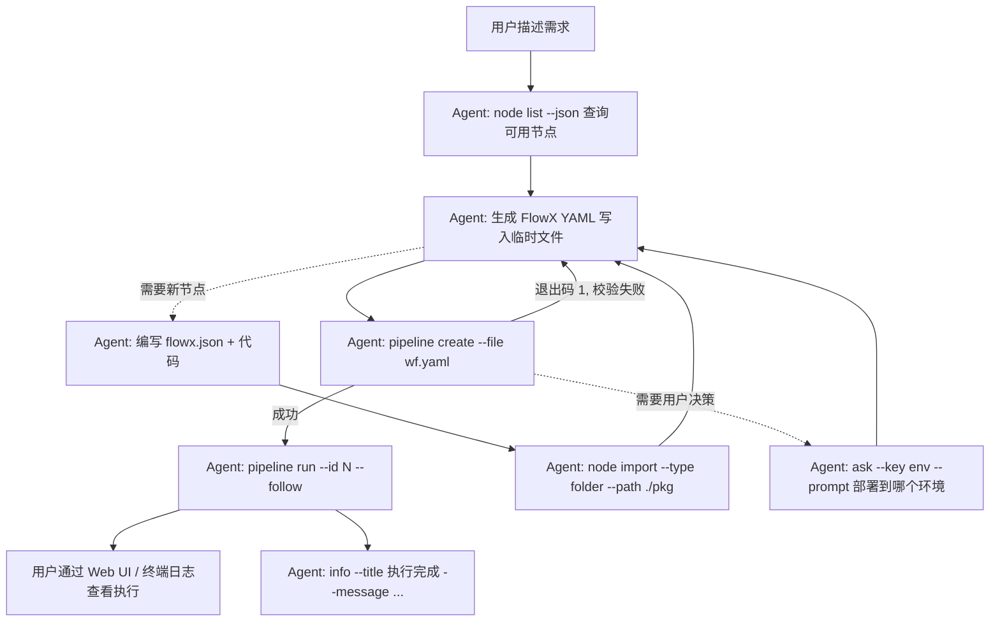

# 6. AI 集成（SKILL + CLI 渐进式披露）

> 本文档描述 FlowX Studio 当前的 AI 集成方式：FlowX Studio 提供一个 **SKILL（技能文件）+ `flowx-studio` CLI 客户端**，由外部 AI Agent（Claude Code、opencode、pi 等）通过 Shell 调用 CLI，CLI 再以 HTTP 客户端身份与 `flowx-studio server` 启动的 Web 服务端交互，完成流水线与节点的生成、校验、执行。

## 6.1 设计演变

### 第一阶段：后端 AI 服务层（已移除）

早期版本（2026-07-12 之前）曾内置一套后端 AI 服务层，包含多 Provider 抽象（OpenAI / Anthropic / Ollama）、Prompt 模板、API Key 加密存储与 FAP（FlowX Action Protocol）动作协议。该方案要求服务端持有密钥、维护 Prompt 并承担会话管理，复杂度高，**2026-07-12 架构调整中整体移除**。

### 第二阶段：stdio MCP 服务端（已移除）

2026-07-12 至 2026-08-17 期间，AI 集成采用「外部 AI 客户端 + FlowX Studio stdio MCP 服务端」模式（`flowx-studio mcp` 子命令，JSON-RPC 2.0 over stdio，8 个工具）。实践中暴露出几个问题：

- **依赖客户端 MCP 支持**：并非所有 Agent/客户端都支持 MCP 协议，接入面受限。
- **进程模型复杂**：MCP 进程由客户端按会话拉起，与 `server` 进程相互独立，事件总线是进程内的，导致「MCP 写入的数据 Web UI 无法实时感知」的边界问题。
- **协议开销**：JSON-RPC 握手、工具发现、`isError` 包装等协议层代码与业务无关，维护成本高。

### 第三阶段：SKILL + CLI 渐进式披露（当前）

**2026-08-17 架构调整**：移除 `internal/mcpserver` 与 `flowx-studio mcp` 子命令，改为 **SKILL + CLI** 模式：

- **SKILL**：仓库内提供 `skills/flowx-studio/SKILL.md`，安装到 Agent 的技能目录后，Agent 在路由阶段只需加载一份简短速查表，便知道「何时用、用什么命令」。
- **CLI 客户端**：`flowx-studio` 在 `server` 子命令之外提供一组客户端子命令（`pipeline` / `node` / `ask` / `info` 等），它们是 `flowx-studio server` 的 **HTTP 客户端**，通过 REST API 完成全部读写。
- **渐进式披露**：SKILL.md 只放最小必要信息；详细用法由 `flowx-studio <cmd> --help` 按需展开；机器可读的参数契约由 `flowx-studio <cmd> --schema` 输出。Agent 只在需要时才加载更深层的信息，上下文开销最小。

职责划分：

| 职责 | 承担方 |
| --- | --- |
| 需求理解、YAML/节点包生成、失败重试、会话管理 | 外部 AI Agent（Claude Code、opencode、pi 等） |
| SKILL 路由与调用指引 | `skills/flowx-studio/SKILL.md` |
| 命令行入口、HTTP 调用、输出格式化、错误码 | `flowx-studio` CLI 客户端子命令 |
| YAML 校验、持久化、节点导入、流水线执行、事件推送 | FlowX Studio HTTP Server（`flowx-studio server`） |

服务端不感知任何 AI Provider，不存储密钥，不维护 Prompt。AI 能力完全来自用户自己选择的 Agent。

**相比 MCP 模式的收益**：

- 任何能执行 Shell 命令的 Agent 都可接入，无协议门槛。
- 所有写操作都经过 HTTP server 单进程，事件总线只有一份，Web UI 通过 SSE 可**实时**感知 Agent 的全部操作（旧 MCP 模式的跨进程边界问题随之消失）。
- CLI 即文档：`--help` / `--schema` 自描述，SKILL.md 可以保持极简。

## 6.2 总体架构



要点：

- **AI Agent** 通过 Shell 执行 `flowx-studio` 子命令；SKILL.md 告诉它何时用哪个命令。
- **CLI 客户端**只做参数解析、HTTP 调用与输出格式化，不含业务逻辑；默认连接 `http://127.0.0.1:8080`，可用 `--server` flag 或 `FLOWX_STUDIO_SERVER_URL` 环境变量覆盖。
- **HTTP Server** 是唯一持有业务逻辑与事件总线的进程；CLI 的一切写入都会触发事件，经 SSE 实时推送到 Web UI。
- **前置条件**：使用 CLI 客户端子命令前，必须先运行 `flowx-studio server`。

## 6.3 渐进式披露（Progressive Disclosure）

AI 集成不依赖大而全的系统 Prompt，而是把信息分三层，Agent 按需深入：

| 层级 | 载体 | 内容 | 加载时机 |
| --- | --- | --- | --- |
| L1 路由层 | `skills/flowx-studio/SKILL.md` | 场景描述、命令速查表、典型流程、错误处理约定 | Agent 判断任务匹配时加载（常驻上下文，极简） |
| L2 用法层 | `flowx-studio <cmd> --help` | 子命令完整用法、flag 说明、示例 | Agent 首次使用某命令时执行查看 |
| L3 契约层 | `flowx-studio <cmd> --schema` | 该命令参数的 JSON Schema（名称/类型/必填/枚举/默认值） | Agent 需要精确构造参数或批量调用时查看 |

设计约定：

- **`--schema` 输出 JSON Schema**：每个数据写入类子命令必须支持，输出到 stdout，退出码 0。Agent 解析 Schema 后即可一次性构造合法参数，减少试错往返。
- **错误即指令**：校验失败时 CLI 以**非零退出码**退出，stderr 输出人类/AI 均可读的错误详情，并以 `Please regenerate the YAML and retry.` 之类的重试指引结尾（语义同旧 MCP 的 `isError: true` 文本）。
- **`--json` 机器可读输出**：所有查询类子命令支持 `--json`，输出结构化 JSON（默认输出为人类可读的表格/摘要）。
- **SKILL.md 保持极简**：只放命令速查与流程图，不复制 flag 细节；细节一律通过 `--help` / `--schema` 在运行时获取，避免文档与实现漂移。

## 6.4 CLI 命令清单

CLI 客户端子命令覆盖原 MCP 8 个工具的全部能力，并新增原 FAP 动作对应的命令。全局 flag：

| Flag / 环境变量 | 说明 | 默认值 |
| --- | --- | --- |
| `--server` / `FLOWX_STUDIO_SERVER_URL` | HTTP server 地址 | `http://127.0.0.1:8080` |
| `--json` | 以 JSON 输出结果 | false |
| `--schema` | 输出该命令参数的 JSON Schema 后退出 | false |

**认证**：server 自 2026-08-18 起要求本地 token。CLI 按 `FLOWX_STUDIO_AUTH_TOKEN` → `<data-dir>/auth.token` 顺序自动解析并附加 `Authorization: Bearer` 头，无需手动配置；token 不匹配时返回 401，CLI 会提示检查 token 来源。

退出码约定：`0` 成功；`1` 业务/校验失败（stderr 含错误详情与重试指引）或缺少必填参数（错误信息会提示查看 `--schema`）；`2` flag 解析错误（由 Cobra 输出用法）。

`pipeline` 命令组注册了别名 `workflow`，两者等价。

### 6.4.1 server 生命周期命令（daemon 管理）

CLI 调用前可用以下命令探测与启动 server；`status` 退出码恒为 0，状态由 stdout（或 `--json`）表达：

| 命令 | 说明 |
| --- | --- |
| `flowx-studio server status` | 输出 `running (pid=N, url=...)` 或 `stopped`；`--json` 输出 `{"status":"running","pid":N,"url":"..."}` |
| `flowx-studio server start [--port 8080] [--host 0.0.0.0]` | 后台守护启动（Setsid 脱离终端，日志写入 `<data.dir>/server.log`），阻塞轮询就绪（复用 `GET /api/v1/config/system` 探测，任意 HTTP 响应即就绪，超时 10s）；已在运行时幂等输出 `Server already running` 并退出 0 |
| `flowx-studio server stop` | SIGTERM 优雅停止，最多等待 5s；未运行时输出 `Server not running` 并清理陈旧 pid 文件 |

实现要点：`runServer` 启动后将实际监听地址写入 `<data.dir>/server.json`（`{pid, host, port}`），`status`/`stop` 读取它探测真实端口；`stop`/`status` 通过 `singleton.FindRunning`（`/proc/<pid>/exe` 比对 + cmdline 子命令匹配）确认进程身份。

### 6.4.2 流水线命令（pipeline）

| 命令 | 说明 | 对应原 MCP 工具 |
| --- | --- | --- |
| `flowx-studio pipeline list [--status s] [--search kw] [--page n] [--page-size n]` | 分页列出流水线 | `list_pipelines` |
| `flowx-studio pipeline create --name n --file wf.yaml [--description d] [--status draft]` | 创建流水线，YAML 经服务端校验 | `create_pipeline` |
| `flowx-studio pipeline update --id N [--name n] [--file wf.yaml] [--status s]` | 更新流水线，YAML 同样被校验 | `update_pipeline` |
| `flowx-studio pipeline delete --id N` | 删除流水线 | `delete_pipeline` |
| `flowx-studio pipeline run --id N [--follow]` | 触发执行，输出 execution id 与 stream URL；`--follow` 时在终端持续跟随 SSE 日志 | `run_pipeline` |

说明：

- YAML 通过 `--file` 从文件读入（`-` 表示 stdin），避免超长命令行转义问题。
- `pipeline run` 默认输出 `Started execution id=<execID> streamUrl=/api/v1/executions/<execID>/stream`；加 `--follow` 后 CLI 订阅该 SSE 流并把日志打印到终端，直到执行结束。

### 6.4.3 节点命令（node）

| 命令 | 说明 | 对应原 MCP 工具 |
| --- | --- | --- |
| `flowx-studio node list [--language l] [--tag t] [--search kw] [--node-type t] [--page n] [--page-size n]` | 分页列出节点（生成 YAML 前查询可用 `nodeRef` 名称） | `list_nodes` |
| `flowx-studio node import --type git --url <repo>` / `flowx-studio node import --type folder --path <dir>` | 从 Git 仓库或本地文件夹导入节点包（读取 `flowx.json`） | `import_node` |
| `flowx-studio node create --file node.yaml` | 直接创建代码节点（对应原 FAP `create_node` 动作） | 无（原 FAP 能力） |
| `flowx-studio node delete --id N` | 删除节点 | `delete_node` |
| `flowx-studio node mock --id N [--params '{...}']` | 触发节点 Mock 测试并输出结果 | 无（新增，便于 Agent 自验） |

### 6.4.4 交互命令（原 FAP 动作的 CLI 等价物）

原 FAP（FlowX Action Protocol）定义了 `create_node` / `update_workflow` / `ask_input` / `show_info` 四种动作标签。FAP 协议本身已移除，其语义由以下 CLI 命令承接：

| 原 FAP 标签 | CLI 命令 | 行为 |
| --- | --- | --- |
| `[[ACTION:create_node]]` | `flowx-studio node create --file node.yaml` | 创建节点，输出新节点摘要 |
| `[[ACTION:update_workflow]]` | `flowx-studio pipeline update --id N --file wf.yaml` | 更新流水线，非法 YAML 拒绝并给出重试指引 |
| `[[ACTION:ask_input]]` | `flowx-studio ask --key name --prompt "请输入环境" [--options a,b,c] [--default v]` | 在终端向用户发起一次交互式提问，把用户回答以 `<key>=<value>` 输出到 stdout，供 Agent 捕获后继续 |
| `[[ACTION:show_info]]` | `flowx-studio info --title "构建完成" --message "..." [--level info\|warn\|error]` | 在终端渲染一张信息卡片（标题 + 正文 + 级别着色），用于向用户汇报阶段性结果 |

`ask` 与 `info` 不访问 HTTP server，是纯粹的终端交互命令：Agent 在 Shell 会话中执行它们即可与用户完成「提问 / 展示」闭环，替代了原 FAP 需要前端配合渲染表单与卡片的能力。

## 6.5 YAML 生成与校验约定

### 6.5.1 校验规则

`pipeline create` / `pipeline update` 的 YAML 由服务端 `WorkflowValidator`（`internal/validator/workflow.go`）校验，规则如下：

1. `yaml_config` 非空且能被 YAML 解析。
2. 必须包含非空字符串字段 `Name`。
3. `Nodes` 必须是非空 map。
4. `Graph` 必须是非空字符串，且：
   - 以 `stateDiagram`（即 Mermaid `stateDiagram-v2`）开头；
   - 至少包含一条状态迁移（形如 `A --> B`，支持 `[*]` 起止节点）。
5. 若存在 `Executors`，其必须是 map，且每个节点声明的 `executor` 必须在 `Executors` 中有定义。

校验失败时服务端返回 400，CLI 将其转换为退出码 1，stderr 输出如：

```
Error: failed to create pipeline: 'Graph' must start with 'stateDiagram-v2'. Please regenerate the YAML and retry.
```

**错误文本即重试指令**，Agent 应修正 YAML 后再次执行同一命令。

### 6.5.2 校验-重试循环



### 6.5.3 nodeRef 引用与展开

YAML 的节点可通过 `config.nodeRef` 引用已导入的节点包，而不必内联代码：

```yaml
Name: demo
Graph: |
  stateDiagram-v2
    [*] --> download
    download --> [*]
Nodes:
  download:
    executor: download-image-executor
    config:
      nodeRef: download-image
Executors:
  download-image-executor:
    type: docker
```

执行前 `ExpandWorkflowConfig`（`internal/runtime/node_expander.go`）会：

1. 按 `nodeRef` 名称查找节点（`node list` 可查可用名称）；
2. 用 `ExpandNodeToConfig` 把节点包展开为 FlowX 核心 `NodeConfig`：注入环境变量（`env` 映射或默认 `FLOWX_PARAM_<NAME>` 模板）、写入入口文件与附属文件、拼接运行命令（`run` 或按语言默认）；
3. 自动补充 `<node名>-executor` 的 Executor 定义（`image` 存在时默认 `docker`，否则 `local`）。

因此 Agent 生成 YAML 时通常只需关心 `Graph` 拓扑和 `nodeRef` 引用，节点实现细节由节点包承载。

## 6.6 节点包导入

`node import` 的背后是 `NodeImportService`（`internal/service/node_import.go`）：

- **git**：`git clone --depth 1` 到临时目录后导入，导入完成即清理。
- **folder**：直接读取本地目录。

两种来源最终都读取目录下的 `flowx.json` 清单并做完整校验（`validatePackage`）：

- `name` 必填，须以字母开头、仅含字母数字/下划线/连字符；
- `language` 必填且受沙箱支持；
- `entry` 入口文件必须存在，`files` 列出的每个文件必须存在；
- `parameters` 不允许重名，类型限定为 `string/integer/float/boolean/array/object`；
- `executor.type` 若提供，限定为 `local/docker/k8s`；
- 启用 mock 时 `mock.entry` 文件必须存在。

校验通过后读取入口/附属文件内容、依赖列表（`requirements` 字段或 `requirements.txt`）、mock 与 docker 配置，组装为 `model.Node` 落库，并保留 `source_type/source_url/source_path` 溯源信息。

`flowx.json` 的完整字段规范见 [11. FlowX 节点包规范](./11-node-package.md)。

## 6.7 事件推送与 Web UI 联动

所有 Service 层变更都会发布到内存事件总线（`internal/event/bus.go`），事件类型包括：

- `workflow.created` / `workflow.updated` / `workflow.deleted`
- `node.created` / `node.updated` / `node.deleted`
- `execution.started` / `execution.completed` / `execution.log`

HTTP server 通过 `GET /api/v1/events`（`internal/handler/event_handler.go`）以 SSE 向 Web UI 推送：

```
event: workflow.created
data: {"Type":"workflow.created","Data":{...}}
```

由于 CLI 客户端的一切写操作都经由 HTTP server 完成，事件天然产生于 server 进程内部，Web UI 订阅该流即可**实时**感知 Agent 创建/修改/运行流水线的全部操作——这正是 SKILL + CLI 模式相比旧 MCP 模式（MCP 进程事件无法跨进程到达 Web UI）的关键改进。

## 6.8 SKILL 安装与使用示例

### 6.8.1 SKILL 文件

仓库内置 `skills/flowx-studio/SKILL.md`，安装方式因 Agent 而异（如 pi 的 `~/.pi/agent/skills/`、Claude Code 的 `.claude/skills/`）。文件内容保持极简，示例骨架：

```markdown
---
name: flowx-studio
description: 管理 FlowX Studio 流水线与节点。当用户要求创建/修改/运行工作流、
  导入或创建节点时使用。前置条件：flowx-studio server 已在运行。
---

# FlowX Studio

通过 `flowx-studio` CLI 与本地 server（默认 http://127.0.0.1:8080）交互。
每个子命令支持 `--help` 查看用法、`--schema` 查看参数 JSON Schema、`--json` 输出 JSON。

## 命令速查

| 任务 | 命令 |
| --- | --- |
| 列出节点（查 nodeRef） | `flowx-studio node list --json` |
| 导入节点包 | `flowx-studio node import --type git --url <repo>` |
| 创建节点 | `flowx-studio node create --file node.yaml` |
| 创建流水线 | `flowx-studio pipeline create --name <n> --file wf.yaml` |
| 更新流水线 | `flowx-studio pipeline update --id <N> --file wf.yaml` |
| 运行流水线 | `flowx-studio pipeline run --id <N> [--follow]` |
| 向用户提问 | `flowx-studio ask --key <k> --prompt "<问题>"` |
| 展示信息卡片 | `flowx-studio info --title <t> --message <m>` |

## 约定

- YAML 校验失败时命令退出码为 1，stderr 含错误详情，修正 YAML 后重试。
- 生成 YAML 时优先用 `config.nodeRef` 引用已有节点，不要内联代码。
- Graph 必须是 `stateDiagram-v2` 且至少一条迁移。
```

### 6.8.2 典型协作流程


