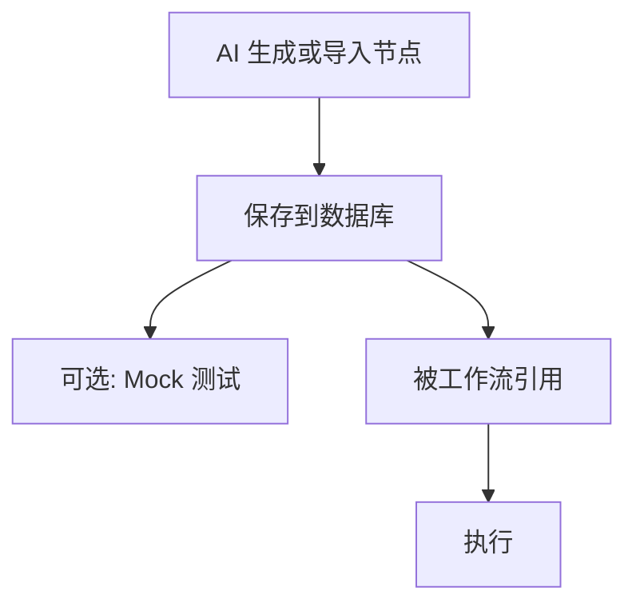
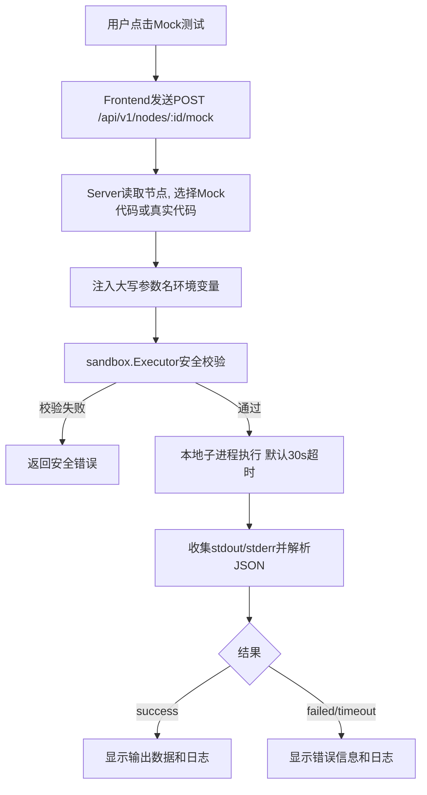
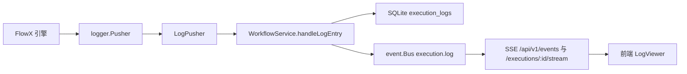

# 7. 节点系统与执行引擎

## 7.1 节点注册中心

### 7.1.1 节点定义

节点是 FlowX 工作流中的最小执行单元。节点模型定义于 `internal/model/model.go`：

```go
type Node struct {
    ID          int64
    Name        string             // 唯一标识（蛇形命名）
    DisplayName string             // 显示名称
    Description string             // 功能描述
    Version     string             // 版本号（存储字段）
    Author      string             // 作者
    Icon        string             // 图标
    NodeType    string             // code | image

    // 代码节点字段
    Language     string            // 见下方语言清单
    Code         string            // 实现代码
    Entry        string            // 入口文件（如 main.py）
    Requirements []string          // 依赖列表

    // 镜像节点字段
    Image        string            // 镜像节点使用的镜像

    // 通用配置
    Parameters   []NodeParameter   // 参数定义
    Outputs      []NodeOutput      // 输出定义
    DockerConfig *NodeDockerConfig // Docker 配置
    MockConfig   *NodeMockConfig   // Mock 配置

    // 节点包文件（文件名 -> 内容）
    Files        map[string]string

    // 完整的 flowx.json 包配置（运行时展开使用）
    PackageConfig *NodePackage

    // 来源信息
    SourceType  string             // git | manual | folder
    SourceURL   string
    SourcePath  string

    Tags        []string
    CreatedAt   time.Time
    UpdatedAt   time.Time
}

type NodeParameter struct {
    Name        string      `json:"name"`
    Type        string      `json:"type"`        // string | integer | float | boolean | array | object
    Description string      `json:"description"`
    Required    bool        `json:"required"`
    Default     interface{} `json:"default,omitempty"`
}

type NodeMockConfig struct {
    Enabled bool   `json:"enabled"`
    Entry   string `json:"entry,omitempty"`
    Code    string `json:"code,omitempty"`
}

type NodeDockerConfig struct {
    Image   string `json:"image,omitempty"`
    Workdir string `json:"workdir,omitempty"`
}
```

**支持的语言**（`sandbox/executor.go`）：
`python, go, bash, sh, javascript, js, node, typescript, ts, ruby, php`

### 7.1.2 flowx.json 节点包

节点包通过 `flowx.json` 描述，对应模型 `NodePackage`，详见 [11. 节点包规范](11-node-package.md)：

```go
type NodePackage struct {
    Name         string             // 必填，节点名
    DisplayName  string
    Description  string
    Version      string
    Author       string
    Tags         []string
    Icon         string
    Language     string             // 必填
    Entry        string             // 必填，入口文件
    Files        []string           // 额外文件
    Image        string             // 镜像（docker 执行器）
    Executor     NodeExecutorConfig // 执行器配置（type + config）
    Requirements []string           // 依赖列表
    Parameters   []NodeParameter    // 参数定义
    Env          map[string]string  // 环境变量注入（优先级高于自动参数注入）
    Run          string             // 自定义运行命令
    Outputs      []NodeOutput
    Extract      *NodeExtractConfig // 输出提取配置
    Mock         *NodeMockConfig
    Timeout      int
}
```

导入时读取并校验 `flowx.json`（`node_import.go`），运行时以 `PackageConfig` 作为节点展开的关键依据（`node_expander.go`）。

### 7.1.3 节点导入

`NodeImportService` 支持两种来源：

- **Git 仓库**：`ImportFromGit(url)`，浅克隆（`git clone --depth 1`）到临时目录后导入
- **本地文件夹**：`ImportFromFolder(path)`

HTTP 接口：`POST /api/v1/nodes/import`。

导入流程：读取 `flowx.json` → `validatePackage` 校验（名称格式、语言受支持、入口文件存在、`files` 列表文件存在、参数类型合法、执行器类型为 `local|docker|k8s|kubernetes`、Mock 入口文件存在）→ 读取入口代码与附加文件构建 `Node` 入库。若未声明 `requirements`，会回退读取包内 `requirements.txt`。

### 7.1.4 节点生命周期

> 注意：`Node` 模型**没有持久化的 status 字段**，当前实现不存在"生成中/已注册/可用"的状态机。节点创建（AI 生成或导入）即入库保存；Mock 测试仅返回执行结果，不改变节点任何状态。



### 7.1.5 节点版本管理

`Node` 已包含 `Version` 字段（随节点存储展示），但当前不提供多版本管理机制。节点名称全局唯一，由数据库 `name` 字段的 UNIQUE 约束保证；创建同名节点会返回 `node name already exists` 错误，需用户选择覆盖（更新）或重命名。

## 7.2 节点代码规范

### 7.2.1 输入规范

节点通过**环境变量**接收输入参数。运行时展开路径使用 `FLOWX_PARAM_` 前缀：

```bash
# 参数名格式：FLOWX_PARAM_{大写参数名}
FLOWX_PARAM_URL=https://example.com/image.jpg
FLOWX_PARAM_TIMEOUT=30
```

> **参数注入的两条路径**（环境变量名已统一，2026-08-17 修复）：
> - **运行时展开路径**（`node_expander.go`）：生成 `export FLOWX_PARAM_{大写参数名}="{{ Param.xxx }}"`，带 `FLOWX_PARAM_` 前缀；若 `flowx.json` 声明了 `env` 字段，则直接使用 `env` 配置。
> - **Mock 测试路径**（`service/node.go` MockTest）：同样注入 `FLOWX_PARAM_{大写参数名}`；同时保留**裸大写参数名**（如 `URL=...`）作为兼容别名，存量节点代码无需修改。
>
> 新节点代码一律使用 `FLOWX_PARAM_` 前缀变量名即可，Mock 与真实执行行为一致。

不同语言的读取示例（以运行时展开路径为例）：

**Python**：
```python
import os

url = os.environ.get('FLOWX_PARAM_URL')
timeout = int(os.environ.get('FLOWX_PARAM_TIMEOUT', '30'))
```

**Go**：
```go
package main

import (
    "os"
    "strconv"
)

func main() {
    url := os.Getenv("FLOWX_PARAM_URL")
    timeout, _ := strconv.Atoi(os.Getenv("FLOWX_PARAM_TIMEOUT"))
}
```

**Bash**：
```bash
URL="${FLOWX_PARAM_URL}"
TIMEOUT="${FLOWX_PARAM_TIMEOUT:-30}"
```

### 7.2.2 输出规范

节点将结果输出到 **stdout**。为使下游节点能引用当前节点的输出，必须使用 `flowx-yaml` 代码块格式，FlowX 引擎会自动提取并写入 Metadata：

**标准输出（成功）**：

```bash
echo '```flowx-yaml'
echo "file_path: \"/tmp/image.jpg\"  # 下载文件路径"
echo "size_bytes: 2048  # 文件大小字节数"
echo '```'
```

提取后，FlowX 引擎将其存储到 Metadata 中的格式为：

```go
// Metadata["{nodeId}.file_path"] = FieldItem{
//     Value:       "/tmp/image.jpg",
//     Description: "下载文件路径",      // 从行尾注释提取
//     SrcNode:     "{nodeId}",          // 自动设置为当前节点ID
// }
// Metadata["{nodeId}.size_bytes"] = FieldItem{
//     Value:       2048,
//     Description: "文件大小字节数",
//     SrcNode:     "{nodeId}",
// }
```

**下游节点引用方式**：

```yaml
Nodes:
  Download:
    # ... 执行下载 ...
    extract:
      type: codec-block
    steps:
      - name: download
        run: |
          echo '```flowx-yaml'
          echo "file_path: \"/tmp/image.jpg\"  # 下载文件路径"
          echo '```'

  Process:
    steps:
      - name: process
        run: |
          echo "Processing {{ Metadata.Download.file_path }}"
```

**规则说明**：
- 必须包裹在 ` ```flowx-yaml ` 代码块中
- 字段值后可用 `# 描述` 添加行尾注释，自动提取为 `Description`
- 提取的 key 会自动加上节点前缀：`{nodeId}.{key}`
- 复杂类型（数组、对象）会被序列化为 JSON 字符串存储，下游节点自动解析
- 节点展开时若 `flowx.json` 未声明 `extract`，默认使用 `extract.type: codec-block`

**错误时输出到 stderr 并返回非 0 exit code**：

```bash
echo '{"success": false, "error": "下载失败：连接超时"}' >&2
exit 1
```

### 7.2.3 AI Prompt 中的代码规范要求

在生成节点的 Prompt 中，必须明确要求 AI：

1. 使用环境变量读取参数（`FLOWX_PARAM_*` 格式，Mock 与运行时一致，见 7.2.1）
2. 使用 `flowx-yaml` 代码块输出结果到 stdout，以便下游节点通过 Metadata 引用
3. 错误时输出 JSON 到 stderr 并 exit 1
4. 包含基本的错误处理
5. 提供有意义的日志输出
6. 为 `flowx-yaml` 中的字段添加行尾注释（`# 描述`），方便生成字段说明

## 7.3 Mock 模式

### 7.3.1 Mock 代码规范

Mock **是可选的**（`NodeMockConfig.Enabled`）。Mock 代码的要求：

1. **不依赖外部服务**：不调用真实 API、不连接真实数据库
2. **返回合理数据**：返回与真实输出结构一致的模拟数据
3. **快速执行**：Mock 执行时间控制在 1-2 秒内
4. **验证逻辑**：验证输入参数的有效性

若节点未启用 Mock 或 Mock 代码为空，Mock 测试会**回退执行真实代码**（`service/node.go` MockTest）。

**Mock 代码示例（Python）**：

```python
import os
import sys
import time

# 读取参数
url = os.environ.get('FLOWX_PARAM_URL', 'https://example.com/default.jpg')

# 验证参数
if not url.startswith(('http://', 'https://')):
    print(json.dumps({
        "success": False,
        "error": "Invalid URL format"
    }), file=sys.stderr)
    sys.exit(1)

# 模拟执行
print("Mock: 模拟下载图片...")
time.sleep(0.5)

# 返回模拟结果（flowx-yaml 格式，供下游节点引用）
print('```flowx-yaml')
print('file_path: "/tmp/mock_image_12345.jpg"  # 下载文件路径')
print('size_bytes: 2048  # 文件大小字节数')
print('format: "JPEG"  # 图片格式')
print('width: 1920  # 图片宽度')
print('height: 1080  # 图片高度')
print('```')
```

### 7.3.2 沙箱执行器

Mock 测试由 `sandbox.Executor` 结构体执行（`internal/sandbox/executor.go`），**不是**独立的 MockExecutor 接口：

```go
// Executor 沙箱执行器
type Executor struct {
    Timeout       time.Duration // 超时时间（默认 30s）
    MaxOutputSize int64         // 最大输出长度（默认 1MB）
    WorkDir       string        // 工作目录（默认系统临时目录）
}

type ExecuteOptions struct {
    Code     string            // 节点代码
    Language string            // 编程语言
    Entry    string            // 入口文件（可选，如 main.py）
    EnvVars  map[string]string // 环境变量参数
    ExtraEnv map[string]string // 额外环境变量
    Files    map[string]string // 额外文件（文件名 -> 内容）
}

// Execute 执行节点代码
func (e *Executor) Execute(opts ExecuteOptions) *Result

type Result struct {
    Status     string                 // success | failed | timeout
    DurationMs int64
    Output     map[string]interface{} // 尝试从 stdout 解析 JSON
    Stdout     string
    Stderr     string
    Logs       string
    Error      string
    ExitCode   int
}
```

**执行策略（实际实现）**：

1. **本地子进程**：使用 `os/exec` 直接在本机启动子进程执行代码，**不使用 Docker**，也没有 seccomp/cgroup/sandbox-exec 等系统级隔离
2. **安全校验（字符串黑名单）**：
   - 语言白名单：仅支持 `python, go, bash, sh, javascript, js, node, typescript, ts, ruby, php`
   - 危险模式黑名单：如 `os.system`、`subprocess.*`、`eval(`、`exec(`、`rm -rf`、`curl | sh` 等
   - 敏感路径黑名单：如 `/etc/passwd`、`/root`、`/.ssh` 等
3. **超时控制**：默认 30 秒；Mock 测试接口可传 `timeout`（秒），上限 5 分钟
4. **输出处理**：stdout/stderr 超过 1MB 截断；尝试将 stdout（或其最后一行）解析为 JSON 作为 `Output`

### 7.3.3 Mock 测试流程



## 7.4 执行引擎集成

### 7.4.1 运行时适配器与节点展开

运行时适配器为 `runtime.Adapter`（`internal/runtime/adapter.go`），包装 FlowX Runtime，提供 `ExecuteWorkflow` / `GetPipelineStatus` / `CancelExecution` / 事件通道等能力：

```go
// Adapter FlowX 运行时适配器
type Adapter struct {
    runtime   flowx.Runtime
    eventCh   chan ExecutionEvent
    logPusher *LogPusher
    mu        sync.RWMutex
}

// ExecuteWorkflow 通过 RunAsync 异步执行，并注册 pipeline->execution 映射
func (a *Adapter) ExecuteWorkflow(ctx context.Context, executionID int64, configYAML string) error
```

节点展开为**包级函数**（`internal/runtime/node_expander.go`），不是 `BuildPipelineConfig` 方法：

```go
// ExpandWorkflowConfig 展开工作流 YAML 中的 nodeRef 引用，返回展开后的 YAML
func ExpandWorkflowConfig(configYAML string, lookup func(name string) (*model.Node, error)) (string, error)

// ExpandNodeToConfig 将 model.Node 展开为 flowx 核心的 NodeConfig
func ExpandNodeToConfig(node *model.Node) (*core.NodeConfig, error)
```

**注入机制**：`ExpandNodeToConfig` 以节点的 `PackageConfig`（flowx.json）为依据，生成一段 shell 脚本放入**单个 step**（`name: run`）：

1. `export KEY="{{ Param.xxx }}"` 注入环境变量（默认 `FLOWX_PARAM_{大写参数名}`；`flowx.json` 的 `env` 字段优先）
2. `cat > {entry} << 'FLOWX_FILE_EOF'` heredoc 写入入口代码及 `files` 附加文件
3. 追加运行命令（`flowx.json` 的 `run` 字段；缺省时按语言推断，如 `python3 main.py`）

同时以 `{nodeName}-executor` 为名向 `cfg.Executors` 写入执行器配置，类型来自 `flowx.json` 的 `executor.type`（缺省时：有 `image` 为 `docker`，否则 `local`）。未声明 `extract` 时默认 `codec-block`。

### 7.4.2 事件桥接

FlowX 引擎事件经由 `studioListener`（实现 `dag.Listener` 接口，`adapter.go`）桥接：

```go
type studioListener struct {
    adapter     *Adapter
    executionID int64
}

// Handle 处理 dag 事件并推入 adapter.eventCh：
//   PipelineStart      -> "execution_start"   (携带 params)
//   PipelineFinish     -> "execution_complete" (携带 params/metadata)
//   PipelineNodeStart  -> "node_start"
//   PipelineNodeFinish -> "node_complete" (status=success)
//   PipelineNodeFailed -> "node_complete" (status=failed)
func (l *studioListener) Handle(p dag.Pipeline, event dag.Event)
```

`WorkflowService.StartEventBridge`（`workflow.go`）启动 goroutine 消费 `adapter.GetEvents()`，调用 `persistRuntimeEvent` 将事件持久化到数据库（更新 `executions` / `execution_nodes` 表）并转发到 `event.Bus`，最终经 SSE 推送前端：

- 全局 SSE：`GET /api/v1/events`
- 单次执行 SSE：`GET /api/v1/executions/:id/stream`

此外 `WorkflowService` 自身还会发布 `execution.started` / `execution.completed` / `execution.log` 事件。注意：**日志事件类型是 `execution.log`，不存在 `node_log`**。

### 7.4.3 执行状态持久化

执行由 `WorkflowService.Run` / `runWorkflow` 完成（`workflow.go`），**直接执行 SQL**，无独立仓储层：

```go
// Run 校验工作流后直接以 running 状态插入执行记录（无 pending 阶段）
func (s *WorkflowService) Run(id int64, params map[string]interface{}, dryRun bool) (int64, string, error)

func (s *WorkflowService) runWorkflow(execID int64, wf *model.Workflow) {
    ctx := context.Background()

    // 1. 展开工作流 YAML（nodeRef -> 实际节点配置）
    yamlConfig, _ := runtime.ExpandWorkflowConfig(wf.YAMLConfig, s.nodeSvc.GetByName)

    // 2. 发布 execution.started，启动异步执行（listener 事件经 RunAsync 传入）
    err := s.runtime.ExecuteWorkflow(ctx, execID, yamlConfig)

    // 3. 每 500ms 轮询 GetPipelineStatus，直到 SUCCESS / FAILED / CANCELLED
    for {
        status, _ := s.runtime.GetPipelineStatus(execID)
        if status == "SUCCESS" || status == "FAILED" || status == "CANCELLED" { break }
        time.Sleep(500 * time.Millisecond)
    }

    // 4. 若 pipeline 已被清理导致轮询出错，
    //    由 resolveFinalStatusFromNodes 根据 execution_nodes 表兜底判定最终状态

    // 5. 更新 executions 最终状态，发布 execution.completed
}
```

## 7.5 执行日志管理

### 7.5.1 日志架构



### 7.5.2 日志收集与实时推送

日志链路（**实时逐条处理**，无内存环形缓冲区、无批量写库）：

1. **Pusher 层**：`LogPusher`（`adapter.go`）实现 FlowX 核心库的 `logger.Pusher` 接口（`Push` / `PushBatch` / `Close`），并将 pipeline 内部 ID 映射为 `exec-{executionID}`
2. **处理层**：`WorkflowService.handleLogEntry`（`workflow.go`）通过 `Adapter.OnLog` 注册为回调，对每条日志：
   - 立即 `INSERT INTO execution_logs` 持久化
   - 立即向 `event.Bus` 发布 `execution.log` 事件
3. **推送层**：事件总线经 SSE（`GET /api/v1/events`、`GET /api/v1/executions/:id/stream`）实时推送到前端

**日志来源**：
- **节点标准输出**：捕获 stdout/stderr（Python print、Go fmt 等）
- **引擎事件**：节点开始、完成、失败等状态变更
- **系统日志**：执行器生命周期、执行启动失败的兜底错误日志（`logExecutionError`）

### 7.5.3 日志存储

- 所有日志**实时逐条持久化**到 `execution_logs` 表（见 3.3.5 节）
- 支持按执行 ID、节点 ID、日志级别查询
- 分页加载，每页默认 100 条

**日志清理**：当前**未实现**自动清理与保留策略（规划中）。

### 7.5.4 日志格式

```json
{
  "id": 1024,
  "execution_id": 42,
  "node_id": "download",
  "node_name": "下载图片",
  "step_name": "download_image",
  "level": "info",
  "message": "开始下载图片: https://example.com/image.jpg",
  "output": "HTTP/1.1 200 OK\nContent-Length: 2048...",
  "timestamp": "2025-01-20T10:00:01.123Z"
}
```

**级别定义**：
| 级别 | 颜色 | 使用场景 |
|------|------|---------|
| `debug` | 灰色 | 开发调试、详细的执行跟踪 |
| `info` | 青色 | 节点开始/完成、正常操作 |
| `warn` | 黄色 | 超时、降级、资源限制触发 |
| `error` | 红色 | 节点执行失败、异常错误 |
| `fatal` | 深红 | 系统级致命错误 |

### 7.5.5 日志查询 API

后端提供日志查询接口 `GET /api/v1/executions/:id/logs`（`GetExecutionLogs`，详见 4.5.4 节），当前支持的过滤条件：

- 按执行 ID 查询日志列表
- 按节点 ID 过滤（`node_id`）
- 按日志级别过滤（`level`）
- 分页加载（`limit`/`offset`，limit 上限 1000）

> 关键词搜索（message 字段）与日志导出（JSON / TXT / Markdown）**尚未实现**（规划中）。

## 7.6 执行超时与取消

### 7.6.1 超时控制

> 工作流/节点级执行超时**当前未实现**：`runWorkflow` 使用裸 `context.Background()`，没有 `context.WithTimeout` 包装（规划中）。
>
> 目前唯一实际的超时是 **Mock 测试超时**：`sandbox.Executor` 默认 30 秒，Mock 接口可传 `timeout`（秒），上限 5 分钟。节点真实执行时的超时由 FlowX 引擎侧 YAML 配置决定，Studio 层不额外控制。

### 7.6.2 手动取消

底层能力已存在：`Adapter.CancelExecution(ctx, executionID)` 调用 FlowX Runtime 的 `Cancel` 优雅停止执行。

> 但 HTTP 取消接口（`POST /api/v1/executions/:id/cancel`）**路由尚未注册**，前端暂无法触发取消（待接线）。

## 7.7 并发与资源限制

> 当前**未实现**并发执行限制（ExecutionLimiter）与资源隔离（ResourceLimits / Docker 资源配额）：
>
> - 同时执行的工作流数量无上限控制
> - Mock 测试为本地子进程执行，仅通过字符串黑名单做安全校验，无 CPU/内存/磁盘配额
>
> 该能力规划中，后续版本引入。
