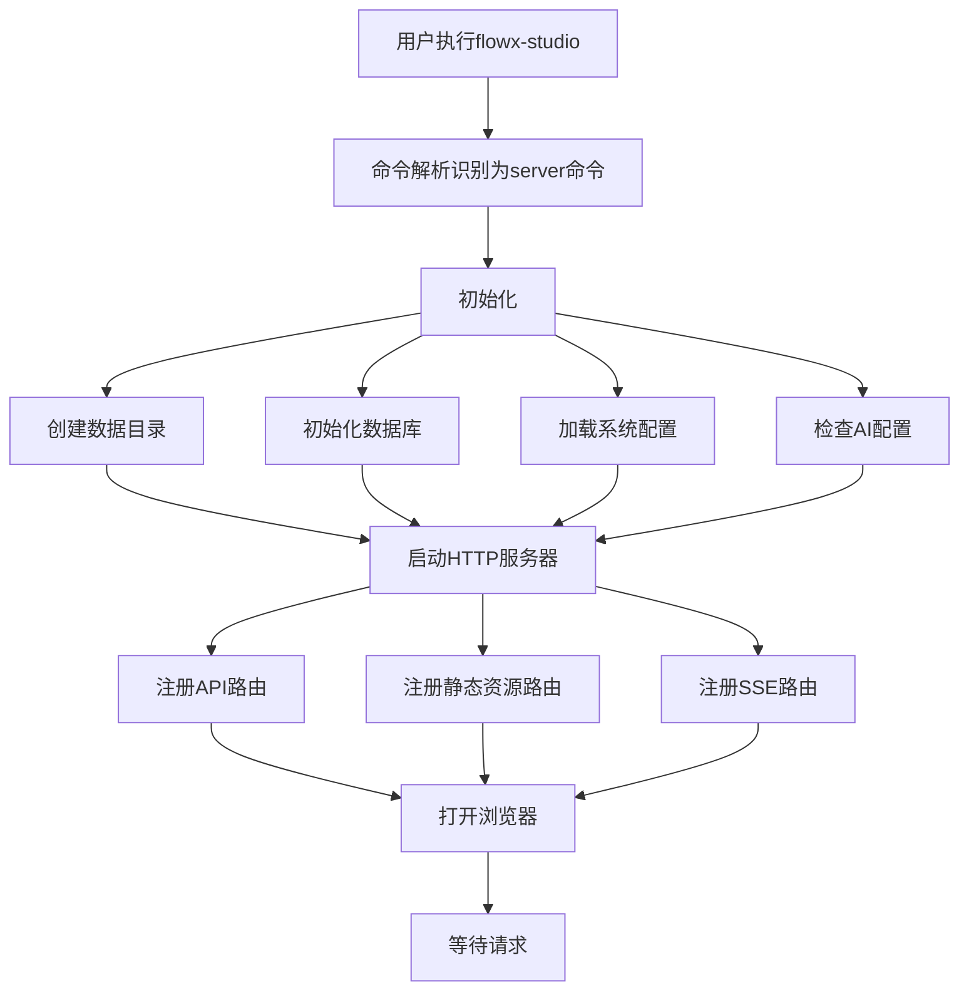

# 8. 运行时与部署设计

## 8.1 单二进制架构

### 8.1.1 设计目标

- **单个文件**：`flowx-studio` 一个二进制文件包含所有功能
- **零依赖**：无需安装 Node.js、Python 等运行时
- **自包含**：前端资源嵌入二进制，无需外部文件
- **快速启动**：3 秒内完成启动并打开浏览器
- **外部引擎**：FlowX 核心引擎通过 Go Module 编译进二进制

### 8.1.2 构建策略

```
┌─────────────────────────────────────────────────────────────┐
│                 flowx-studio binary                          │
│  ┌───────────────────────────────────────────────────────┐  │
│  │  Go 编译的 HTTP 服务器 + 业务逻辑                      │  │
│  │  ┌───────────────────────────────────────────────┐   │  │
│  │  │  前端静态资源 (go:embed web/dist/*)            │   │  │
│  │  │  - index.html                                  │   │  │
│  │  │  - *.js, *.css                                 │   │  │
│  │  │  - assets/                                     │   │  │
│  │  └───────────────────────────────────────────────┘   │  │
│  │  ┌───────────────────────────────────────────────┐   │  │
│  │  │  后端代码                                      │   │  │
│  │  │  - HTTP Server                                 │   │  │
│  │  │  - Business Logic                              │   │  │
│  │  │  - AI Service                                  │   │  │
│  │  │  - DB Layer (SQLite)                           │   │  │
│  │  └───────────────────────────────────────────────┘   │  │
│  └───────────────────────────────────────────────────────┘  │
│  ┌───────────────────────────────────────────────────────┐  │
│  │  FlowX 核心引擎 (通过 go.mod 编译进二进制)              │  │
│  │  github.com/LerkoX/flowx v1.x.x                       │  │
│  └───────────────────────────────────────────────────────┘  │
└─────────────────────────────────────────────────────────────┘
```

### 8.1.3 go:embed 嵌入前端资源

实际实现为 `(*Server).RegisterStatic()`，基于 gin 的 `NoRoute` 处理 SPA 回退（`internal/server/server.go:55-85`）：

```go
package server

//go:embed all:web/dist
var webDist embed.FS

// RegisterStatic 注册静态资源
func (s *Server) RegisterStatic() {
    distFS, err := fs.Sub(webDist, "web/dist")
    if err != nil {
        panic(fmt.Sprintf("failed to create sub fs: %v", err))
    }

    fileServer := http.FileServer(http.FS(distFS))

    s.router.NoRoute(func(c *gin.Context) {
        path := c.Request.URL.Path
        // API 请求不处理
        if strings.HasPrefix(path, "/api/") {
            c.JSON(404, gin.H{"code": 404, "message": "not found"})
            return
        }
        // 尝试打开文件
        cleanPath := strings.TrimPrefix(path, "/")
        if cleanPath == "" {
            cleanPath = "index.html"
        }
        _, err := distFS.Open(cleanPath)
        if err != nil {
            // 文件不存在，返回 index.html（SPA fallback）
            c.Request.URL.Path = "/index.html"
        }
        c.Header("Cache-Control", "no-cache, no-store, must-revalidate")
        fileServer.ServeHTTP(c.Writer, c.Request)
    })
}
```

### 8.1.4 构建流程

```bash
# 1. 构建前端
cd web
npm install
npm run build

# 2. 复制前端产物到 embed 目录
#    （embed 路径是 internal/server/web/dist，见 internal/server/server.go:14）
cd ..
rm -rf internal/server/web/dist
cp -r web/dist internal/server/web/dist

# 3. 构建后端（嵌入前端）
go build -o flowx-studio cmd/flowx-studio/main.go

# 最终产物：单个 flowx-studio 二进制文件
```

也可以直接使用 `make build` 或 `./boot.sh build` 一键完成上述全部步骤（见 Makefile 的 `copy-web` 目标）。

## 8.2 命令行接口（Cobra）

### 8.2.1 技术选型

使用 [spf13/cobra](https://github.com/spf13/cobra) 作为 CLI 框架，配合 [spf13/viper](https://github.com/spf13/viper) 处理配置加载。

**选择理由**：
- 业界标准的 Go CLI 框架，生态成熟
- 内置子命令、参数解析、帮助生成、自动补全
- 与 viper 无缝集成，支持配置文件和环境变量

### 8.2.2 命令设计

实际提供两个子命令（见 `cmd/flowx-studio/main.go:37-61`）：

```bash
# 启动 HTTP 服务（Web UI + API）
flowx-studio server

# 启动 stdio MCP 服务
flowx-studio mcp

# 裸运行：仅打印帮助信息，不启动 server
flowx-studio

# 查看帮助
flowx-studio --help
flowx-studio server --help
flowx-studio mcp --help
```

**注意**：
- 裸运行 `flowx-studio` 不带子命令时只打印帮助，不会启动 server。
- 目前没有 `version` 命令（规划中，未实现）。
- 运行 YAML 工作流的 CLI 功能保留在 FlowX 核心库中（`flowx run workflow.yaml`），不在 flowx-studio 中提供。

### 8.2.3 启动参数

```bash
flowx-studio server [flags]

Flags:
      --port int      HTTP 服务端口 (默认 8080)
      --host string   监听地址 (默认 "0.0.0.0")
```

**说明**（见 `cmd/flowx-studio/main.go:47-48`）：
- 仅有 `--port`、`--host` 两个 flag，没有 `-p`/`-H` 短选项。
- 没有 `--no-open`、`--debug` flag（规划中，未实现）。
- 没有 `--data-dir` flag。数据目录只能通过环境变量 `FLOWX_STUDIO_DATA_DIR` 或配置文件设置。
  ⚠️ 已知问题：`boot.sh` 启动时会向二进制传递 `--data-dir` 参数，但二进制不支持该 flag，会报 `unknown flag` 错误；boot.sh 与二进制存在此不一致。

### 8.2.4 Cobra 实现示例

实际实现（简化自 `cmd/flowx-studio/main.go`）。注意：没有 `versionCmd`、`--config` flag，也没有 `viper.BindPFlag`；flag 仅在显式传参时手动覆盖配置（main.go:96-101），配置加载统一由 `config.Load()` 完成。

```go
package main

import (
    "github.com/spf13/cobra"
)

func main() {
    rootCmd := &cobra.Command{
        Use:   "flowx-studio",
        Short: "FlowX Studio - FlowX runtime viewer with MCP support",
    }

    serverCmd := &cobra.Command{
        Use:   "server",
        Short: "Start the HTTP server",
        RunE:  runServer,
    }
    serverCmd.Flags().Int("port", 8080, "HTTP server port")
    serverCmd.Flags().String("host", "0.0.0.0", "HTTP server host")
    rootCmd.AddCommand(serverCmd)

    mcpCmd := &cobra.Command{
        Use:   "mcp",
        Short: "Start the stdio MCP server",
        RunE:  runMCP,
    }
    rootCmd.AddCommand(mcpCmd)

    if err := rootCmd.Execute(); err != nil {
        log.Fatal(err)
    }
}

func runServer(cmd *cobra.Command, args []string) error {
    cfg, err := config.Load()
    if err != nil {
        return fmt.Errorf("failed to load config: %w", err)
    }

    // flag 仅在显式传入时覆盖配置
    if cmd.Flags().Changed("port") {
        cfg.Server.Port, _ = cmd.Flags().GetInt("port")
    }
    if cmd.Flags().Changed("host") {
        cfg.Server.Host, _ = cmd.Flags().GetString("host")
    }
    // ... 创建数据目录、获取单例锁、启动 HTTP server
}
```

### 8.2.5 配置加载优先级

Cobra + Viper 的配置优先级（高到低）：

1. **命令行参数**：`--port 9090`
2. **环境变量**：`FLOWX_STUDIO_SERVER_PORT=9090`
3. **配置文件**：`~/.flowx-studio/config.yaml`
4. **默认值**：`8080`

```yaml
# ~/.flowx-studio/config.yaml 示例
# 注意：Config 结构仅有 server 和 data 两段（internal/config/config.go:12-15）
server:
  port: 8080
  host: "0.0.0.0"
  no_open: false
  auto_open_browser: true   # 配置项已定义但未接线（规划中，未实现）

data:
  dir: "~/.flowx-studio"
  db_path: "~/.flowx-studio/studio.db"
```

### 8.2.6 环境变量

viper 使用前缀 `FLOWX_STUDIO`，且键中的 `.` 映射为 `_`（`internal/config/config.go:33-35`），实际生效的环境变量为：

| 变量名 | 说明 | 默认值 |
|--------|------|--------|
| `FLOWX_STUDIO_SERVER_PORT` | HTTP 服务端口 | 8080 |
| `FLOWX_STUDIO_SERVER_HOST` | 监听地址 | 0.0.0.0 |
| `FLOWX_STUDIO_SERVER_NO_OPEN` | 不自动打开浏览器 | false |
| `FLOWX_STUDIO_DATA_DB_PATH` | 数据库文件路径 | ~/.flowx-studio/studio.db |
| `FLOWX_STUDIO_DATA_DIR` | 数据目录 | ~/.flowx-studio |

## 8.3 进程管理

### 8.3.1 启动流程



### 8.3.2 优雅关闭

实际实现使用 `signal.NotifyContext` 监听 `SIGINT`/`SIGTERM`，关闭超时为 **5 秒**（`cmd/flowx-studio/main.go:120-154`）：

```go
func runServer(cmd *cobra.Command, args []string) error {
    // ... 初始化配置、单例锁、服务

    ctx, stop := signal.NotifyContext(context.Background(), os.Interrupt, syscall.SIGTERM)
    defer stop()

    go func() {
        if err := srv.Start(); err != nil && !errors.Is(err, http.ErrServerClosed) {
            log.Printf("HTTP server error: %v", err)
        }
        stop()
    }()

    <-ctx.Done()

    // 优雅关闭（5 秒超时）
    shutdownCtx, cancel := context.WithTimeout(context.Background(), 5*time.Second)
    defer cancel()

    if err := srv.Shutdown(shutdownCtx); err != nil {
        log.Printf("HTTP server shutdown error: %v", err)
    }
    return nil
}
```

### 8.3.3 单实例机制

通过 PID 文件实现进程级单例锁（`internal/singleton/lock.go:26-38`）。与"检测到已有实例就报错退出"不同，实际行为是**杀死旧进程并接管**：

```go
lock := singleton.New(filepath.Join(cfg.Data.Dir, "flowx-studio.pid"), "server")
if err := lock.Acquire(); err != nil {
    return fmt.Errorf("failed to acquire singleton lock: %w", err)
}
defer lock.Release()
```

`Acquire()` 的行为：

1. 读取 PID 文件，通过 `/proc/<pid>/cmdline` 判断对应进程是否仍是 `flowx-studio server`（按子命令名匹配，避免误杀 `mcp` 等其他子命令进程）。
2. 若已有同子命令实例在运行：先发送 `SIGTERM` 请求其优雅退出，最多等待 5 秒；若仍未退出则发送 `SIGKILL` 强制杀死。
3. 写入当前进程 PID，完成接管。

`Release()` 在退出时删除 PID 文件。

## 8.4 数据目录结构

```
~/.flowx-studio/
├── studio.db              # SQLite 数据库
├── flowx-studio.pid       # 进程 ID 文件（单例锁，cmd/flowx-studio/main.go:108）
└── config.yaml            # 可选：外部配置文件
```

**说明**：
- 没有自动备份逻辑（无 `studio.db.backup`）。
- 没有 `logs/` 目录，日志仅输出到控制台。
- 没有 `nodes/` 节点代码缓存目录。
- Mock 测试的临时目录创建在系统临时目录下（`$TMPDIR/flowx_mock_*`，见 `internal/sandbox/executor.go:42,79`），执行完成后立即清理，不在数据目录中。

## 8.5 自动浏览器打开（规划中，未实现）

> ⚠️ 本节描述的功能均未实现：全仓库没有打开浏览器的代码，配置项 `auto_open_browser` / `no_open` 已定义但未接线。以下为**目标设计**。

### 8.5.1 实现机制（规划中，未实现）

```go
func openBrowser(url string) error {
    var cmd string
    var args []string
    
    switch runtime.GOOS {
    case "darwin":
        cmd = "open"
        args = []string{url}
    case "windows":
        cmd = "rundll32"
        args = []string{"url.dll,FileProtocolHandler", url}
    default: // linux
        cmd = "xdg-open"
        args = []string{url}
    }
    
    return exec.Command(cmd, args...).Start()
}
```

### 8.5.2 启动时机（规划中，未实现）

- 服务器成功启动后（端口监听就绪）
- 延迟 500ms 确保服务完全初始化
- 仅在桌面环境自动打开（检测 `DISPLAY` 环境变量等）
- 可通过 `FLOWX_STUDIO_SERVER_NO_OPEN=true` 禁用（配置键 `server.no_open` 已定义但未接线）

## 8.6 日志系统（规划中，未实现）

> ⚠️ 本节描述的分级、文件输出与日志轮转均未实现。当前实现仅使用标准库 `log.Printf` 输出到控制台。以下为**目标设计**。

### 8.6.1 日志分级（规划中，未实现）

| 级别 | 用途 | 输出位置 |
|------|------|---------|
| DEBUG | 开发调试信息 | 控制台（debug 模式） |
| INFO | 正常运行信息 | 控制台 + 文件 |
| WARN | 警告信息 | 控制台 + 文件 |
| ERROR | 错误信息 | 控制台 + 文件 |
| FATAL | 致命错误 | 控制台 + 文件，程序退出 |

### 8.6.2 日志格式（规划中，未实现）

```
2025-01-20T10:00:00.123+0800 [INFO] [server] HTTP server started on :8080
2025-01-20T10:00:01.456+0800 [INFO] [browser] Opened browser at http://localhost:8080
2025-01-20T10:05:00.789+0800 [INFO] [execution] Execution 42 started for workflow 8
2025-01-20T10:05:02.012+0800 [INFO] [node] Node 'download' started
2025-01-20T10:05:32.345+0800 [INFO] [node] Node 'download' completed in 30.333s
```

### 8.6.3 日志轮转（规划中，未实现）

- 日志文件最大 10MB
- 保留最近 5 个日志文件
- 使用 lumberjack 库实现

## 8.7 版本管理与核心库依赖

### 8.7.1 Go Module 依赖策略

flowx-studio 通过 Go Module 引入 FlowX 核心库：

```go
// go.mod（当前实际内容节选）
module github.com/LerkoX/flowx-studio

go 1.25.0

// 开发期使用本地路径 replace，指向本地 flowx 仓库
replace github.com/LerkoX/flowx => ../flowx

require (
    github.com/LerkoX/flowx v0.0.0-20260527104758-c693505dcf32 // 伪版本占位
    // ... 其他依赖
)
```

**当前状态**：开发期通过 `replace => ../flowx` 指向本地 FlowX 仓库，`require` 中的版本为伪版本占位，不代表真实发布的 tag。**发布前需移除 replace 指令并替换为正式版本 tag**。

**版本锁定原则**：
- flowx-studio 的 `go.mod` 中明确指定 FlowX 的版本 tag（如 `v1.2.0`）
- 不依赖 FlowX 的 `main` 分支或 `latest` 标签，确保构建可复现
- 每次升级 FlowX 版本前，先在开发环境验证兼容性

**版本升级流程**：
1. FlowX 核心库发布新 tag（如 `v1.3.0`）
2. flowx-studio 在 feature 分支升级依赖版本
3. 运行集成测试验证
4. 合并到 main 分支并发布 flowx-studio 新版本

### 8.7.2 核心库接口评估结论

经过对 FlowX 核心库代码的审阅，现有接口**基本满足** flowx-studio 的需求，但有以下**建议增强**：

| 能力 | 现有支持 | 评估结论 |
|------|---------|---------|
| 工作流执行 | `Runtime.RunAsync/RunSync` | 满足 |
| 执行取消 | `Runtime.Cancel` | 满足 |
| 暂停/恢复 | `Runtime.Pause/Resume` | 满足 |
| 状态查询 | `Runtime.Get(id)` + `Pipeline.Status()` | 满足 |
| 节点状态 | `Node.GetRuntimeStatus()` | 满足 |
| 事件监听 | `dag.Listener` 接口 | 满足，`Pipeline.CurrentNode()` 已提供节点上下文 |
| 日志捕获 | `logger.Pusher` 接口 | 满足，`Entry` 包含 Node 字段 |
| 执行输出 | 通过 `NodeRuntimeStatus.Steps[].Output` | 满足 |

**说明**：此前评估中提到的"`dag.Listener.Handle(p Pipeline, event Event)` 缺少节点上下文信息"问题已解决——FlowX 已实现 `Pipeline.CurrentNode()` 与 `Pipeline.GetParam()`，并已在 `RuntimeAdapter` 事件桥接中实际使用（`internal/runtime/adapter.go:142,152,157,169,182`）。

详见 [10-core-deps.md](./10-core-deps.md) 完整评估报告。

## 8.8 配置加载优先级

配置来源按优先级排序（高优先级覆盖低优先级）：

1. **命令行参数**：`--port 9090`
2. **环境变量**：`FLOWX_STUDIO_SERVER_PORT=9090`
3. **配置文件**：`~/.flowx-studio/config.yaml`
4. **默认值**：`8080`

配置文件格式与可用环境变量的完整说明见 [8.2.5 配置加载优先级](#825-配置加载优先级) 与 [8.2.6 环境变量](#826-环境变量)，此处不再重复。

## 8.9 运行时事件与元数据

### 8.9.1 事件桥接（EventBridge）

`RuntimeAdapter` 实现了 `dag.Listener` 接口，把 FlowX 流水线事件转换为 `ExecutionEvent`，再通过事件总线持久化并转发到 SSE 客户端：

| 事件类型 | 来源 | 处理逻辑 |
|----------|------|----------|
| `execution_start` | `PipelineStart` | 记录执行开始，收集并保存渲染后参数 |
| `node_start` | `PipelineNodeStart` | 插入/更新 `execution_nodes` 为 `running` |
| `node_complete` | `PipelineNodeFinish/Failed` | 更新节点状态、耗时 |
| `execution_complete` | `PipelineFinish` | 更新执行状态、耗时，保存运行时元数据 |

### 8.9.2 运行时元数据

为了在前端“元数据”面板展示“执行时的真实信息”，`WorkflowService` 在执行生命周期中收集并持久化：

- **渲染后参数**：通过 `Pipeline.GetParam()` 从 FlowX 引擎获取（FlowX 已提供该方法，`internal/runtime/adapter.go:142,152`）。
- **运行时 metadata**：通过 `Pipeline.Metadata()` 获取节点输出、中间结果等。
- **状态 / 错误 / 耗时**：从事件和 DB 中汇总。

这些数据在执行结束时合并为 JSON，保存到 `executions.metadata_json`。

示例结构：

```json
{
  "status": "success",
  "trigger": "manual",
  "params": {
    "env": "production",
    "appName": "myapp"
  },
  "metadata": {
    "Build.output": "build done",
    "Test.output": "all tests passed"
  },
  "error": ""
}
```

### 8.9.3 日志桥接（LogPusher）

`LogPusher` 实现 FlowX 的 `logger.Pusher` 接口，把日志 `Entry` 写入 `execution_logs` 表并推送到 SSE：

- 通过 `pipelineMap` 把 FlowX pipeline 内部 ID 映射到 execution ID。
- `Entry` 中的 `Node` 字段用于记录 `node_id` / `node_name`。
- SSE 客户端收到 `execution.log` 事件后追加到 `executionStore.executionLog`。

### 8.9.4 单例锁与优雅关闭

- 启动时写入 `~/.flowx-studio/flowx-studio.pid`，若已存在则优雅终止旧进程。
- 收到 `SIGINT`/`SIGTERM` 后：
  1. 调用 `http.Server.Shutdown()` 关闭 HTTP 服务。
  2. 停止 FlowX Runtime 后台循环。
  3. 删除 PID 文件并退出。
