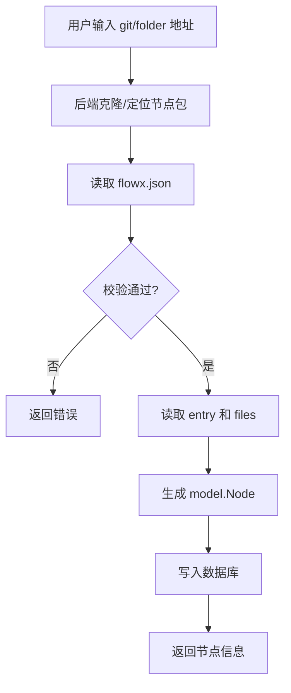

# 11. FlowX 节点包规范（flowx.json）

> 本文档定义 FlowX Studio 的节点包（Node Package）格式 `flowx.json`，以及节点导入、参数注入和运行时展开规则。

## 11.1 背景与目标

> **历史背景**：早期节点导入未真正打通——前端 `NodeManagerPage` 只是本地模拟，后端也只保存 `source_type/source_url/source_path`，不会解析来源。目前导入链路已完全实现：后端 `internal/service/node_import.go` 解析 `flowx.json`、`internal/handler/node_handler.go` 提供 `POST /api/v1/nodes/import`，前端 `NodeImportModal` + `nodeService.ts` + `NodeManagerPage` 已对接真实接口。

为了把外部节点真正导入系统，需要一份标准的节点包清单。该清单应定义：

- 节点元信息（名称、描述、版本、作者等）
- 节点运行时（语言、入口、镜像、执行器）
- 节点所需参数及参数使用方式
- 节点输出及提取方式

同时明确以下约束：

- `flowx.json` 与代码文件**同级目录**，不做代码内联
- 参数注入同时支持 `env` 环境变量映射和 `run` 命令模板，但 **`env` 优先**
- 节点包格式使用 **JSON**（`flowx.json`），原因见 [11.10 节](#1110-为什么使用-json-而不是-flowxyaml)

## 11.2 设计原则

1. **包即目录**：一个节点包是一个目录，包含 `flowx.json` 和若干代码文件
2. **清单与代码分离**：`flowx.json` 只描述元信息，不内联代码
3. **可映射到现有模型**：导入后可直接生成 `model.Node`（`internal/model/model.go:71-111`）
4. **可展开到 FlowX 核心**：运行时能把节点包展开为 `flowx/core.NodeConfig`（`flowx/core/config.go:113-124`）
5. **参数注入统一**：优先使用环境变量，兼容命令行模板
6. **不感知 pipeline 实例**：节点包模板只引用 `{{ Param.* }}`，不引用 pipeline 中的节点实例 ID；上游数据通过参数声明（可附 `source` 推荐来源）+ pipeline 层 `config.params` 接线传入（见 [11.7 节](#117-参数注入规则)）

## 11.3 文件布局

一个节点包目录示例：

```
image-downloader/
├── flowx.json
├── main.py
├── utils.py
├── requirements.txt
├── mock.py
└── ui/                  # 可选：自定义 UI 组件（见 11.13 节）
    └── node-widget.js
```

- `flowx.json`：节点包清单（必需）
- `main.py`：入口文件（由 `entry` 指定）
- `utils.py`：其他依赖文件（由 `files` 列出）
- `requirements.txt`：依赖文件（可选，可被 `requirements` 字段覆盖）
- `mock.py`：Mock 测试入口（由 `mock.entry` 指定）
- `ui/node-widget.js`：自定义 UI 组件 bundle（可选，由 `ui.entry` 指定）

## 11.4 flowx.json Schema

### 11.4.1 完整示例

```json
{
  "name": "download-image",
  "displayName": "下载图片",
  "description": "从 URL 下载图片并返回文件路径",
  "version": "1.0.0",
  "author": "flowx-team",
  "tags": ["image", "download"],
  "icon": "🖼️",
  "language": "python",
  "entry": "main.py",
  "files": ["utils.py"],
  "image": "python:3.11-slim",
  "executor": {
    "type": "docker",
    "config": {
      "workdir": "/app",
      "volumes": ["/tmp:/tmp"]
    }
  },
  "requirements": ["requests"],
  "parameters": [
    {
      "name": "url",
      "type": "string",
      "description": "图片 URL，支持 http/https 直链",
      "required": true,
      "source": {
        "nodeRef": "resolve-url",
        "output": "url",
        "description": "推荐由链接解析节点的 url 输出提供"
      }
    },
    {
      "name": "timeout",
      "type": "integer",
      "description": "超时秒数",
      "required": false,
      "default": 30
    }
  ],
  "env": {
    "URL": "{{ Param.url }}",
    "TIMEOUT": "{{ Param.timeout }}"
  },
  "run": "python3 main.py",
  "outputs": [
    { "name": "file_path", "type": "string", "description": "下载后的文件路径" },
    { "name": "size_bytes", "type": "integer", "description": "文件大小" }
  ],
  "extract": {
    "type": "codec-block"
  },
  "mock": {
    "enabled": true,
    "entry": "mock.py"
  },
  "ui": {
    "entry": "ui/node-widget.js",
    "width": 280,
    "height": 140,
    "collapsed": false,
    "apiVersion": 1
  },
  "timeout": 60
}
```

### 11.4.2 字段说明

| 字段 | 类型 | 必填 | 说明 |
|------|------|------|------|
| `name` | string | 是 | 节点唯一标识，字母开头，支持 snake_case 或 kebab-case（正则 `^[a-zA-Z][a-zA-Z0-9_-]*$`） |
| `displayName` | string | 否 | 展示名称 |
| `description` | string | 否 | 功能描述 |
| `version` | string | 否 | 版本号，如 `1.0.0` |
| `author` | string | 否 | 作者 |
| `tags` | string[] | 否 | 标签 |
| `icon` | string | 否 | 图标，如 `🖼️` |
| `language` | string | 是 | 运行语言：`python` / `go` / `bash` / `node` 等 |
| `entry` | string | 是 | 入口文件，如 `main.py` |
| `files` | string[] | 否 | 需要一起拷贝的其他同级文件 |
| `image` | string | 否 | Docker 镜像；若指定，默认使用 `docker` 执行器 |
| `executor.type` | string | 否 | 执行器类型：`local` / `docker` / `k8s`；默认根据 `image` 推断 |
| `executor.config` | object | 否 | 执行器配置，透传给 FlowX 执行器（`flowx/executor/local/adapter.go:23-32`、`flowx/executor/docker/adapter.go:23-32`） |
| `requirements` | string[] | 否 | 依赖列表；若不填，可尝试读取 `requirements.txt` |
| `parameters` | Parameter[] | 是 | 参数定义（`description` 应详细描述所需数据；可用 `source` 标注推荐来源节点包 + 输出字段） |
| `env` | map<string, string> | 否 | 参数 → 环境变量映射，值支持模板表达式 |
| `run` | string | 否 | 执行命令模板；不填则按 `language + entry` 生成默认命令 |
| `outputs` | Output[] | 否 | 输出字段声明 |
| `extract` | ExtractConfig | 否 | 输出提取方式：`codec-block` 或 `regex` |
| `mock` | MockConfig | 否 | Mock 测试配置 |
| `ui` | UIConfig | 否 | 节点自定义 UI 组件（module 模式），见 [11.13 节](#1113-节点自定义-ui-组件module-模式) |
| `timeout` | int | 否 | 默认超时秒数 |

#### Parameter

```json
{
  "name": "url",
  "type": "string",
  "description": "图片 URL，支持 http/https 直链",
  "required": true,
  "default": "https://example.com/default.jpg",
  "source": {
    "nodeRef": "resolve-url",
    "output": "url",
    "description": "推荐由链接解析节点的 url 输出提供"
  }
}
```

- `name`：参数名，唯一
- `type`：`string` / `integer` / `float` / `boolean` / `array` / `object`
- `description`：**应详细描述参数需要的数据**（格式、取值范围、单位等），这是 pipeline 编排时接线的依据
- `required`：是否必填
- `default`：默认值
- `source`（可选）：推荐数据来源，见下

##### ParamSource（推荐数据来源）

节点包**不允许**在模板中引用上游节点实例 ID（见 [11.7 节](#117-参数注入规则)）。为了让外部数据以参数形式接入，参数可声明 `source` 提示编排者（人或 AI）该参数推荐由哪个节点的哪个输出提供：

| 字段 | 类型 | 必填 | 说明 |
|------|------|------|------|
| `source.nodeRef` | string | 是 | 推荐来源**节点包名**（如 `get-weather`），不是 pipeline 中的节点实例 ID |
| `source.output` | string | 是 | 推荐来源节点的输出字段名（如 `city`） |
| `source.description` | string | 否 | 补充说明 |

`source` 只是接线建议，不产生任何运行时行为；真正的接线发生在 pipeline YAML 的 `config.params` 中（见 [11.7 规则 5](#规则-5pipeline-层接线configparams)）。

#### Output

```json
{
  "name": "file_path",
  "type": "string",
  "description": "下载后的文件路径"
}
```

#### ExtractConfig

```json
{
  "type": "codec-block"
}
```

或

```json
{
  "type": "regex",
  "patterns": {
    "coverage": "coverage: (\\d+\\.\\d+)%"
  }
}
```

#### MockConfig

```json
{
  "enabled": true,
  "entry": "mock.py"
}
```

#### UIConfig

```json
{
  "entry": "ui/node-widget.js",
  "width": 280,
  "height": 140,
  "collapsed": false,
  "apiVersion": 1
}
```

| 字段 | 类型 | 必填 | 说明 |
|------|------|------|------|
| `ui.entry` | string | 是 | 组件 bundle 文件（包内相对路径的单文件 `.js`），导入时随节点入库 |
| `ui.width` / `ui.height` | int | 否 | 内嵌区域尺寸（px），供画布布局占位，默认 260×120 |
| `ui.collapsed` | bool | 否 | 移动端是否默认收起，缺省视为 true |
| `ui.apiVersion` | int | 否 | 组件契约版本，当前固定为 1 |

## 11.5 导入流程



后端导入服务建议放在 `internal/service/node_import.go`：

1. 接收 `source_type`（`git` / `folder`）和 `source_url` / `source_path`
2. 对于 `git`，使用临时目录 clone
3. 读取并解析 `flowx.json`
4. 校验必填字段、参数类型、文件存在性
5. 读取 `entry` 文件内容 → `Node.Code`
6. 读取 `files` 列表 → `Node.Files`（新增 JSON 字段）
7. 若 `requirements` 为空且存在 `requirements.txt`，读取其内容
8. 若 `mock.enabled` 为真，读取 `mock.entry` 内容 → `MockConfig`
9. 若声明了 `ui.entry`，校验并读取组件 bundle 内容存入 `Files`（见 [11.13 节](#1113-节点自定义-ui-组件module-模式)）
10. 生成 `model.Node` 并调用 `NodeService.Create`
11. 清理临时目录

新增 API 接口：

```http
POST /api/v1/nodes/import
Content-Type: application/json

{
  "source_type": "git",
  "source_url": "https://github.com/xxx/image-downloader.git"
}
```

节点 UI 组件 bundle 静态服务（见 [11.13 节](#1113-节点自定义-ui-组件module-模式)）：

```http
GET /api/v1/nodes/:id/ui/*filepath
```

## 11.6 字段映射

### 11.6.1 映射到 model.Node

| flowx.json | model.Node 字段 |
|------------|-----------------|
| `name` | `Name` |
| `displayName` | `DisplayName` |
| `description` | `Description` |
| `version` | `Version` |
| `author` | `Author` |
| `tags` | `Tags` |
| `icon` | `Icon` |
| `language` | `Language` |
| `entry` | `Entry` |
| `entry` 文件内容 | `Code` |
| `files` 文件内容 | 新增 `Files`（JSON map） |
| `image` | `Image` / `DockerConfig.Image` |
| `executor.config` | `DockerConfig`（仅提取 `workdir` 字段） |
| `executor`（完整配置） | `PackageConfig.Executor`（原样保存，运行时透传给 FlowX 执行器） |
| `requirements` | `Requirements` |
| `parameters` | `Parameters` |
| `outputs` | `Outputs` |
| `mock` | `MockConfig` |
| `ui` | `PackageConfig.UI`（原样保存；`Node.UI` 透出给 API） |
| `ui.entry` 文件内容 | `Files`（以 ui.entry 路径为 key） |
| `source_type` | `SourceType` |
| `source_url` / `source_path` | `SourceURL` / `SourcePath` |

`NodeType` 规则：

- `entry` 恒必填（`node_import.go` 导入校验强制要求），因此 `NodeType = "code"`
- image-only 节点（无 `entry` 仅有 `image`）暂不支持导入；`image` 字段仅用于指定 Docker 执行镜像

### 11.6.2 运行时展开为 flowx/core.NodeConfig

节点包在运行时应展开为 FlowX 核心可识别的 `NodeConfig`：

```yaml
DownloadImage:
  name: "下载图片"
  executor: docker
  image: python:3.11-slim
  steps:
    - name: run
      run: |
        export URL="https://example.com/img.jpg"
        export TIMEOUT="30"
        python3 main.py
  extract:
    type: codec-block
```

展开规则：

1. 生成 `export` 环境变量注入行（见 [11.7 节](#117-参数注入规则)）；若 pipeline YAML 的节点 `config.params` 提供了绑定，先将 env/run 中的 `Param.<name>` 引用替换为绑定值（保留过滤器）
2. 追加 `run` 命令；若未指定 `run`，则按 `language + entry` 生成默认命令
3. 将 `entry` 和 `files` 写入执行器工作目录
4. 透传 `image` 和 `executor.config`
5. 透传 `extract` 配置

展开逻辑建议放在 `internal/runtime/adapter.go` 或新增 `internal/runtime/node_expander.go`。

## 11.7 参数注入规则

参数注入优先使用 `env`，其次使用 `run` 模板，最后回退到默认 `FLOWX_PARAM_*` 环境变量。

**核心约束：flowx.json 中的 `env`/`run` 模板只允许引用 `{{ Param.* }}` 或常量字面量，禁止引用上游节点实例 ID**（如 `{{ GetWeather.city }}`）。原因：

- 同一节点包（如 `get-weather`）在一条 pipeline 中可能存在多个实例，实例 ID 由 pipeline YAML 的 `Nodes` map 键决定，节点包无法预知
- 实例 ID 可能随 pipeline 编辑而变化，节点包对其硬编码会造成脆性耦合

外部数据一律通过参数传入：节点包在 `parameters` 中声明所需数据（`description` 详细描述数据要求，可选 `source` 标注推荐来源节点），由 pipeline YAML 完成实际接线（规则 5）。

### 规则 1：env 优先

如果 `flowx.json` 中定义了 `env`，则按 env 生成环境变量注入：

```json
"env": {
  "URL": "{{ Param.url }}",
  "TIMEOUT": "{{ Param.timeout }}"
}
```

展开后：

```bash
export URL="<求值后的 Param.url>"
export TIMEOUT="<求值后的 Param.timeout>"
```

`env` 的值支持的模板表达式：

- `{{ Param.name }}`：节点参数（**唯一允许的变量来源**），可接过滤器，如 `{{ Param.forecasts | toYaml }}`
- 常量字符串 / 数字 / 布尔字面量

**不允许**：`{{ GetWeather.city }}` 等任何节点实例 ID 引用（导入校验会报错）。也不存在 `{{ Metadata.UpNode.field }}` 语法。

### 规则 2：run 模板

如果定义了 `run`，则追加在 env 注入之后。`run` 中同样只允许 `{{ Param.name }}` 模板。

示例：

```json
"run": "python3 main.py --url '{{ Param.url }}'"
```

### 规则 3：默认 env 回退

如果 `env` 未定义，则为每个 `parameter` 自动生成默认环境变量：

```bash
export FLOWX_PARAM_URL="<值>"
export FLOWX_PARAM_TIMEOUT="<值>"
```

注意：`NodeService.MockTest`（`internal/service/node.go`）同样以 `FLOWX_PARAM_` 前缀注入环境变量，并额外保留裸大写参数名（如 `URL`）作为兼容别名——Mock 与运行时展开的变量名已统一（2026-08-17 修复）。

### 规则 4：默认 run 命令

如果 `run` 未定义，则根据 `language` 和 `entry` 生成默认命令：

| language | 默认 run |
|----------|----------|
| `python` | `python3 <entry>` |
| `go` | `go run <entry>` |
| `bash` | `bash <entry>` |
| `node` | `node <entry>` |

### 规则 5：pipeline 层接线（config.params）

节点包只面向 `Param` 编程，上游节点数据在 pipeline YAML 中通过节点 `config.params` 绑定：

```yaml
Nodes:
  GetWeather:                 # 节点实例 ID，pipeline 作者自定义
    name: 获取天气
    config:
      nodeRef: get-weather    # 引用节点包
      params:
        city: 深圳             # 常量绑定
  SendFeishu:
    name: 发送飞书通知
    config:
      nodeRef: send-feishu
      params:
        weatherCity: "{{ GetWeather.city }}"          # 引用本 pipeline 中的实例 ID
        weatherForecasts: "{{ GetWeather.forecasts }}"
```

展开规则（`internal/runtime/node_expander.go` 的 `applyParamBindings`）：

1. 绑定值是模板（`{{ GetWeather.city }}`）时，取其内部表达式替换 env/run 中的 `Param.<name>` 引用，**保留后续过滤器**：`{{ Param.weatherForecasts | toYaml }}` → `{{ GetWeather.forecasts | toYaml }}`；替换后的模板在节点执行时以完整上下文渲染，上游输出正常解析
2. 绑定值是常量时，替换为字符串字面量：`{{ Param.title }}` → `{{ "每日播报" }}`
3. 未在 `config.params` 中绑定的参数保留 `{{ Param.<name> }}` 引用，运行时由 pipeline 级 `Param` / `pipeline run --params` 解析
4. 绑定未声明的参数名会在展开时报错（`config.params references undeclared parameter ...`）

编排者（人或 AI）可依据参数上的 `source` 提示（`nodeRef` 节点包名 + `output` 输出字段）找到 pipeline 中对应节点包的实例，生成上述 `params` 绑定。

## 11.8 Mock 测试

当 `mock.enabled` 为 `true` 时：

1. 读取 `mock.entry` 文件内容
2. 存入 `Node.MockConfig`（`enabled: true, entry: <文件名>`）
3. Mock 测试时复用与真实运行相同的参数注入逻辑
4. 运行的是 mock 入口文件而非 `entry`

Mock 测试入口 API 仍使用 `POST /api/v1/nodes/:id/mock`。

## 11.9 API 与前端改动

### 后端

1. 新增 `internal/service/node_import.go`：导入核心逻辑
2. 新增 `internal/handler/node_import_handler.go`：`POST /api/v1/nodes/import`
3. 扩展 `model.Node`：新增 `Files` JSON 字段
4. 扩展 `sandbox.Executor`：支持多文件写入/挂载
5. 扩展 `internal/runtime/adapter.go`：实现节点包 → `NodeConfig` 展开

### 前端

1. `NodeImportModal` 移除 `image` 类型，只保留 `git` / `folder`
2. `NodeManagerPage.handleAddNode` 改为调用 `POST /api/v1/nodes/import`
3. 导入完成后刷新节点列表

## 11.10 为什么使用 JSON 而不是 flowx.yaml

推荐 `flowx.json`，不推荐使用 `flowx.yaml` 作为节点包清单。

| 维度 | JSON | YAML |
|------|------|------|
| 解析与校验 | 原生支持，可配 JSON Schema | 需要额外解析器，易受缩进影响 |
| 版本控制 | 差异清晰，格式歧义少 | 多行字符串和注释差异较乱 |
| 代码分离 | 适合作为清单，代码放在独立文件 | 容易诱使内联代码 |
| 概念混淆 | 生态中 `flowx-yaml` 已表示“输出提取块” | `flowx.yaml` 容易与输出格式混淆 |
| 工具链对齐 | 与 `flowx-studio` JSON API 和 TS 类型天然对齐 | FlowX 核心流水线配置是 YAML，但那是 pipeline，不是 node package |

节点包是“清单 + 同级代码文件”的结构，JSON 是最自然的 manifest 格式。

## 11.11 校验规则

导入时必须校验：

1. `name` 必填，字母开头，支持 snake_case 或 kebab-case（正则 `^[a-zA-Z][a-zA-Z0-9_-]*$`）
2. `language` 必填且在支持列表内（`python` / `go` / `bash` / `node` 等）
3. `entry` 必填且文件存在
4. `files` 中列出的文件必须存在
5. `parameters` 中 `name` 唯一，`type` 合法；`source` 若存在，`source.nodeRef` 必须为合法节点包名（正则同上）且 `source.output` 非空
6. `env` 和 `run` 中的 `{{ ... }}` 模板表达式只允许引用 `{{ Param.* }}` 或字面量，禁止引用节点实例 ID（如 `{{ GetWeather.city }}`），违反时导入失败并提示改用参数 + `config.params` 接线
7. ~~如果 `image` 为空且 `executor.type` 为 `docker`，导入失败~~（**未在代码中实现**：`node_import.go` 仅校验 `executor.type` 类型名合法性，不检查 `image` 是否配置）
8. `mock.entry` 若存在，文件必须存在
9. 节点名称唯一（数据库唯一约束）
10. `ui` 若存在：`ui.entry` 必填且为包内相对路径的单文件 `.js`（禁止绝对路径与 `..` 穿越），文件必须存在且大小 ≤ 10MB，`ui.apiVersion` 缺省或为 1

## 11.12 实现任务（已全部完成 ✅）

- [x] 新增 `model.Node.Files` 字段并创建数据库迁移（迁移 005）
- [x] 实现 `internal/service/node_import.go` 导入服务
- [x] 实现 `POST /api/v1/nodes/import` 接口（`node_handler.go`）
- [x] 扩展 `sandbox.Executor` 支持多文件写入（`executor.go`）
- [x] 实现节点包 → `flowx/core.NodeConfig` 展开逻辑（`internal/runtime/node_expander.go`）
- [x] 更新前端 `NodeImportModal` 和 `NodeManagerPage`
- [x] 为导入流程编写单元测试和端到端测试（`node_import_test.go`、`internal/cli/import_node_test.go`）
- [x] 节点自定义 UI 组件（module 模式）：`ui` 字段解析与校验、bundle 静态服务、画布内嵌渲染（见 11.13 节）

## 11.13 节点自定义 UI 组件（module 模式）

节点包可携带一个**预编译的单文件 JS bundle**作为自定义 UI 组件，在 FlowX Studio 画布节点卡片中内嵌渲染，替代默认的“入参/返回”摘要展示。

### 11.13.1 工作原理

1. 节点包在 `flowx.json` 中声明 `ui.entry`（包内相对路径的单文件 `.js`）
2. 导入时校验（见 11.11 规则 10）并将 bundle 内容存入 `Node.Files`
3. 前端画布解析 pipeline YAML 的 `config.nodeRef`，匹配节点包后发现 `ui` 配置，
   通过 `GET /api/v1/nodes/:id/ui/<entry>?v=<updatedAt>` 动态加载 bundle
4. 在节点卡片内嵌容器上调用 bundle 的 `mount(el, props)`；节点数据变化时调 `update(props)`；卸载时调 `unmount()`

bundle 格式不限制：ESM 默认导出 `mount` 函数，或 IIFE/UMD 加载后调用
`window.FlowXNodeWidget.define(mount)` 注册。同一 bundle URL 全局只加载一次
（模块级缓存 + 串行加载队列）；`?v=` 参数做缓存破坏，重新导入后自动生效。

### 11.13.2 组件契约（apiVersion 1）

```ts
type NodeWidgetMount = (el: HTMLElement, props: NodeWidgetProps) => NodeWidgetHandle | void

interface NodeWidgetHandle {
  update?: (props: NodeWidgetProps) => void   // 数据变化时调用（整体推送，不做 diff）
  unmount?: () => void                        // 节点卸载时调用
}

interface NodeWidgetProps {
  nodeId: string                // pipeline 中的节点实例 ID
  nodeRef: string               // 节点包名
  status: 'idle' | 'running' | 'success' | 'failed' | 'skipped'
  inputs: string[]              // 节点入参参数名
  outputs: Record<string, string>  // 节点运行时输出
  execution: {                  // 流水线执行实例实时 metadata（SSE 驱动）；无运行实例时为 null
    id: string
    status: 'pending' | 'running' | 'success' | 'failed' | 'cancelled'
    trigger?: string
    startedAt?: string
    completedAt?: string
    durationMs?: number
    errorMessage?: string
    errorNodeId?: string
    metadata?: Record<string, unknown>
  } | null
  theme: 'dark'                 // 预留
  locale: string                // 预留
}
```

契约为**只读**：组件不能回调 Studio，不暴露认证 token。未来如需交互能力，以
`apiVersion: 2` 新增 `actions` 演进。

类型定义与 React 开发模板见 `templates/node-widget/`（Vite 单文件构建）；免构建
原生 DOM 示例见 `tests/e2e/testdata/ui-demo-node/ui/node-widget.js`。

### 11.13.3 安全说明

module 模式本质是在 Studio 前端上下文执行节点包携带的任意 JS（可访问
localStorage、auth token、Studio 内部状态），**只应导入可信来源的节点包**。
节点详情弹窗对含自定义 UI 的节点有明确标记。前端对加载/mount/update/unmount
各阶段做 try/catch 兜底：失败时内嵌区域显示警示条，不影响节点卡片其余部分。

### 11.13.4 前端渲染细节

- `ModuleNodeWidget`（`web/src/components/ModuleNodeWidget.tsx`）：加载缓存、
  挂载句柄管理、错误兜底；容器带 `nodrag nowheel` class 防止画布拖拽/滚轮误触
- `GlowNode`：有 `ui` 的节点按 `ui.width/height` 撑开卡片；桌面端原生“入参/返回”
  摘要折叠为「查看数据」开关；移动端组件按 `ui.collapsed` 默认收起
- `AutoLayout`（dagre）：带 ui 节点按组件尺寸动态计算占位
- `NodeTestPanel`：提供「UI 预览」，用 Mock 测试的真实输出渲染组件

## 11.14 参考资料

- `flowx/core/config.go:113-124` — `NodeConfig` 结构定义
- `flowx/dag/eval_context.go:80-115` — 模板上下文（`Param` 与 `Metadata`）
- `flowx/executor/local/adapter.go:23-32` — local 执行器配置项
- `flowx/executor/docker/adapter.go:23-32` — docker 执行器配置项
- `flowx-studio/internal/model/model.go:71-111` — `Node` 数据模型
- `flowx-studio/internal/service/node.go:243-251` — `MockTest` 参数环境变量注入
