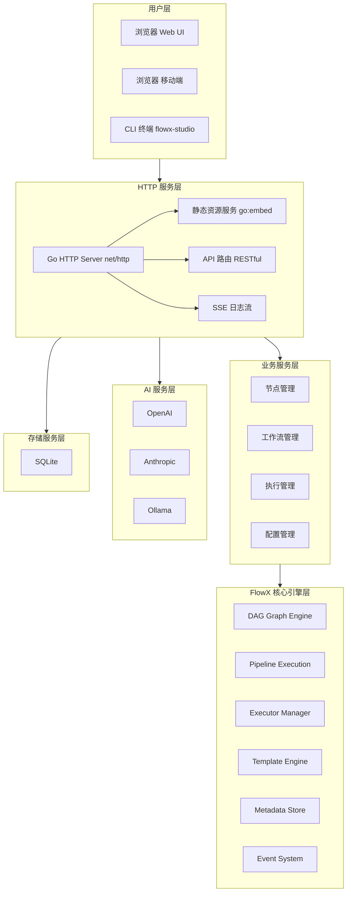
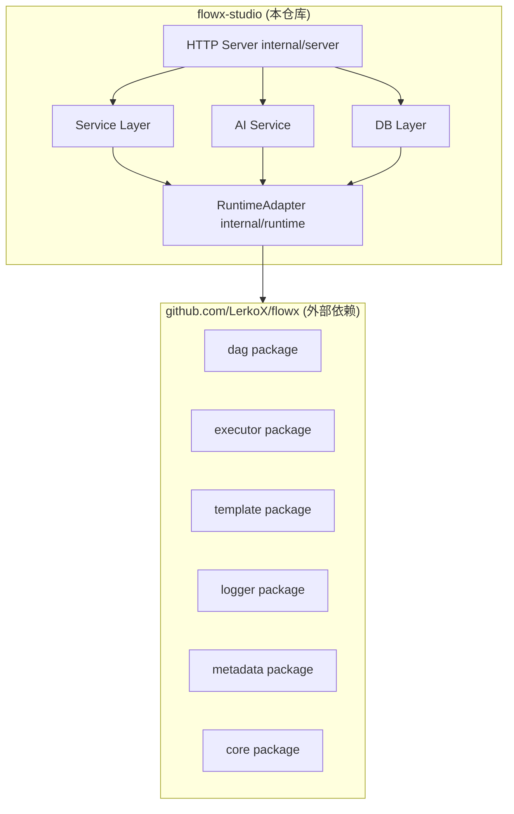
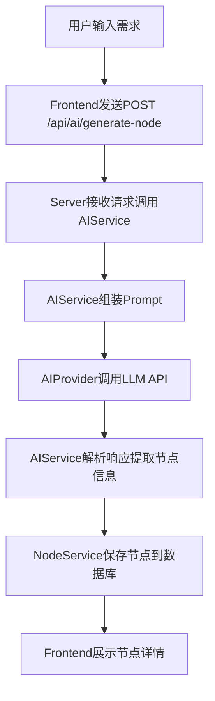
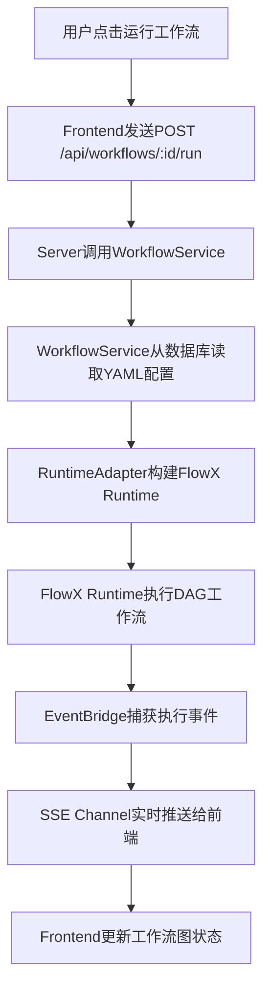
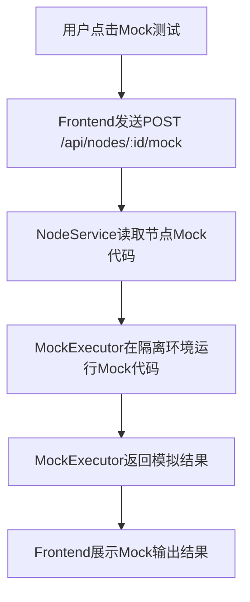

# 2. 系统架构设计

## 2.1 项目组织

本项目（FlowX Studio）是一个**独立仓库**，通过 Go Module 引入 FlowX 核心引擎库。

```
┌─────────────────────────────────────────────────────────────┐
│                     独立仓库                                  │
├─────────────────────────────────────────────────────────────┤
│  github.com/LerkoX/flowx-studio                              │
│  ├── cmd/flowx-studio/     # CLI 入口                       │
│  ├── internal/             # 业务逻辑                       │
│  │   ├── server/           # HTTP 服务层                    │
│  │   ├── service/          # 业务服务层                    │
│  │   ├── ai/               # AI 服务层                     │
│  │   ├── db/               # SQLite 数据层                 │
│  │   └── runtime/          # FlowX 运行时适配              │
│  ├── web/                  # React 前端                     │
│  └── go.mod                # require github.com/LerkoX/flowx │
├─────────────────────────────────────────────────────────────┤
│  外部依赖（Go Module）                                        │
│  github.com/LerkoX/flowx v1.x.x                             │
│  ├── dag/                  # DAG 引擎                       │
│  ├── executor/             # 执行器（local/docker/k8s）     │
│  ├── template/             # 模板引擎                      │
│  ├── metadata/             # 元数据存储                    │
│  ├── logger/               # 日志系统                      │
│  └── core/                 # 核心模型                      │
└─────────────────────────────────────────────────────────────┘
```

## 2.2 整体架构



## 2.2 模块划分

### 2.2.1 HTTP 服务层 (internal/server)

**职责**：提供 Web API 和静态资源服务

**核心组件**：
- `Server`：HTTP 服务器主结构体，管理路由注册和中间件
- `Router`：API 路由分发，按功能域分组
- `Middleware`：CORS、日志、恢复、请求限流
- `StaticHandler`：前端构建产物静态文件服务（通过 `go:embed` 嵌入）

**设计要点**：
- 使用标准库 `net/http`，不引入额外 Web 框架，保持二进制体积最小化
- 静态资源通过 `//go:embed web/dist/*` 嵌入二进制，无需外部文件
- SSE（Server-Sent Events）用于实时推送执行日志和状态变更

### 2.2.2 业务服务层 (internal/service)

**职责**：处理核心业务逻辑，协调各子系统

**核心服务**：
- `NodeService`：节点注册、查询、Mock 测试执行
- `WorkflowService`：工作流 CRUD、AI 生成、执行触发
- `ExecutionService`：执行状态管理、日志收集、结果存储
- `ConfigService`：AI 配置、系统设置管理

**设计要点**：
- 采用依赖注入模式，各服务通过接口解耦
- 服务层不直接操作 HTTP 或数据库，通过 Repository 接口隔离
- 所有业务操作通过上下文 `context.Context` 传递，支持超时和取消

### 2.2.3 AI 服务层 (internal/ai)

**职责**：统一封装多 AI 提供商调用

**核心组件**：
- `Provider` 接口：抽象所有 AI 提供商的通用能力
- `OpenAIProvider`：OpenAI API 实现
- `AnthropicProvider`：Anthropic Claude API 实现
- `OllamaProvider`：本地 Ollama 服务实现
- `AIService`：高阶业务封装，负责 Prompt 组装和结果解析

**设计要点**：
- 统一的请求/响应结构，屏蔽不同提供商的差异
- 支持模型能力声明（是否支持函数调用、JSON 模式等）
- 内置重试机制和故障转移（主模型失败时切换备用模型）

### 2.2.4 存储服务层 (internal/db)

**职责**：SQLite 数据库操作和迁移管理

**核心组件**：
- `DB`：数据库连接管理
- `Repository` 接口：各实体（Node/Workflow/Execution）的数据访问抽象
- `Migration`：数据库版本迁移管理

**设计要点**：
- 使用 `modernc.org/sqlite` 纯 Go SQLite 驱动，无需 CGO
- 数据库文件默认存储在用户 home 目录 `~/.flowx/flowx.db`
- 支持通过环境变量自定义数据库路径

### 2.2.5 核心引擎层 (复用现有)

**职责**：保持现有 FlowX 引擎不变，通过适配层集成

**集成点**：
- `RuntimeAdapter`：将 Web 层的执行请求转换为 FlowX `Runtime` 调用
- `EventBridge`：将 FlowX 事件系统（12 种事件）桥接到 Web 层的 SSE 推送
- `ConfigAdapter`：将数据库存储的 YAML 配置转换为 FlowX `PipelineConfig`

## 2.3 模块依赖关系



**依赖规则**：
- 上层可依赖下层，下层不可反向依赖上层
- 同层模块之间通过接口解耦，避免直接依赖
- **FlowX 核心库作为外部依赖，不感知 flowx-studio 的存在**
- flowx-studio 通过 `go.mod` 的 `require` 引入 FlowX 特定版本

## 2.4 数据流设计

### 2.4.1 AI 生成节点数据流



### 2.4.2 工作流执行数据流



### 2.4.3 Mock 测试数据流



## 2.5 关键技术选型

| 层次 | 技术 | 选择理由 |
|------|------|---------|
| 后端语言 | Go 1.25 | 复用现有代码库，单二进制编译 |
| HTTP 服务 | `net/http` 标准库 | 避免框架依赖，最小化二进制体积 |
| 数据库 | SQLite (`modernc.org/sqlite`) | 纯 Go 实现，无需 CGO，零配置 |
| 前端框架 | React 18 + TypeScript | 生态成熟，类型安全 |
| 构建工具 | Vite | 快速构建，热更新 |
| 图可视化 | ReactFlow | 专业的工作流图渲染 |
| 代码编辑 | Monaco Editor | VS Code 同款，支持多语言高亮 |
| AI SDK | 官方 SDK / HTTP 客户端 | 直接调用各提供商 API |
| 进程管理 | `os/exec` + Docker API | 复用现有执行器能力 |
| 实时通信 | SSE (Server-Sent Events) | 单向推送足够，比 WebSocket 简单 |

## 2.6 与 FlowX 核心库的集成策略

### 2.6.1 FlowX 核心库作为外部依赖

FlowX 核心库（`github.com/LerkoX/flowx`）作为独立 Go Module，通过 `go.mod` 引入：

```go
// flowx-studio/go.mod
module github.com/LerkoX/flowx-studio

go 1.25

require (
    github.com/LerkoX/flowx v1.2.0
    // ... 其他依赖
)
```

**依赖原则**：
- FlowX 核心库保持完全独立，不引入任何 Web/AI 相关代码
- flowx-studio 只使用 FlowX 公开的 API（`Runtime`、`Pipeline`、`Listener` 等接口）
- 通过 Go Module 版本管理，锁定依赖的 FlowX 版本

### 2.6.2 适配层设计

在 `internal/runtime/` 创建适配层，桥接 FlowX 核心库与 flowx-studio 业务层：

```go
package runtime

import (
    "context"
    
    "github.com/LerkoX/flowx"
    "github.com/LerkoX/flowx/dag"
)

// RuntimeAdapter 将 flowx-studio 的执行请求适配到 FlowX Runtime
type RuntimeAdapter struct {
    runtime flowx.Runtime
    eventCh chan Event
}

// NewRuntimeAdapter 创建适配器
func NewRuntimeAdapter() *RuntimeAdapter {
    return &RuntimeAdapter{
        runtime: flowx.NewRuntime(context.Background()),
    }
}

// ExecuteWorkflow 执行工作流并实时推送事件
func (ra *RuntimeAdapter) ExecuteWorkflow(ctx context.Context, workflowID string, yamlConfig string) error {
    // 1. 注册 FlowX 事件监听器
    listener := &studioListener{
        eventCh: ra.eventCh,
        pipelineID: workflowID,
    }
    
    // 2. 调用 FlowX Runtime 异步执行
    _, err := ra.runtime.RunAsync(ctx, workflowID, yamlConfig, listener)
    return err
}

// studioListener 实现 dag.Listener 接口
type studioListener struct {
    eventCh    chan Event
    pipelineID string
}

func (l *studioListener) Handle(p dag.Pipeline, event dag.Event) {
    // 将 FlowX 事件转换为 flowx-studio 内部事件
    l.eventCh <- Event{
        Type:       string(event),
        PipelineID: l.pipelineID,
        Status:     p.Status(),
    }
}

func (l *studioListener) Events() []dag.Event {
    return []dag.Event{
        dag.PipelineStart,
        dag.PipelineFinish,
        dag.PipelineNodeStart,
        dag.PipelineNodeFinish,
        dag.PipelinePaused,
        dag.PipelineResumed,
    }
}
```

### 2.6.3 命令行入口

flowx-studio 的 CLI 入口：

```go
// cmd/flowx-studio/main.go
func main() {
    switch os.Args[1] {
    case "version":
        printVersion()
    case "help":
        printHelp()
    default:
        // 默认启动 Web UI
        runServer()
    }
}
```

**注意**：FlowX 核心库原有的 `flowx run workflow.yaml` CLI 功能保持在核心库中，flowx-studio 不提供此命令。
