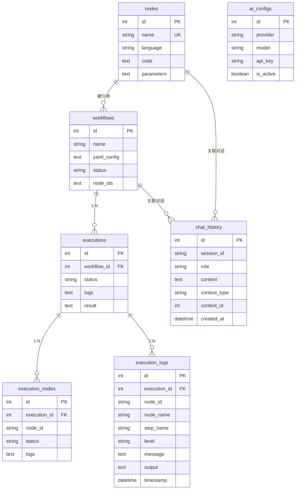

# 3. 数据库设计

## 3.1 设计原则

- **单文件 SQLite**：所有数据存储在一个 `.db` 文件中，零配置
- **纯 Go 驱动**：使用 `modernc.org/sqlite`，无需 CGO
- **自动迁移**：应用启动时自动执行数据库迁移
- **外键约束**：启用 SQLite 外键约束保证数据完整性

## 3.2 数据库配置

```go
// 默认路径
~/.flowx/flowx.db

// 环境变量覆盖
FLOWX_DB_PATH=/custom/path/flowx.db
```

## 3.3 Schema 设计

### 3.3.1 节点注册中心 (nodes)

存储 AI 生成的可复用节点。

```sql
CREATE TABLE nodes (
    id              INTEGER PRIMARY KEY AUTOINCREMENT,
    name            TEXT NOT NULL UNIQUE,           -- 节点唯一标识（蛇形命名）
    description     TEXT,                            -- 节点功能描述
    language        TEXT NOT NULL,                   -- 编程语言: python | go | bash | node
    code            TEXT NOT NULL,                   -- 节点实现代码
    mock_code       TEXT NOT NULL,                   -- Mock 测试代码
    parameters      TEXT NOT NULL,                   -- JSON: 参数定义列表
    dockerfile      TEXT,                            -- 可选：自定义 Dockerfile
    requirements    TEXT,                            -- 可选：依赖列表（如 requirements.txt）
    tags            TEXT,                            -- 标签，逗号分隔
    created_at      DATETIME DEFAULT CURRENT_TIMESTAMP,
    updated_at      DATETIME DEFAULT CURRENT_TIMESTAMP
);

-- 索引
CREATE INDEX idx_nodes_language ON nodes(language);
CREATE INDEX idx_nodes_tags ON nodes(tags);
```

**parameters JSON 结构示例**：
```json
[
  {
    "name": "url",
    "type": "string",
    "description": "图片下载地址",
    "required": true,
    "default": null
  },
  {
    "name": "timeout",
    "type": "integer",
    "description": "下载超时时间（秒）",
    "required": false,
    "default": 30
  }
]
```

### 3.3.2 工作流 (workflows)

存储 AI 生成的工作流定义。

```sql
CREATE TABLE workflows (
    id              INTEGER PRIMARY KEY AUTOINCREMENT,
    name            TEXT NOT NULL,                   -- 工作流名称
    description     TEXT,                            -- 工作流描述
    intent          TEXT,                            -- 用户需求原文
    yaml_config     TEXT NOT NULL,                   -- 完整 FlowX YAML 配置
    status          TEXT DEFAULT 'draft',            -- draft | active | archived
    node_ids        TEXT,                            -- JSON: 引用的节点 ID 列表
    created_at      DATETIME DEFAULT CURRENT_TIMESTAMP,
    updated_at      DATETIME DEFAULT CURRENT_TIMESTAMP
);

-- 索引
CREATE INDEX idx_workflows_status ON workflows(status);
CREATE INDEX idx_workflows_created ON workflows(created_at);
```

**yaml_config 示例**：
```yaml
name: image_processing
version: "1.0"
graph: |
  stateDiagram-v2
    [*] --> download
    download --> compress
    compress --> upload
    upload --> [*]
nodes:
  download:
    steps:
      - name: download_image
        executor: local
        commands:
          - python {{.node.code}}
  compress:
    steps:
      - name: compress_image
        executor: local
        commands:
          - python {{.node.code}}
```

### 3.3.3 执行记录 (executions)

存储工作流执行历史和结果。

```sql
CREATE TABLE executions (
    id              INTEGER PRIMARY KEY AUTOINCREMENT,
    workflow_id     INTEGER NOT NULL,
    status          TEXT DEFAULT 'pending',          -- pending | running | success | failed | cancelled
    trigger         TEXT DEFAULT 'manual',           -- manual | schedule | api
    started_at      DATETIME,
    completed_at    DATETIME,
    duration_ms     INTEGER,
    logs            TEXT,                            -- 执行日志（聚合）
    result          TEXT,                            -- 执行结果摘要（JSON）
    error_message   TEXT,                            -- 错误信息
    error_node_id   TEXT,                            -- 失败节点 ID
    created_at      DATETIME DEFAULT CURRENT_TIMESTAMP,
    
    FOREIGN KEY (workflow_id) REFERENCES workflows(id) ON DELETE CASCADE
);

-- 索引
CREATE INDEX idx_executions_workflow ON executions(workflow_id);
CREATE INDEX idx_executions_status ON executions(status);
CREATE INDEX idx_executions_created ON executions(created_at);
```

**result JSON 结构示例**：
```json
{
  "summary": "所有节点执行成功",
  "node_count": 3,
  "completed_nodes": ["download", "compress", "upload"],
  "outputs": {
    "upload": {
      "s3_url": "https://bucket.s3.amazonaws.com/image_thumb.jpg"
    }
  }
}
```

### 3.3.4 执行节点状态 (execution_nodes)

存储每次执行中各节点的详细状态（用于支持运行时监控）。

```sql
CREATE TABLE execution_nodes (
    id              INTEGER PRIMARY KEY AUTOINCREMENT,
    execution_id    INTEGER NOT NULL,
    node_id         TEXT NOT NULL,                   -- 工作流中的节点 ID
    node_name       TEXT,                            -- 节点名称
    status          TEXT DEFAULT 'pending',          -- pending | running | success | failed | skipped
    started_at      DATETIME,
    completed_at    DATETIME,
    duration_ms     INTEGER,
    logs            TEXT,                            -- 节点执行日志
    output          TEXT,                            -- 节点输出结果
    error           TEXT,                            -- 错误信息
    
    FOREIGN KEY (execution_id) REFERENCES executions(id) ON DELETE CASCADE
);

-- 索引
CREATE INDEX idx_exec_nodes_execution ON execution_nodes(execution_id);
CREATE INDEX idx_exec_nodes_status ON execution_nodes(status);
```

### 3.3.5 执行日志 (execution_logs)

存储执行过程中的详细日志条目，支持实时推送和历史查询。

```sql
CREATE TABLE execution_logs (
    id              INTEGER PRIMARY KEY AUTOINCREMENT,
    execution_id    INTEGER NOT NULL,                   -- 关联的执行记录 ID
    node_id         TEXT,                                -- 节点 ID（可为空，表示系统级日志）
    node_name       TEXT,                                -- 节点名称
    step_name       TEXT,                                -- 步骤名称
    level           TEXT DEFAULT 'info',                 -- debug | info | warn | error | fatal
    message         TEXT NOT NULL,                       -- 日志内容
    output          TEXT,                                -- 命令标准输出/错误
    timestamp       DATETIME DEFAULT CURRENT_TIMESTAMP,  -- 日志时间
    
    FOREIGN KEY (execution_id) REFERENCES executions(id) ON DELETE CASCADE
);

-- 索引
CREATE INDEX idx_exec_logs_execution ON execution_logs(execution_id);
CREATE INDEX idx_exec_logs_node ON execution_logs(execution_id, node_id);
CREATE INDEX idx_exec_logs_level ON execution_logs(level);
CREATE INDEX idx_exec_logs_timestamp ON execution_logs(timestamp);
```

**日志级别说明**：
- `debug`：开发调试信息
- `info`：正常运行信息（节点开始、完成等）
- `warn`：警告信息（超时、降级等）
- `error`：错误信息（节点执行失败）
- `fatal`：致命错误（系统级异常）

### 3.3.6 AI 配置 (ai_configs)

存储 AI 提供商的配置信息。

```sql
CREATE TABLE ai_configs (
    id              INTEGER PRIMARY KEY AUTOINCREMENT,
    provider        TEXT NOT NULL,                   -- openai | anthropic | ollama
    name            TEXT NOT NULL,                   -- 配置名称（用户自定义）
    model           TEXT NOT NULL,                   -- 模型名称
    api_key         TEXT,                            -- API 密钥（加密存储）
    base_url        TEXT,                            -- 自定义 API 地址
    temperature     REAL DEFAULT 0.7,                -- 生成温度
    max_tokens      INTEGER,                         -- 最大 token 数
    is_active       BOOLEAN DEFAULT 0,               -- 是否为默认配置
    is_enabled      BOOLEAN DEFAULT 1,               -- 是否启用
    capabilities    TEXT,                            -- JSON: 模型能力声明
    created_at      DATETIME DEFAULT CURRENT_TIMESTAMP,
    updated_at      DATETIME DEFAULT CURRENT_TIMESTAMP
);

-- 索引
CREATE UNIQUE INDEX idx_ai_configs_active ON ai_configs(is_active) WHERE is_active = 1;
```

**capabilities JSON 结构**：
```json
{
  "supports_function_calling": true,
  "supports_json_mode": true,
  "supports_vision": false,
  "max_context_length": 128000
}
```

### 3.3.6 系统配置 (system_configs)

存储系统级配置参数。

```sql
CREATE TABLE system_configs (
    key             TEXT PRIMARY KEY,
    value           TEXT NOT NULL,
    description     TEXT,
    updated_at      DATETIME DEFAULT CURRENT_TIMESTAMP
);

-- 默认配置
INSERT INTO system_configs (key, value, description) VALUES
('default_executor', 'local', '默认执行器类型'),
('mock_timeout_sec', '30', 'Mock 测试超时时间（秒）'),
('execution_timeout_sec', '3600', '工作流执行超时时间（秒）'),
('max_workflow_history', '100', '保留的最大执行历史数量'),
('auto_open_browser', 'true', '启动时是否自动打开浏览器'),
('server_port', '8080', 'HTTP 服务端口'),
('log_retention_days', '30', '执行日志保留天数'),
('log_max_buffer_size', '1000', '实时日志内存缓冲区大小'),
('log_auto_scroll', 'true', '日志查看器默认自动滚动');
```

### 3.3.7 对话历史 (chat_history)

存储用户与 AI 的对话记录。

```sql
CREATE TABLE chat_history (
    id              INTEGER PRIMARY KEY AUTOINCREMENT,
    session_id      TEXT NOT NULL,                   -- 会话标识
    role            TEXT NOT NULL,                   -- user | assistant | system
    content         TEXT NOT NULL,                   -- 消息内容
    context_type    TEXT,                            -- node_generate | workflow_generate | general
    context_id      INTEGER,                         -- 关联的节点或工作流 ID
    created_at      DATETIME DEFAULT CURRENT_TIMESTAMP
);

-- 索引
CREATE INDEX idx_chat_session ON chat_history(session_id, created_at);
CREATE INDEX idx_chat_context ON chat_history(context_type, context_id);
```

## 3.4 实体关系图



## 3.5 数据迁移策略

### 3.5.1 迁移框架

使用简单的版本化迁移机制：

```
migrations/
├── 001_init.sql          -- 初始 Schema
├── 002_add_node_tags.sql -- 添加节点标签
└── 003_add_workflow_intent.sql -- 添加意图字段
```

### 3.5.2 迁移执行逻辑

1. 应用启动时检查 `schema_migrations` 表
2. 按顺序执行未应用的迁移脚本
3. 每个迁移在独立事务中执行
4. 迁移失败时回滚并记录错误

```sql
CREATE TABLE schema_migrations (
    version     INTEGER PRIMARY KEY,
    applied_at  DATETIME DEFAULT CURRENT_TIMESTAMP
);
```

## 3.6 数据备份与恢复

- **自动备份**：每次应用启动时，如果数据库文件存在，自动创建 `.backup` 副本
- **手动导出**：提供 API 导出所有数据为 JSON 格式
- **恢复**：通过替换数据库文件实现
