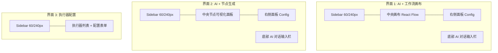

# 5. 前端设计（详细实现方案）

## 5.1 设计哲学

FlowX Studio 采用**对话式配置**作为核心交互模式。用户通过与 AI 助手自然语言对话，完成节点生成、工作流编排、执行监控等所有操作。整个过程中**不提供传统的手动配置界面**。

界面设计参考 **Taskade** 和 **n8n** 的视觉风格，追求"未来感、丝滑、精致"的交互体验。

---

## 5.2 技术栈

| 技术 | 版本 | 用途 |
|------|------|------|
| React | 18.x | UI 框架 |
| TypeScript | 5.x | 类型系统 |
| Vite | 5.x | 构建工具 |
| Tailwind CSS | 3.x | 样式方案 |
| @xyflow/react | 12.x | 工作流画布（React Flow v12） |
| Framer Motion | 11.x | 动画系统 |
| Lucide React | 最新 | 图标库 |
| Zustand | 4.x | 状态管理 |
| React Query | 5.x | 服务端状态管理 |
| Axios | 1.x | HTTP 客户端 |
| `react-markdown` | 9.x | Markdown 渲染 |
| `react-syntax-highlighter` | 15.x | 代码语法高亮 |
| `dagre` | 0.8.x | DAG 自动布局算法 |

---

## 5.3 界面架构（3 个核心界面）

### 5.3.1 界面总览



### 5.3.2 路由设计

使用 React Router v6 的 `createBrowserRouter` 配置三个路由，所有路由共享一个 Layout 布局组件：

- **`/`（首页）**：AI + 工作流画布（`WorkflowCanvasPage`）
- **`/node-generator`**：AI + 节点生成（`NodeGeneratorPage`）
- **`/executors`**：执行器配置（`ExecutorConfigPage`）

Layout 组件包裹所有页面，提供 Sidebar 和底部 AI 对话输入栏。

---

## 5.4 视觉设计系统

### 5.4.1 色彩系统

采用深色主题，以 Indigo 和 Purple 作为品牌渐变色：

- **主题色**：Indigo (#6366f1) 到 Purple (#a855f7) 的 135deg 线性渐变
- **状态色**：
  - 运行中：Cyan (#22d3ee)
  - 成功：Emerald (#34d399)
  - 失败：Rose (#fb7185)
  - 空闲：Slate (#94a3b8)
- **文字色**：三级透明度白色（90%/60%/40%）实现视觉层级
- **背景色**：深蓝紫三色渐变背景 + 5% 透明度白色面板
- **边框**：10% 透明度白色作为默认边框，Hover 时提升至 20%

### 5.4.2 毛玻璃（Glassmorphism）规范

所有浮动面板统一使用毛玻璃效果：

- 背景为 5% 透明度的白色
- `backdrop-filter: blur(24px)` 高斯模糊
- 1px 半透明边框（10% 透明度白色）
- 20px 大圆角
- Hover 时背景透明度提升至 8%，边框变亮（20%），添加品牌色阴影（`0 8px 32px rgba(99, 102, 241, 0.15)`）

### 5.4.3 节点设计规范（n8n 风格）

节点卡片设计要点：

- 圆角 20px，半透明背景（8% 白色），内阴影营造凹陷感
- 顶部 2px 彩色条（根据节点类型变化，默认使用品牌渐变）
- 左侧 40px 圆形图标容器，品牌渐变背景，白色图标
- 最小宽度 200px，内边距 16px
- **选中态**：呼吸灯脉冲动画（青色阴影从中心向外扩散再消失，2s 循环）
- **Hover**：轻微放大（scale 1.03）+ 边框高亮 + 品牌色阴影，鼠标变为 grab/grabbing

### 5.4.4 连线设计规范

- **默认状态**：半透明白色（20%）2px 线条
- **激活状态**：Cyan 到 Purple 的 SVG 线性渐变，添加发光滤镜（`drop-shadow(0 0 4px cyan)`）
- **流动动画**：虚线（10px 实线 + 5px 间隙）配合 1s 线性无限偏移动画，模拟数据流动效果

### 5.4.5 画布背景

多层背景叠加营造星空感：

- **底层**：三个径向渐变（Indigo/Purple/Cyan 分别位于不同位置），极低透明度
- **中层**：深蓝紫三色线性渐变（135deg）
- **上层**：24px 间距的点阵网格（1px 圆点，3% 透明度白色）

---

## 5.5 项目结构

```
web/
├── public/
│   └── favicon.ico
├── src/
│   ├── main.tsx                    # 应用入口
│   ├── App.tsx                     # 根组件
│   ├── index.css                   # 全局样式 + CSS 变量
│   ├── router.tsx                  # 路由配置
│   │
│   ├── components/                 # 通用组件
│   │   ├── Layout.tsx              # 页面布局（Sidebar + 内容区）
│   │   ├── Sidebar.tsx             # 左侧导航栏（可折叠）
│   │   ├── GlassPanel.tsx          # 毛玻璃面板容器
│   │   ├── SpotlightCard.tsx       # 鼠标跟随高光卡片
│   │   ├── GlowNode.tsx            # 霓虹发光节点效果
│   │   ├── GradientEdge.tsx        # 渐变流动连线
│   │   ├── ChatInputBar.tsx        # 底部 AI 对话输入栏（悬浮胶囊）
│   │   ├── ChatMessage.tsx         # 单条聊天消息
│   │   ├── StreamingText.tsx       # 流式文本渲染
│   │   ├── AIActionButtons.tsx     # AI 操作按钮组
│   │   ├── CodeViewer.tsx          # 代码展示（Monaco）
│   │   ├── YamlViewer.tsx          # YAML 配置展示
│   │   ├── LogViewer.tsx           # 日志查看器
│   │   └── StatusBadge.tsx         # 状态标签
│   │
│   ├── pages/                      # 页面组件（3 个核心界面）
│   │   ├── WorkflowCanvasPage.tsx      # 界面 1: AI + 工作流画布
│   │   ├── NodeGeneratorPage.tsx       # 界面 2: AI + 节点生成
│   │   └── ExecutorConfigPage.tsx      # 界面 3: 执行器配置
│   │
│   ├── features/                   # 功能模块
│   │   ├── workflow-canvas/        # 工作流画布模块
│   │   │   ├── WorkflowCanvas.tsx      # 画布主组件
│   │   │   ├── CustomNode.tsx          # 自定义节点（GlowNode 封装）
│   │   │   ├── CustomEdge.tsx          # 自定义边（GradientEdge 封装）
│   │   │   ├── NodeDetailPanel.tsx     # 节点详情右侧面板
│   │   │   ├── WorkflowConfigPanel.tsx # 工作流配置/YAML 切换面板
│   │   │   ├── AutoLayout.ts           # DAG 自动布局
│   │   │   └── useWorkflowCanvas.ts    # 画布状态 Hook
│   │   │
│   │   ├── node-visualization/     # 节点可视化模块
│   │   │   ├── NodeVisualizer.tsx      # 节点可视化主组件
│   │   │   ├── NodeParamPanel.tsx      # 节点参数面板
│   │   │   ├── NodeCodePanel.tsx       # 代码展示面板（代码/Mock 切换）
│   │   │   └── NodeConfigPanel.tsx     # 节点配置右侧面板
│   │   │
│   │   ├── chat/                   # AI 聊天模块
│   │   │   ├── ChatPanel.tsx           # 聊天面板（嵌入各页面底部）
│   │   │   ├── ChatMessage.tsx         # 单条消息
│   │   │   ├── ChatInput.tsx           # 输入框
│   │   │   ├── StreamingText.tsx       # 流式文本
│   │   │   ├── AIActionButtons.tsx     # 操作按钮
│   │   │   ├── useChat.ts              # 聊天逻辑 Hook
│   │   │   └── useChatContext.ts       # 上下文管理
│   │   │
│   │   └── executor-config/        # 执行器配置模块
│   │       ├── ExecutorList.tsx        # 执行器列表
│   │       ├── ExecutorForm.tsx        # 执行器配置表单
│   │       └── ExecutorMonitor.tsx     # 执行器监控面板
│   │
│   ├── hooks/                      # 自定义 Hooks
│   │   ├── useSSE.ts               # SSE 实时流
│   │   ├── useNodes.ts             # 节点数据管理
│   │   ├── useWorkflows.ts         # 工作流数据管理
│   │   └── useAIConfig.ts          # AI 配置管理
│   │
│   ├── stores/                     # 状态管理 (Zustand)
│   │   ├── appStore.ts             # 应用级状态（侧边栏折叠、主题等）
│   │   ├── chatStore.ts            # 聊天状态
│   │   ├── workflowStore.ts        # 工作流状态
│   │   ├── nodeStore.ts            # 节点状态
│   │   └── executionStore.ts       # 执行状态
│   │
│   ├── types/                      # TypeScript 类型定义
│   │   ├── node.ts
│   │   ├── workflow.ts
│   │   ├── execution.ts
│   │   ├── ai.ts
│   │   └── api.ts
│   │
│   ├── utils/                      # 工具函数
│   │   ├── formatters.ts
│   │   ├── validators.ts
│   │   └── constants.ts
│   │
│   └── services/                   # 业务服务层
│       ├── chatContext.ts          # 上下文组装服务
│       └── layoutEngine.ts         # 布局引擎
│
├── index.html
├── package.json
├── tsconfig.json
├── vite.config.ts
└── tailwind.config.js
```

---

## 5.6 核心组件实现

### 5.6.1 Layout 布局组件

Layout 是整个应用的根布局，采用全屏深色渐变背景，包含以下区域：

- **左侧 Sidebar**：固定定位，支持折叠（60px/240px 两种宽度），使用 Framer Motion spring 动画实现平滑宽度过渡
- **主内容区**：动态 `margin-left` 跟随 Sidebar 宽度变化，使用 spring 动画避免生硬跳动
- **顶部悬浮工具栏**：胶囊形状，绝对定位在顶部中央，包含运行/暂停/缩放/全屏等操作按钮，入场时从上方滑入
- **底部 AI 对话输入栏**：通过 `AnimatePresence` 控制显示/隐藏，支持条件渲染

### 5.6.2 Sidebar 侧边栏组件

可折叠的左侧导航栏，核心功能：

- **导航项**：三个路由入口（AI 工作流、AI 节点、执行器），使用 Lucide 图标
- **激活态高亮**：当前路由项显示白色背景 + 左侧 3px 圆角指示条，使用 Framer Motion 的 `layoutId` 实现指示条在不同项之间平滑滑动切换
- **Logo 区域**：渐变背景的 FX 图标 + FlowX 文字，折叠时文字通过 AnimatePresence 渐隐
- **折叠按钮**：底部居中，点击切换 Sidebar 宽度，图标随状态切换为左/右箭头
- **动画**：整体宽度变化使用 spring 动画（stiffness: 300, damping: 25）

### 5.6.3 SpotlightCard 组件（鼠标跟随高光）

实现鼠标跟随的径向渐变高光效果，技术要点：

- 使用 `useRef` 获取卡片 DOM 引用，`useState` 记录鼠标坐标和悬停状态
- 监听 `onMouseMove` 事件，通过 `getBoundingClientRect` 计算鼠标相对于卡片的局部坐标
- 在卡片上叠加一层绝对定位的 `radial-gradient`（600px 圆形，Indigo 15% 透明度），中心点实时跟随鼠标位置
- 鼠标离开时（`onMouseLeave`）渐变透明度渐变为 0，实现平滑消失
- 使用 Framer Motion 的 `whileHover` 实现整体缩放效果（scale 1.02）

### 5.6.4 GlowNode 组件（霓虹发光节点）

React Flow 的自定义节点组件，核心特性：

- **霓虹发光边框**：选中时在最外层显示 `conic-gradient` 旋转边框动画（3s 线性无限旋转），营造科技感
- **状态系统**：idle/running/success/failed/skipped 五种状态，每种状态映射不同的颜色和发光效果：
  - running：Cyan 色 + 脉冲发光
  - success：Emerald 色
  - failed：Rose 色
  - idle/skipped：Slate 灰色，无发光
- **节点内容结构**：
  - 顶部 2px 彩色条（颜色可自定义，默认品牌渐变）
  - 左侧圆形图标容器（渐变背景）
  - 名称（白色 90%，单行截断）+ 描述（白色 40%，单行截断）
  - 底部标签行：语言标签 + 状态标签（状态标签带脉冲圆点动画）
- **连接点**：顶部输入 Handle（target）和底部输出 Handle（source），3px 圆形，半透明样式
- **入场动画**：spring 动画从 scale 0.85 + 下移 10px 过渡到正常状态

### 5.6.5 GradientEdge 组件（渐变流动连线）

React Flow 的自定义边组件：

- 使用 `getBezierPath` 计算贝塞尔曲线路径（基于源节点和目标节点的坐标及连接点位置）
- 在 SVG `defs` 中定义线性渐变（Cyan 到 Purple），每条边使用独立 ID 避免冲突
- 根据 `data` 属性动态切换样式：
  - `data.animated` 为 true 时：显示虚线（10px 实线 + 5px 间隙）并启用流动动画
  - `data.status` 为 active 时：使用渐变描边 + 发光滤镜
  - 默认状态：半透明白色实线

### 5.6.6 ChatInputBar 组件（底部悬浮 AI 对话栏）

底部固定的 AI 输入组件，设计为悬浮胶囊形态：

- **输入框**：自适应高度的 textarea，支持多行输入：
  - Enter 发送消息，Shift+Enter 换行
  - 自动根据内容高度调整（最大 120px）
  - 禁用状态下不可输入
- **发送按钮**：渐变背景（Indigo 到 Purple），加载时显示旋转 Loader 图标，禁用时空心
  - 使用 Framer Motion 的 `whileHover` 和 `whileTap` 实现缩放反馈
- **快捷提示**：输入框下方水平排列"生成节点/创建工作流/Mock 测试/查看日志"等快捷按钮，点击后自动填入输入框并聚焦
- **整体样式**：毛玻璃效果（5% 白色背景 + 24px 模糊 + 半透明边框），聚焦时边框和背景变亮
- **定位**：绝对定位在底部中央，最大宽度 2xl，两侧留边距

---

## 5.7 三大界面详细设计

### 5.7.1 界面 1: AI + 工作流画布 (WorkflowCanvasPage)

三栏布局：

- **左侧**：可展开/收起的 AI 对话历史面板（宽度 320px），使用 `AnimatePresence` 实现滑入/滑出动画（从左侧 -20px 滑入）。通过绝对定位的按钮（◀/▶）控制显示状态
- **中央**：`WorkflowCanvas` 组件（React Flow 画布），占据剩余全部空间
- **右侧**：400px 宽配置面板，固定在右侧：
  - 顶部标签切换："流程图" / "YAML"，使用 `layoutId` 实现下划线平滑滑动动画
  - 内容区使用 `AnimatePresence mode="wait"` 实现标签切换时的淡入淡出过渡
  - `WorkflowConfigPanel` 组件根据当前标签渲染不同视图

### 5.7.2 界面 2: AI + 节点生成 (NodeGeneratorPage)

与界面 1 采用类似的布局模式：

- **左侧**：可展开/收起的 AI 对话历史面板（与界面 1 相同交互）
- **中央**：`NodeVisualizer` 组件（节点可视化），带内边距的滚动区域
- **右侧**：400px 宽配置面板，三标签切换：
  - "参数"：显示节点输入参数列表
  - "代码"：显示节点实现代码
  - "Mock"：显示 Mock 测试配置和结果
  - 标签切换同样使用 `layoutId` 下划线动画

### 5.7.3 界面 3: 执行器配置 (ExecutorConfigPage)

两栏布局，无底部 AI 输入栏：

- **左侧**：执行器类型列表（宽度 320px），三种类型：
  - Local（本地 Shell 执行器）
  - Docker（Docker 容器执行器）
  - Kubernetes（K8s Pod 执行器）
  - 每项包含图标、名称、描述，选中项高亮（白色背景 + 渐变图标背景）
  - 使用 Framer Motion 的 `whileHover` 和 `whileTap` 实现缩放反馈
- **右侧**：上下两部分：
  - 上部：`ExecutorForm` 配置表单（根据选中的执行器类型渲染不同表单字段）
  - 下部：`ExecutorMonitor` 监控面板（显示状态和资源使用图表）

---

## 5.8 工作流画布模块

### 5.8.1 WorkflowCanvas 主组件

基于 React Flow 的工作流可视化画布，核心逻辑：

- **数据初始化**：从 `workflowStore` 获取当前工作流的 YAML 配置，解析为节点和边数据：
  - 使用 `parseYaml` 解析 YAML 文本
  - 使用 `parseMermaidToFlow` 将 Mermaid 图语法转换为 React Flow 的 nodes/edges 格式
  - 节点状态从 `nodeStatuses` 注入到每个节点的 `data` 中
- **自动布局**：使用 `dagre` 算法进行 DAG 自动布局（默认 TB 垂直方向），将计算后的坐标应用到节点
- **实时状态同步**：监听 `nodeStatuses` 变化，使用函数式 `setNodes/setEdges` 更新：
  - 节点：根据状态更新颜色配置
  - 边：源节点 running 时启用流动动画，目标节点 failed 时变红
- **交互功能**：
  - 节点可拖拽（`nodesDraggable: true`）
  - 节点可点击选中（触发外部状态更新）
  - 支持缩放（0.2x ~ 2x）和平移
  - 自动适配视图（`fitView`）
- **视觉元素**：
  - `Background`：点阵网格背景（24px 间距，1px 圆点）
  - `Controls`：自定义毛玻璃样式（半透明背景 + 圆角）
  - `MiniMap`：小地图，节点颜色根据状态动态映射
  - `Panel`：右上角状态面板，显示当前工作流名称

### 5.8.2 自动布局算法

使用 `dagre` 库实现 DAG 自动布局，流程：

- 创建 `dagre.graphlib.Graph` 实例，设置默认边标签
- 配置图属性：`rankdir` 为 TB（垂直）或 LR（水平），节点间距 60px，层间距 100px
- 遍历所有节点，设置固定宽高（220x100）
- 遍历所有边，建立源节点到目标节点的连接关系
- 调用 `dagre.layout()` 执行布局计算
- 将计算结果转换为 React Flow 的 position 格式（坐标居中偏移：减去节点宽高的一半）
- 返回布局后的 nodes 和 edges

---

## 5.9 节点可视化模块

### 5.9.1 NodeVisualizer 主组件

节点详情展示页面，用于预览 AI 生成的节点：

- **空状态**：当没有当前节点时，中央显示机器人图标（带摇摆动画）和提示文字，引导用户通过底部 AI 对话栏描述节点需求
- **节点头部**：使用 `SpotlightCard` 包装，包含：
  - 左侧 48px 渐变图标（品牌色）
  - 名称（大字号）+ 描述（小字号，灰色）
  - 右侧语言标签（小圆角标签）
- **参数列表**：使用 `SpotlightCard` 包装，遍历 `parameters` 数组：
  - 每个参数水平排列：名称（Indigo 色等宽字体）、类型标签（小圆角）、描述（灰色）、必填标记（红色星号）
  - 使用 Framer Motion 实现逐项入场动画（stagger 效果）
- **Mock 测试结果**：如有 `mockResult`，使用 `SpotlightCard` 包装，内部为黑色半透明背景的等宽字体代码块，JSON 格式化展示
- 所有卡片均使用 `SpotlightCard` 实现鼠标跟随高光效果

---

## 5.10 AI 聊天模块

### 5.10.1 ChatPanel 组件

聊天消息展示面板，支持嵌入各页面：

- **自动滚动**：使用 `useRef` 获取滚动容器，通过 `useEffect` 监听 `messages` 和 `streamingContent` 变化，自动将滚动条置底
- **欢迎消息**：当消息列表为空时显示，包含：
  - 机器人图标（Framer Motion 循环摇摆动画，2s 周期）
  - "FlowX AI 助手" 标题
  - 引导文字（说明可以通过对话生成工作流和节点）
- **历史消息**：使用 `AnimatePresence` 包裹消息列表，每条消息入场时从下方淡入（spring 动画，带 stagger delay）
- **流式输出**：当 `isGenerating` 为 true 且存在 `streamingContent` 时，显示 `StreamingText` 组件实时渲染流式文本
- **加载指示器**：当 AI 正在思考但尚无流式内容时，显示三个圆点跳动动画（Framer Motion，不同 delay 的上下位移，0.6s 周期）
- **紧凑模式**：通过 `compact` prop 控制是否添加底部 padding（非紧凑模式需要为底部输入栏留空）

### 5.10.2 LogViewer 组件

日志查看器用于展示执行过程中的实时日志和历史日志，嵌入 WorkflowCanvasPage 的右侧面板或作为独立弹窗。

**核心功能**：

- **实时日志流**：
  - 通过 SSE `/api/v1/executions/:id/stream` 接收实时日志
  - 日志自动追加到底部，保持滚动条在底部（可手动暂停自动滚动）
  - 新日志条目入场动画：从右侧淡入（100ms）

- **日志级别过滤**：
  - 顶部工具栏提供级别筛选按钮：`全部` / `INFO` / `WARN` / `ERROR` / `DEBUG`
  - 选中的级别高亮显示（品牌色背景）
  - 支持多选组合过滤

- **节点过滤**：
  - 下拉选择框列出当前执行的所有节点
  - 选择节点后只显示该节点的日志
  - 支持"只看当前选中节点"快捷切换

- **日志条目样式**：
  - 时间戳：等宽字体，灰色（40% 透明度），格式 `HH:MM:SS.ms`
  - 级别标签：彩色圆角标签（INFO-绿色、WARN-黄色、ERROR-红色、DEBUG-灰色）
  - 节点名：Indigo 色等宽字体
  - 消息内容：白色 90%，自动换行
  - 错误日志：左侧 2px 红色竖线标识

- **搜索高亮**：
  - 顶部搜索框输入关键词
  - 匹配的日志条目高亮显示（黄色背景）
  - 支持正则表达式搜索（可选）

- **日志导出**：
  - 右上角导出按钮，支持导出为 JSON / TXT / Markdown
  - 导出时可选择时间范围和日志级别

- **性能优化**：
  - 虚拟滚动：超过 500 条日志时启用虚拟滚动
  - 日志上限：内存中最多保留 5000 条，超出时写入 IndexedDB
  - 懒加载历史日志：滚动到顶部时自动加载更早的日志

**UI 结构**：

```
┌─────────────────────────────────┐
│ 🔍 [搜索框...]    [全部 ▼] [📥] │  ← 工具栏
├─────────────────────────────────┤
│ 10:00:01  INFO  [download]      │
│           开始下载图片...        │
│ 10:00:02  INFO  [download]      │
│           下载完成，2048 bytes   │
│ 10:00:03  WARN  [compress]      │
│           图片质量降级           │
│ 10:00:04  ERROR [upload]        │
│ ┃ 上传失败：连接超时            │  ← 左侧红色竖线
├─────────────────────────────────┤
│ [自动滚动 ▼]  共 156 条日志      │  ← 底部状态栏
└─────────────────────────────────┘
```

---

## 5.11 动效规范

### 5.11.1 Framer Motion Spring 配置

统一提取动画配置到独立文件，避免各处硬编码：

定义四种弹簧效果预设：
- **default**（通用交互）：stiffness 300, damping 25, mass 0.8 —— 用于大多数 UI 过渡
- **gentle**（柔和过渡）：stiffness 200, damping 20, mass 1 —— 用于较大面积的动画
- **bouncy**（弹性效果）：stiffness 400, damping 15, mass 0.6 —— 用于需要弹性的元素
- **stiff**（快速响应）：stiffness 500, damping 30, mass 0.5 —— 用于快速反馈

同时封装常用动画变体供复用：
- `fadeInUp`：从下方 10px 淡入
- `scaleIn`：从 0.85 缩放到 1 并淡入
- `slideInRight`：从右侧 100% 滑入
- `slideInLeft`：从左侧 -20px 滑入并淡入

### 5.11.2 CSS 动画

全局 CSS 关键帧动画定义：

- **rotate**：360度旋转（3s 线性无限），用于霓虹边框的 conic-gradient 旋转
- **flowDash**：虚线偏移（-15px），1s 线性无限，用于连线流动效果
- **pulse-glow**：脉冲发光（2s ease-in-out 无限），品牌色阴影从 20px 扩散到 40px 再收缩
- **float**：上下浮动（3s ease-in-out 无限），-5px 到 0px 位移

自定义滚动条样式：
- 宽度 6px，高度 6px
- 轨道透明
- 滑块为 10% 透明度白色，圆角 3px，Hover 时提升至 20%

选中文本样式：品牌色 Indigo 30% 透明度背景，白色文字。

---

## 5.12 Tailwind 配置

在 Tailwind 默认配置基础上扩展自定义主题：

- **自定义颜色**：
  - `brand.indigo`: #6366f1
  - `brand.purple`: #a855f7
  - `status.running`: #22d3ee
  - `status.success`: #34d399
  - `status.error`: #fb7185
  - `status.idle`: #94a3b8
- **字体**：monospace 字体栈（SF Mono, Monaco, Cascadia Code）
- **自定义动画**：
  - `flow-dash`：1s 线性无限，对应虚线流动
  - `pulse-glow`：2s ease-in-out 无限，对应脉冲发光
  - `float`：3s ease-in-out 无限，对应上下浮动
- **backdropBlur**：扩展 2xl 为 24px

---

## 5.13 状态管理（Zustand）

### 5.13.1 应用状态

管理应用级 UI 状态（`appStore`）：

- `sidebarCollapsed`：侧边栏折叠状态（布尔值，默认 false）
- `theme`：当前主题（固定为 'dark'）
- `toggleSidebar`：切换侧边栏折叠状态的动作

### 5.13.2 聊天状态

管理 AI 对话状态（`chatStore`）：

- `messages`：消息列表，包含用户和 AI 的消息对象（id, role, content, timestamp）
- `isGenerating`：是否正在生成 AI 回复（布尔值）
- `streamingContent`：当前流式输出的文本片段（字符串，逐步追加）
- `sendMessage(content)`：发送消息流程：
  1. 构建用户消息对象并追加到 messages
  2. 设置 isGenerating 为 true，清空 streamingContent
  3. 调用后端 SSE API 获取流式响应（实际实现中）
  4. 接收完成后设置 isGenerating 为 false
- `appendStreamingContent(content)`：将新片段追加到 streamingContent
- `finalizeStreaming()`：结束流式输出，重置状态
- `executeAction(action)`：执行 AI 返回的结构化操作指令（如创建节点、更新工作流等）

---

## 5.14 性能优化

1. **React.memo**: 所有节点组件使用 memo 包裹，避免不必要的重渲染
2. **ReactFlow 优化**:
   - `onlyRenderVisibleElements: true` 只渲染可视区域内元素
   - 自定义节点使用 `memo`
   - 状态更新使用函数式 `setNodes` 避免闭包问题
3. **Framer Motion**: 使用 `layoutId` 避免不必要的布局重渲染
4. **代码分割**: 路由级懒加载，减少首屏加载时间
5. **图片优化**: 全部使用 SVG 图标（Lucide），避免位图资源
6. **CSS 优化**: 使用 CSS 变量减少运行时计算，关键动画使用 GPU 加速属性

---

## 5.15 特别组件清单

| 组件 | 文件 | 说明 |
|------|------|------|
| **GlowNode** | `components/GlowNode.tsx` | 霓虹发光节点，选中时有 conic-gradient 旋转边框 |
| **GradientEdge** | `components/GradientEdge.tsx` | 渐变连线，支持动态颜色流动动画 |
| **SpotlightCard** | `components/SpotlightCard.tsx` | 鼠标跟随 radial-gradient 高光效果 |
| **GlassPanel** | `components/GlassPanel.tsx` | 毛玻璃面板容器 |
| **ChatInputBar** | `components/ChatInputBar.tsx` | 底部悬浮 AI 对话输入栏 |
| **Sidebar** | `components/Sidebar.tsx` | 可折叠侧边栏，带激活指示条动画 |
| **FloatingToolbar** | `components/Layout.tsx` | 悬浮胶囊工具栏 |

---

## 5.16 当前 UI 演进与近期调整

### 5.16.1 功能范围调整
- 已从“AI 对话驱动”界面简化为 **可视化工作流查看器 + 节点管理 + 设置**。
- 已移除底部 AI 对话输入栏、ChatPanel、节点生成页面等组件。
- 工作流画布页面路由为 `/canvas`，节点管理页面为 `/nodes`。

### 5.16.2 工作流画布页面（WorkflowCanvasPage）
- **布局**：桌面端为“左侧 Sidebar + 中央画布 + 右侧面板”；移动端右侧面板变为底部抽屉。
- **右侧面板 / 底部抽屉 Tab**：`参数` / `YAML` / `元数据` / `历史` / `日志`。
  - `元数据`：默认展示当前选中的执行记录（或最新执行）的运行时元数据，包括渲染后参数、状态、节点输出；无执行时回退为静态工作流信息。
  - `历史`：展示执行历史列表，点击执行后可在画布上回显该次执行的节点状态，点击节点可过滤日志。
  - `日志`：默认展示整条流水线日志，支持节点过滤和清除过滤。
- **画布方向切换**：右上角状态面板提供横向/竖向布局切换按钮，React Flow 自动重新布局，节点连接点（Handle）随方向自适应。
- **终端节点**：Mermaid `stateDiagram-v2` 中的 `[*]` 不再渲染为普通节点，而是渲染为圆形 `Start` / `End` 节点，移除断线。

### 5.16.3 移动端适配
- `Layout` 主内容区在桌面端保留 `md:ml-12`（48px）给折叠侧边栏留空，移动端无左侧 margin，避免画布左侧出现空白边框。
- 底部 Tab 栏点击当前已激活 Tab 可关闭抽屉，再次点击重新打开。
- 底部抽屉内容区增加 `pb-14` 避免最后一项被 Tab 栏遮挡。

### 5.16.4 弹窗交互修复
- `NodeImportModal`、`NodeDetailModal` 等全屏弹窗的外层容器使用 `pointer-events-none`，内部卡片使用 `pointer-events-auto`，确保关闭弹窗时透明容器不会继续拦截主界面点击，同时点击黑色遮罩层可关闭弹窗。

### 5.16.5 状态管理演进
- `executionStore` 新增 `selectedExecution` 完整对象，`selectExecution` 会调用 `getExecution(id)` 加载详情。
- 新增 `updateExecutionMetadata`，根据 SSE 的 `execution_start` / `execution_complete` 实时合并运行时参数和元数据。
- 运行时事件到达时自动选中当前执行，保证元数据面板切换到运行视图。

---
*主要变更: 从多页面架构重构为 3 界面一体化架构，采用 Taskade/n8n 深色主题风格*
