# 6. AI 服务层设计

## 6.1 设计目标

- **多提供商支持**：统一接口封装 OpenAI、Anthropic、Ollama 等
- **模型能力抽象**：自动识别模型能力（函数调用、JSON 模式等）
- **Prompt 工程**：标准化 Prompt 模板，确保 AI 输出符合 FlowX 规范
- **容错机制**：重试、降级、超时控制
- **流式响应**：支持 SSE 流式输出，提升用户体验

## 6.2 架构设计

```
┌─────────────────────────────────────────────────────────────┐
│                      AI Service Layer                        │
│  ┌───────────────────────────────────────────────────────┐  │
│  │                    AIService                           │  │
│  │  ┌──────────────┐  ┌──────────────┐  ┌─────────────┐  │  │
│  │  │ NodeGenerator│  │WorkflowGen   │  │  ChatService│  │  │
│  │  └──────────────┘  └──────────────┘  └─────────────┘  │  │
│  └───────────────────────────────────────────────────────┘  │
│  ┌───────────────────────────────────────────────────────┐  │
│  │                    Provider Interface                  │  │
│  │  ┌──────────┐ ┌──────────┐ ┌──────────┐ ┌──────────┐ │  │
│  │  │  OpenAI  │ │Anthropic │ │  Ollama  │ │  Custom  │ │  │
│  │  └──────────┘ └──────────┘ └──────────┘ └──────────┘ │  │
│  └───────────────────────────────────────────────────────┘  │
│  ┌───────────────────────────────────────────────────────┐  │
│  │                    Prompt Engine                       │  │
│  │  ┌──────────────┐  ┌──────────────┐  ┌─────────────┐  │  │
│  │  │   Templates  │  │  Variables   │  │   Parser    │  │  │
│  │  └──────────────┘  └──────────────┘  └─────────────┘  │  │
│  └───────────────────────────────────────────────────────┘  │
└─────────────────────────────────────────────────────────────┘
```

## 6.3 Provider 接口设计

```go
// Provider 是所有 AI 提供商的通用接口
type Provider interface {
    // 基本信息
    Name() string
    AvailableModels() []ModelInfo
    
    // 核心能力
    Chat(ctx context.Context, req ChatRequest) (ChatResponse, error)
    ChatStream(ctx context.Context, req ChatRequest) (StreamIterator, error)
    
    // 健康检查
    HealthCheck(ctx context.Context) error
}

type ModelInfo struct {
    Name                  string
    DisplayName           string
    MaxContextLength      int
    SupportsFunctionCall  bool
    SupportsJSONMode      bool
    SupportsVision        bool
    MaxOutputTokens       int
}

type ChatRequest struct {
    Model       string
    Messages    []Message
    Temperature float64
    MaxTokens   int
    JSONMode    bool  // 要求返回 JSON 格式
}

type Message struct {
    Role    string // system | user | assistant
    Content string
}

type ChatResponse struct {
    Content      string
    Usage        TokenUsage
    FinishReason string
}

type StreamIterator interface {
    Next() (StreamChunk, error)
    Close() error
}

type StreamChunk struct {
    Content string
    Done    bool
}
```

## 6.4 提供商实现

### 6.4.1 OpenAI Provider

```go
type OpenAIProvider struct {
    apiKey   string
    baseURL  string // 支持自定义代理地址
    client   *http.Client
}

func (p *OpenAIProvider) Chat(ctx context.Context, req ChatRequest) (ChatResponse, error) {
    // 构建 OpenAI 格式的请求
    // 调用 /v1/chat/completions
    // 解析响应为通用 ChatResponse
}

func (p *OpenAIProvider) ChatStream(ctx context.Context, req ChatRequest) (StreamIterator, error) {
    // 调用 /v1/chat/completions?stream=true
    // 返回 SSE 流迭代器
}
```

### 6.4.2 Anthropic Provider

```go
type AnthropicProvider struct {
    apiKey  string
    baseURL string
    client  *http.Client
}

// Anthropic API 格式与 OpenAI 不同，需要转换：
// - messages 格式差异
// - system prompt 位置不同
// - 响应结构差异
// 在 Provider 内部完成所有转换，对外暴露统一接口
```

### 6.4.3 Ollama Provider

```go
type OllamaProvider struct {
    baseURL string // 默认 http://localhost:11434
    client  *http.Client
}

// Ollama 特点：
// - 本地运行，无需 API Key
// - 模型需要预先拉取
// - API 兼容 OpenAI 格式（/api/chat）
// - 支持流式响应
```

## 6.5 Prompt 工程

### 6.5.1 节点生成 Prompt

```markdown
你是一个 FlowX 节点开发专家。FlowX 是一个工作流引擎，节点是可复用的执行单元。

## 任务
根据用户描述，生成一个符合 FlowX 规范的节点。

## 节点规范
1. **输入**：节点通过环境变量接收参数，参数名使用大写+下划线格式，如 `URL`、`TIMEOUT`
2. **输出**：节点将结果输出到 stdout，使用 JSON 格式
3. **错误**：错误信息输出到 stderr，进程 exit code 非 0
4. **语言**：支持 Python、Go、Bash 等

## 输出格式
必须以 JSON 格式返回，包含以下字段：
- name: 节点名称（蛇形命名，如 image_downloader）
- description: 节点描述
- language: 编程语言
- parameters: 参数列表，每个参数包含 name, type, description, required, default
- code: 完整实现代码
- mock_code: Mock 测试代码（不依赖外部服务，返回模拟数据）

## 用户描述
{{user_description}}

## 上下文
{{context}}

请生成节点：
```

### 6.5.2 工作流生成 Prompt

```markdown
你是一个工作流编排专家。FlowX 使用 YAML 配置定义工作流，图结构使用 Mermaid stateDiagram-v2 语法。

## 可用节点
{{available_nodes}}

## 用户需求
{{user_description}}

## 输出要求
1. 生成完整的 FlowX YAML 配置
2. 如果现有节点不够用，列出需要新建的节点
3. 图结构必须正确，使用 Mermaid stateDiagram-v2 语法
4. 节点配置必须引用正确的参数

## YAML 结构示例
```yaml
name: workflow_name
version: "1.0"
graph: |
  stateDiagram-v2
    [*] --> node1
    node1 --> node2
    node2 --> [*]
nodes:
  node1:
    steps:
      - name: step1
        executor: local
        commands:
          - python {{.node.code}}
```

请生成工作流配置：
```

### 6.5.3 对话 Prompt

```markdown
你是 FlowX AI 助手，一个帮助用户创建和管理工作流的智能助手。

## 能力
1. 理解用户的自动化需求
2. 生成可复用的工作流节点
3. 编排复杂的工作流
4. 诊断和修复工作流错误

## 原则
1. 主动询问缺失的关键信息
2. 提供清晰的操作建议
3. 如果用户描述模糊，给出示例帮助澄清
4. 保持对话简洁，聚焦工作流主题

## 当前上下文
{{context}}

用户消息：{{user_message}}
```

## 6.6 高阶服务封装

### 6.6.1 NodeGenerator

```go
type NodeGenerator struct {
    aiService *AIService
    nodeRepo  db.NodeRepository
}

// GenerateNode 根据用户描述生成节点
func (g *NodeGenerator) GenerateNode(ctx context.Context, description string, opts GenerateOptions) (*db.Node, error) {
    // 1. 组装 Prompt（包含节点规范和上下文）
    prompt := g.buildPrompt(description, opts)
    
    // 2. 调用 AI，要求 JSON 模式输出
    response, err := g.aiService.Chat(ctx, ChatRequest{
        Messages: []Message{{Role: "user", Content: prompt}},
        JSONMode: true,
    })
    
    // 3. 解析 JSON 响应
    var nodeData GeneratedNode
    if err := json.Unmarshal([]byte(response.Content), &nodeData); err != nil {
        return nil, fmt.Errorf("parse node data failed: %w", err)
    }
    
    // 4. 验证节点数据完整性
    if err := g.validateNode(nodeData); err != nil {
        return nil, fmt.Errorf("validate node failed: %w", err)
    }
    
    // 5. 保存到数据库
    node := &db.Node{
        Name:        nodeData.Name,
        Description: nodeData.Description,
        Language:    nodeData.Language,
        Code:        nodeData.Code,
        MockCode:    nodeData.MockCode,
        Parameters:  nodeData.Parameters,
    }
    
    if err := g.nodeRepo.Create(ctx, node); err != nil {
        return nil, fmt.Errorf("save node failed: %w", err)
    }
    
    return node, nil
}
```

### 6.6.2 WorkflowGenerator

```go
type WorkflowGenerator struct {
    aiService     *AIService
    nodeRepo      db.NodeRepository
    workflowRepo  db.WorkflowRepository
}

// GenerateWorkflow 根据用户描述生成工作流
func (g *WorkflowGenerator) GenerateWorkflow(ctx context.Context, description string, opts GenerateOptions) (*db.Workflow, error) {
    // 1. 获取所有可用节点作为上下文
    nodes, _ := g.nodeRepo.List(ctx)
    
    // 2. 组装 Prompt
    prompt := g.buildPrompt(description, nodes, opts)
    
    // 3. 调用 AI 生成
    response, err := g.aiService.Chat(ctx, ChatRequest{
        Messages: []Message{{Role: "user", Content: prompt}},
        JSONMode: false, // YAML 不是 JSON
    })
    
    // 4. 从响应中提取 YAML
    yamlConfig := g.extractYAML(response.Content)
    
    // 5. 验证 YAML 结构
    if err := g.validateYAML(yamlConfig); err != nil {
        return nil, fmt.Errorf("validate yaml failed: %w", err)
    }
    
    // 6. 保存工作流
    workflow := &db.Workflow{
        Name:       g.generateName(description),
        Description: description,
        YAMLConfig: yamlConfig,
        Status:     "draft",
    }
    
    if err := g.workflowRepo.Create(ctx, workflow); err != nil {
        return nil, fmt.Errorf("save workflow failed: %w", err)
    }
    
    return workflow, nil
}
```

## 6.7 容错与优化

### 6.7.1 重试机制

```go
type RetryConfig struct {
    MaxRetries  int
    BaseDelay   time.Duration
    MaxDelay    time.Duration
    Multiplier  float64
}

func (p *BaseProvider) callWithRetry(ctx context.Context, fn func() error) error {
    var lastErr error
    delay := p.retryConfig.BaseDelay
    
    for i := 0; i <= p.retryConfig.MaxRetries; i++ {
        if err := fn(); err != nil {
            lastErr = err
            
            // 判断是否需要重试
            if !isRetryable(err) {
                return err
            }
            
            // 指数退避
            if i < p.retryConfig.MaxRetries {
                time.Sleep(delay)
                delay = min(time.Duration(float64(delay)*p.retryConfig.Multiplier), p.retryConfig.MaxDelay)
            }
        } else {
            return nil
        }
    }
    
    return fmt.Errorf("max retries exceeded: %w", lastErr)
}
```

### 6.7.2 故障转移

```go
type AIService struct {
    providers []Provider
    // 按优先级排序，主模型在前
}

func (s *AIService) Chat(ctx context.Context, req ChatRequest) (ChatResponse, error) {
    for _, provider := range s.providers {
        if !provider.IsEnabled() {
            continue
        }
        
        resp, err := provider.Chat(ctx, req)
        if err == nil {
            return resp, nil
        }
        
        // 记录失败，尝试下一个提供商
        log.Printf("Provider %s failed: %v", provider.Name(), err)
    }
    
    return ChatResponse{}, fmt.Errorf("all providers failed")
}
```

### 6.7.3 流式响应处理

```go
func (s *AIService) ChatStream(ctx context.Context, req ChatRequest, onChunk func(string)) error {
    iterator, err := s.primaryProvider.ChatStream(ctx, req)
    if err != nil {
        return err
    }
    defer iterator.Close()
    
    for {
        chunk, err := iterator.Next()
        if err != nil {
            return err
        }
        
        if chunk.Done {
            break
        }
        
        onChunk(chunk.Content)
    }
    
    return nil
}
```

## 6.8 AI 配置管理

### 6.8.1 配置模型

```go
type AIConfig struct {
    ID           int64
    Provider     string  // openai | anthropic | ollama
    Name         string  // 用户自定义名称
    Model        string  // 模型名称
    APIKey       string  // 加密存储
    BaseURL      string  // 自定义地址
    Temperature  float64
    MaxTokens    int
    IsActive     bool    // 是否为默认配置
    IsEnabled    bool    // 是否启用
    Capabilities string  // JSON 模型能力
}
```

### 6.8.2 配置优先级

1. 用户显式指定的配置
2. `is_active = true` 的默认配置
3. 第一个启用的配置
4. 本地 Ollama（如果可用）

### 6.8.3 API Key 加密

使用 AES-GCM 加密存储 API Key：

```go
// 加密密钥从环境变量或系统密钥链获取
var encryptionKey = os.Getenv("FLOWX_ENCRYPTION_KEY")

func encryptAPIKey(key string) (string, error) {
    block, err := aes.NewCipher([]byte(encryptionKey))
    if err != nil {
        return "", err
    }
    
    gcm, err := cipher.NewGCM(block)
    if err != nil {
        return "", err
    }
    
    nonce := make([]byte, gcm.NonceSize())
    if _, err := io.ReadFull(rand.Reader, nonce); err != nil {
        return "", err
    }
    
    ciphertext := gcm.Seal(nonce, nonce, []byte(key), nil)
    return base64.StdEncoding.EncodeToString(ciphertext), nil
}
```

## 6.9 监控与日志

### 6.9.1 AI 调用日志

记录每次 AI 调用的关键信息：

```sql
CREATE TABLE ai_call_logs (
    id              INTEGER PRIMARY KEY AUTOINCREMENT,
    provider        TEXT NOT NULL,                   -- openai | anthropic | ollama
    model           TEXT NOT NULL,                   -- 模型名称
    operation       TEXT NOT NULL,                   -- generate_node | generate_workflow | chat | mock_test
    request_params  TEXT,                            -- JSON: 请求参数（脱敏后）
    input_tokens    INTEGER,                         -- 输入 token 数
    output_tokens   INTEGER,                         -- 输出 token 数
    latency_ms      INTEGER,                         -- 响应延迟（毫秒）
    success         BOOLEAN,                         -- 是否成功
    error_message   TEXT,                            -- 错误信息
    created_at      DATETIME DEFAULT CURRENT_TIMESTAMP
);

-- 索引
CREATE INDEX idx_ai_logs_provider ON ai_call_logs(provider);
CREATE INDEX idx_ai_logs_operation ON ai_call_logs(operation);
CREATE INDEX idx_ai_logs_created ON ai_call_logs(created_at);
```

### 6.9.2 性能指标

监控以下指标：
- AI 调用延迟（P50、P95、P99）
- Token 使用量
- 生成成功率
- 各提供商可用性

## 6.10 安全考虑

1. **API Key 保护**：加密存储，不在日志中明文输出
2. **输入过滤**：对用户输入进行基本的 XSS 和注入过滤
3. **输出验证**：AI 生成的代码在存储前进行语法验证
4. **沙箱执行**：Mock 测试在隔离环境运行，防止恶意代码
5. **速率限制**：对 AI 调用进行速率限制，防止滥用

## 6.11 业务逻辑流程

### 6.11.1 概述

FlowX Studio 的核心交互模式是**对话式配置**：用户通过与 AI 助手自然语言对话，完成节点生成、工作流编排、执行监控等所有操作。整个过程中**不提供传统的手动配置界面**。

### 6.11.2 节点生成的业务流

#### 正常流程

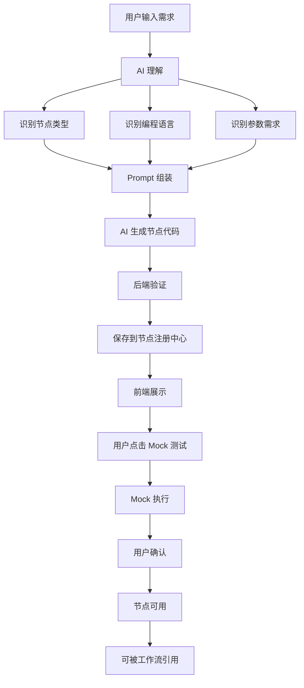

#### 异常流程

**场景 1：AI 生成失败**
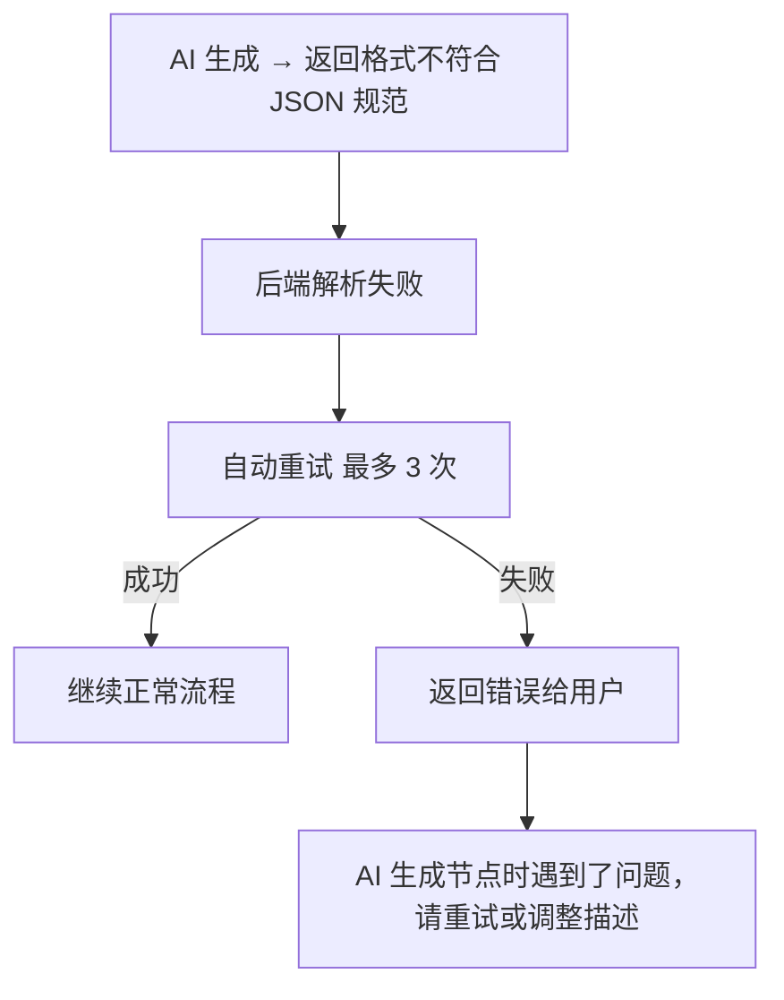

**场景 2：Mock 测试失败**
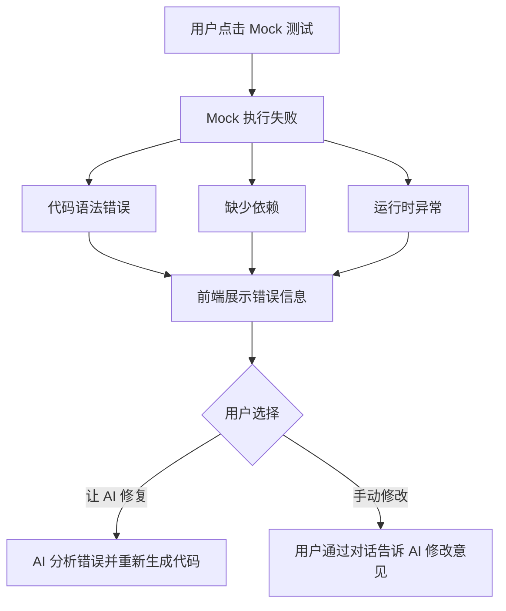

**场景 3：用户描述模糊**
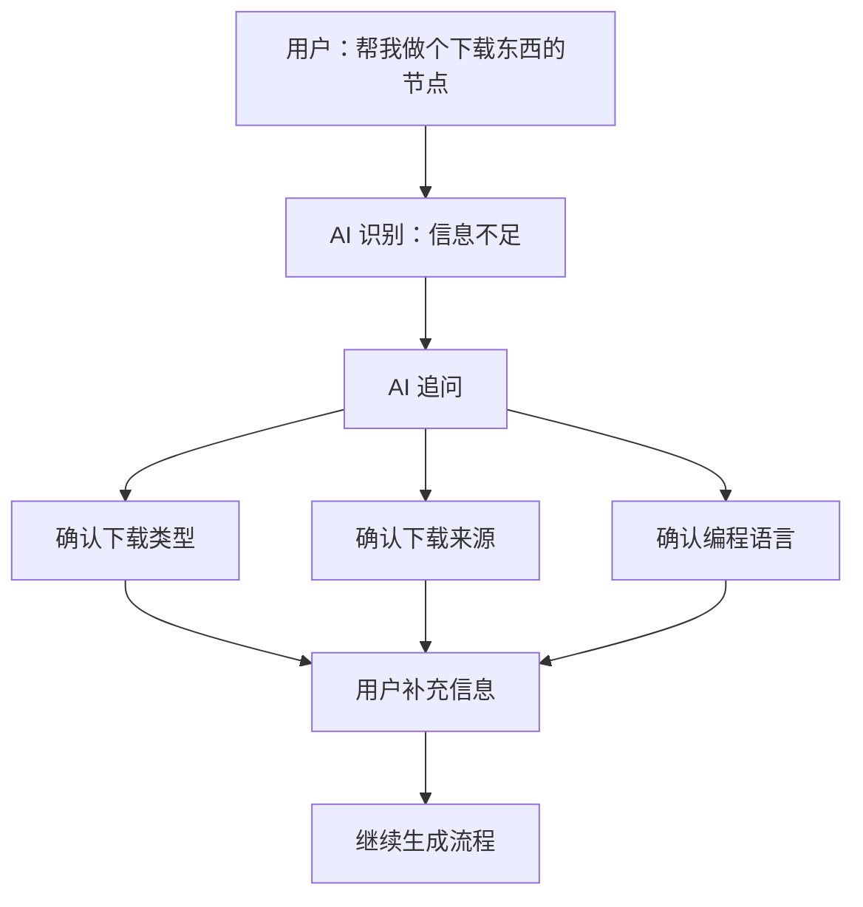

### 6.11.3 工作流生成的业务流

#### 正常流程

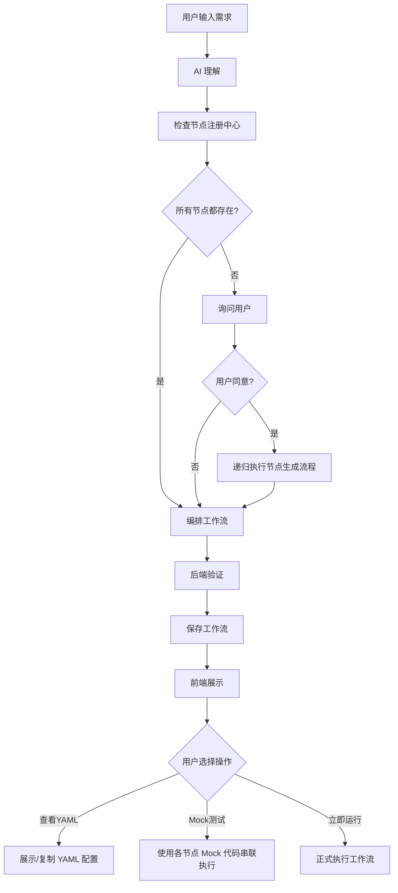

#### 多轮迭代流程

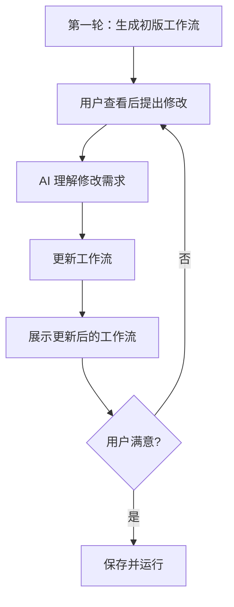

### 6.11.4 对话交互的业务流

#### 核心原则

AI 助手不是简单的问答机器人，而是**主动的工作流构建搭档**。它会：
1. **主动询问**：发现信息缺失时主动追问
2. **主动建议**：根据上下文推荐下一步操作
3. **主动诊断**：执行失败时主动分析原因并给出修复方案

#### 对话状态机

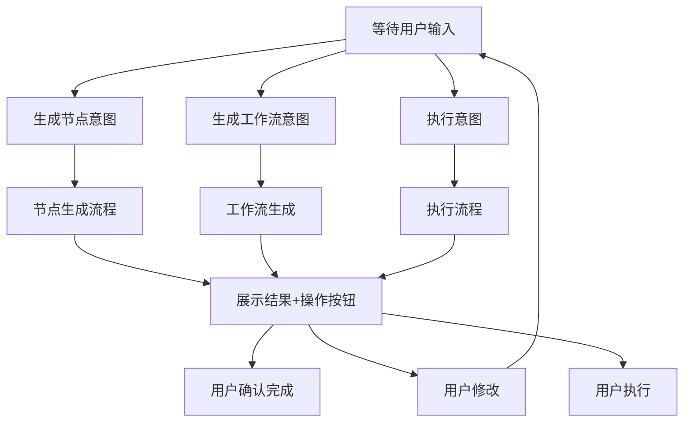

#### 意图识别

AI 需要识别用户的意图类型：

| 意图类型 | 关键词/模式 | 示例 |
|---------|-----------|------|
| **生成节点** | "创建节点"、"生成"、"做个...功能" | "帮我做一个下载图片的节点" |
| **生成工作流** | "工作流"、"流水线"、"流程" | "做一个图片处理工作流" |
| **修改现有** | "修改"、"改成"、"替换" | "把压缩节点改成 WebP 格式" |
| **执行** | "运行"、"执行"、"测试" | "运行这个工作流" |
| **诊断** | "为什么失败"、"报错"、"错误" | "为什么上传节点失败了？" |
| **查询** | "查看"、"显示"、"是什么" | "查看所有可用节点" |

#### 多轮对话的上下文维护

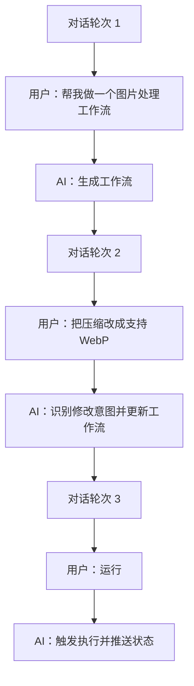

### 6.11.5 执行与监控的业务流

#### 工作流执行流程

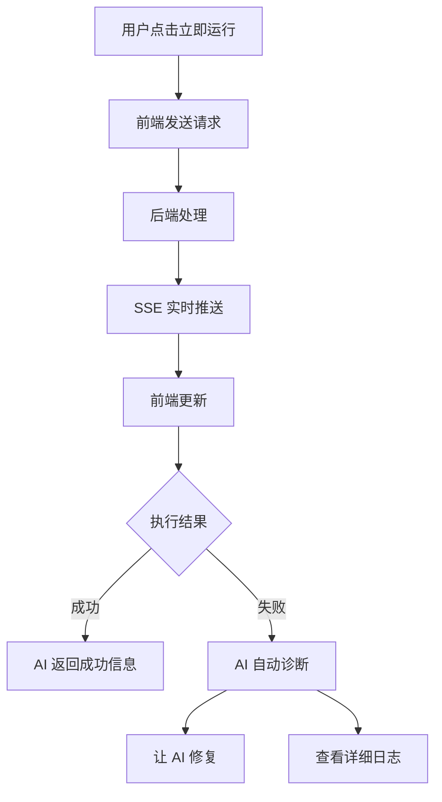

#### Mock 测试流程

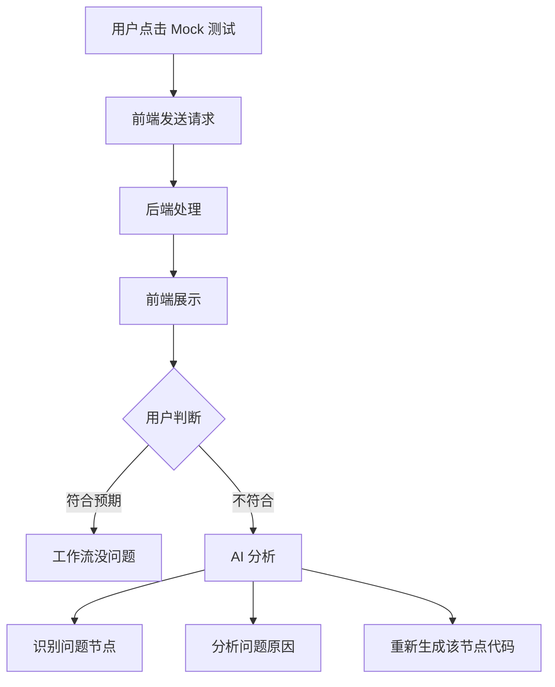

### 6.11.6 异常处理的业务流

#### 生成超时

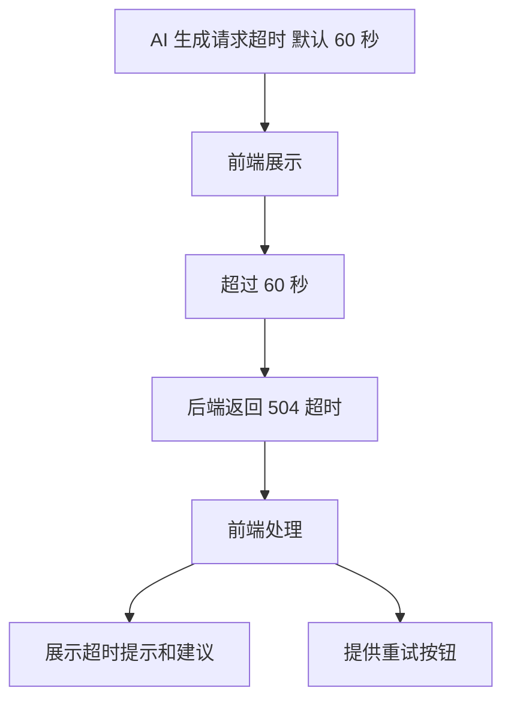

#### AI 理解错误

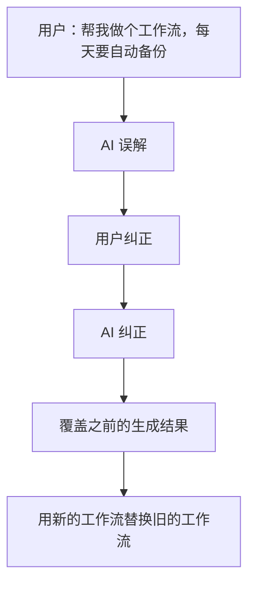

#### 依赖缺失

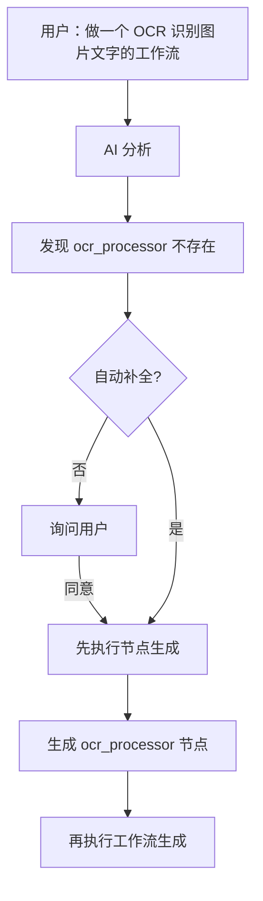

### 6.11.7 业务状态流转图

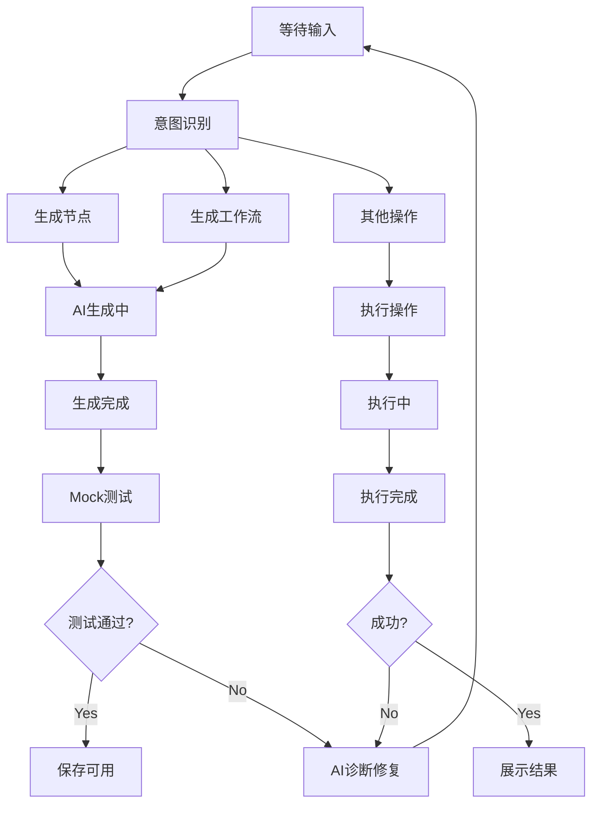

### 6.11.8 关键业务规则

1. **零手动配置**：用户只能通过自然语言与 AI 交互，不提供任何表单、拖拽、参数输入框
2. **Mock 先行**：每个新生成的节点必须先通过 Mock 测试，才能被工作流引用执行
3. **原子性生成**：节点和工作流的生成是原子操作，生成失败不会留下半成品
4. **版本覆盖**：同一工作流多次生成时，新结果覆盖旧结果，但保留历史执行记录
5. **上下文继承**：多轮对话中，AI 始终记得当前工作流和节点的上下文，无需用户重复说明
6. **自动补全**：AI 检测到缺失节点时，默认询问用户是否需要自动生成（可配置为自动）

## 6.12 结构化交互协议（FlowX Action Protocol）

### 6.12.1 设计目标

AI 助手不是简单的问答机器人，而是**主动的工作流构建搭档**。为实现 AI 与系统之间的结构化通信，引入 **FlowX Action Protocol (FAP)**，通过特殊标签承载结构化信息。

**核心目标**：
- **结构化通信**：AI 生成的操作意图以机器可解析的格式传递
- **用户确认**：所有修改类操作必须经过用户确认
- **状态同步**：多轮对话中保持系统状态一致性
- **错误恢复**：操作失败时自动诊断并提供修复方案

**通信模式**：
```
用户自然语言 → AI理解 → 生成带标签的响应 → 前端解析标签
→ 展示可执行卡片 → 用户确认 → 调用API → 反馈结果给AI
```

### 6.12.2 标签语法规范

采用自定义轻量语法，与自然语言明显区分：

```
[[ACTION:类型]]
{
  "参数": "值"
}
[[/ACTION]]
```

**设计理由**：
- `[[` 和 `]]` 在自然语言中极少出现，避免与正文混淆
- 支持 JSON payload，表达能力丰富
- 解析简单，正则即可提取
- 视觉上有"代码块"的暗示，但比 XML/Markdown 更简洁

**完整示例**：
```markdown
好的，我来为你创建一个图片下载节点。

[[ACTION:create_node]]
{
  "name": "image_downloader",
  "description": "从URL下载图片到本地",
  "language": "python",
  "code": "import os\nimport requests\n...",
  "mock_code": "import os\nimport json\n...",
  "parameters": [
    {"name": "url", "type": "string", "description": "图片URL", "required": true},
    {"name": "timeout", "type": "integer", "description": "超时时间(秒)", "required": false, "default": 30}
  ]
}
[[/ACTION]]

节点已生成，是否要进行 Mock 测试？
```

### 6.12.3 Action 类型定义

#### 操作类 Action（需要用户确认）

| Action 类型 | 说明 | Payload 示例 | 确认方式 |
|------------|------|-------------|---------|
| `create_node` | 创建新节点 | `{name, description, language, code, mock_code, parameters}` | 卡片确认 |
| `update_node` | 更新现有节点 | `{id, name?, description?, code?, mock_code?, parameters?}` | 卡片确认 |
| `delete_node` | 删除节点 | `{id, name}` | 危险确认（红色） |
| `create_workflow` | 创建工作流 | `{name, description, yaml_config, nodes}` | 卡片确认 |
| `update_workflow` | 更新工作流 | `{id, name?, description?, yaml_config?, nodes?}` | 卡片确认 |
| `delete_workflow` | 删除工作流 | `{id, name}` | 危险确认（红色） |
| `run_workflow` | 执行工作流 | `{workflow_id, parameters?}` | 卡片确认 |
| `mock_test` | Mock测试 | `{node_id?/workflow_id?, type: "node"|"workflow", parameters?}` | 卡片确认 |

#### 交互类 Action（直接展示）

| Action 类型 | 说明 | Payload 示例 | 展示方式 |
|------------|------|-------------|---------|
| `ask_input` | 向用户请求信息 | `{question, field_name, field_type, options?}` | 输入表单卡片 |
| `show_info` | 展示信息/状态 | `{type: "success"|"error"|"warning"|"info", message, details?}` | 信息卡片 |
| `navigate` | 切换页面 | `{page: "workflow_builder"|"node_generator"|"executors", params?}` | 直接跳转 |
| `confirm_action` | 要求确认 | `{message, action_type, action_payload}` | 确认对话框 |

#### Action 使用规则

1. **单次响应限制**：一个 AI 响应中最多包含 1 个操作类 Action，避免批量操作风险
2. **信息类无限制**：`show_info`、`ask_input` 等交互类 Action 可以多个
3. **嵌套禁止**：Action 标签内不支持嵌套 Action
4. **JSON 转义**：payload 中的字符串需正确转义特殊字符（如换行符 `\n`）

### 6.12.4 前端解析与渲染

#### 解析器实现

```typescript
// 正则匹配所有 ACTION 标签
const ACTION_REGEX = /\[\[ACTION:(\w+)\]\]([\s\S]*?)\[\[\/ACTION\]\]/g;

interface ParsedAction {
  type: string;
  payload: Record<string, unknown>;
  raw: string; // 原始标签内容
}

function parseAIResponse(content: string): {
  text: string;      // 纯文本内容（标签已移除）
  actions: ParsedAction[];
} {
  const actions: ParsedAction[] = [];
  let text = content;
  
  let match;
  while ((match = ACTION_REGEX.exec(content)) !== null) {
    const [, type, payloadStr] = match;
    try {
      actions.push({
        type,
        payload: JSON.parse(payloadStr.trim()),
        raw: match[0]
      });
      text = text.replace(match[0], '');
    } catch (e) {
      // JSON 解析失败，保留原始文本
      console.error('Failed to parse action payload:', e);
    }
  }
  
  return { text: text.trim(), actions };
}
```

#### 渲染策略

**文本部分**：
- 使用 `react-markdown` 渲染
- 支持代码高亮、列表、表格等标准 Markdown

**Action 部分**：
- 操作类 Action：渲染为可交互卡片
  - 顶部：操作类型图标 + 操作名称
  - 中部：参数摘要（可展开查看完整 JSON）
  - 底部：确认/取消/编辑 按钮组
  - 危险操作（delete）：红色主题 + 二次确认
- 交互类 Action：直接展示
  - `ask_input`：内嵌输入表单
  - `show_info`：彩色信息卡片（根据 type）
  - `navigate`：页面平滑过渡

```tsx
// ActionCard 组件示例
function ActionCard({ action, onConfirm, onCancel, onEdit }: ActionCardProps) {
  const isDangerous = ['delete_node', 'delete_workflow'].includes(action.type);
  
  return (
    <div className={`action-card ${isDangerous ? 'danger' : ''}`}>
      <div className="action-header">
        <ActionIcon type={action.type} />
        <span>{getActionLabel(action.type)}</span>
      </div>
      <div className="action-summary">
        {renderSummary(action)}
      </div>
      <div className="action-buttons">
        <button onClick={onCancel}>取消</button>
        {onEdit && <button onClick={onEdit}>编辑</button>}
        <button onClick={onConfirm} className={isDangerous ? 'danger' : 'primary'}>
          确认
        </button>
      </div>
    </div>
  );
}
```

#### 用户输入过滤

防止用户输入中意外包含 Action 标签语法：

```typescript
function sanitizeUserInput(input: string): string {
  // 转义用户输入中的 [[ACTION: 模式
  return input.replace(/\[\[ACTION:/g, '\\[\\[ACTION:');
}
```

### 6.12.5 后端上下文管理

#### 会话上下文结构

```go
package ai

type ChatContext struct {
    SessionID          string
    CurrentPage        string           // 当前页面: workflow_builder|node_generator|executors
    SelectedNodeID     *int64           // 当前选中节点
    SelectedWorkflowID *int64          // 当前选中工作流
    PendingActions     []PendingAction  // 待确认的操作队列
    History            []Message        // 对话历史
    GeneratedNodes     []int64          // 本轮生成的节点ID（用于快速引用）
    GeneratedWorkflows []int64          // 本轮生成的工作流ID
    LastActionResult   *ActionResult    // 上一个操作的结果
}

type PendingAction struct {
    ID        string
    Type      string
    Payload   map[string]interface{}
    CreatedAt time.Time
    Status    string // pending|confirmed|cancelled|executed|failed
}

type ActionResult struct {
    ActionID string
    Success  bool
    Message  string
    Data     map[string]interface{}
}
```

#### 上下文组装服务

```go
func (s *ChatContextService) BuildContext(sessionID string) (*ChatContext, error) {
    ctx := &ChatContext{SessionID: sessionID}
    
    // 1. 从 SessionStore 获取当前状态
    state, _ := s.sessionStore.Get(sessionID)
    ctx.CurrentPage = state.CurrentPage
    ctx.SelectedNodeID = state.SelectedNodeID
    ctx.SelectedWorkflowID = state.SelectedWorkflowID
    
    // 2. 获取待确认操作
    ctx.PendingActions = s.actionStore.GetPending(sessionID)
    
    // 3. 获取对话历史（最近 10 轮）
    ctx.History = s.messageStore.GetRecent(sessionID, 10)
    
    // 4. 获取本轮生成的实体
    ctx.GeneratedNodes = s.nodeStore.GetRecentBySession(sessionID)
    ctx.GeneratedWorkflows = s.workflowStore.GetRecentBySession(sessionID)
    
    return ctx, nil
}

func (s *ChatContextService) InjectContextToPrompt(ctx *ChatContext, basePrompt string) string {
    var b strings.Builder
    
    // 系统状态上下文
    b.WriteString("## 当前系统状态\n")
    b.WriteString(fmt.Sprintf("- 页面: %s\n", ctx.CurrentPage))
    if ctx.SelectedNodeID != nil {
        node, _ := s.nodeRepo.Get(*ctx.SelectedNodeID)
        b.WriteString(fmt.Sprintf("- 选中节点: %s (ID: %d)\n", node.Name, node.ID))
    }
    if ctx.SelectedWorkflowID != nil {
        wf, _ := s.workflowRepo.Get(*ctx.SelectedWorkflowID)
        b.WriteString(fmt.Sprintf("- 选中工作流: %s (ID: %d)\n", wf.Name, wf.ID))
    }
    
    // 可用节点列表（用于工作流生成）
    if ctx.CurrentPage == "workflow_builder" {
        nodes, _ := s.nodeRepo.ListAll()
        b.WriteString("\n## 可用节点\n")
        for _, n := range nodes {
            b.WriteString(fmt.Sprintf("- %s: %s\n", n.Name, n.Description))
        }
    }
    
    // 待确认操作
    if len(ctx.PendingActions) > 0 {
        b.WriteString("\n## 待确认操作\n")
        for _, a := range ctx.PendingActions {
            b.WriteString(fmt.Sprintf("- [%s] %s (创建于 %s)\n", 
                a.Type, a.ID, a.CreatedAt.Format("15:04:05")))
        }
    }
    
    // 最近的生成结果
    if ctx.LastActionResult != nil {
        b.WriteString("\n## 最近操作结果\n")
        status := "成功"
        if !ctx.LastActionResult.Success {
            status = "失败"
        }
        b.WriteString(fmt.Sprintf("- 操作 %s: %s - %s\n", 
            ctx.LastActionResult.ActionID, status, ctx.LastActionResult.Message))
    }
    
    b.WriteString("\n")
    b.WriteString(basePrompt)
    
    return b.String()
}
```

#### API 路由更新

```go
// POST /api/v1/ai/chat
func (h *AIHandler) Chat(w http.ResponseWriter, r *http.Request) {
    var req struct {
        SessionID string `json:"session_id"`
        Message   string `json:"message"`
        Context   struct {
            CurrentPage        string `json:"current_page"`
            SelectedNodeID     *int64 `json:"selected_node_id"`
            SelectedWorkflowID *int64 `json:"selected_workflow_id"`
        } `json:"context"`
    }
    
    json.NewDecoder(r.Body).Decode(&req)
    
    // 1. 构建上下文
    chatCtx, _ := h.contextService.BuildContext(req.SessionID)
    chatCtx.CurrentPage = req.Context.CurrentPage
    chatCtx.SelectedNodeID = req.Context.SelectedNodeID
    chatCtx.SelectedWorkflowID = req.Context.SelectedWorkflowID
    
    // 2. 注入上下文到 Prompt
    prompt := h.contextService.InjectContextToPrompt(chatCtx, req.Message)
    
    // 3. 调用 AI
    response, _ := h.aiService.ChatStream(r.Context(), ChatRequest{
        Messages: []Message{
            {Role: "system", Content: h.promptEngine.GetSystemPrompt()},
            {Role: "user", Content: prompt},
        },
    })
    
    // 4. SSE 流式输出
    h.sseWriter.Write(w, response)
}

// POST /api/v1/ai/actions/:action_id/confirm
func (h *AIHandler) ConfirmAction(w http.ResponseWriter, r *http.Request) {
    actionID := mux.Vars(r)["action_id"]
    var req struct {
        Confirmed bool                   `json:"confirmed"`
        EditedPayload map[string]interface{} `json:"edited_payload,omitempty"`
    }
    json.NewDecoder(r.Body).Decode(&req)
    
    // 1. 获取待确认操作
    action, _ := h.actionStore.Get(actionID)
    
    if !req.Confirmed {
        // 取消操作
        h.actionStore.UpdateStatus(actionID, "cancelled")
        json.NewEncoder(w).Encode(Response{Code: 200, Message: "Action cancelled"})
        return
    }
    
    // 2. 如有编辑，更新 payload
    payload := action.Payload
    if req.EditedPayload != nil {
        payload = req.EditedPayload
    }
    
    // 3. 执行操作
    result, err := h.executeAction(action.Type, payload)
    
    // 4. 更新状态
    if err != nil {
        h.actionStore.UpdateStatus(actionID, "failed")
        h.actionStore.SetResult(actionID, ActionResult{Success: false, Message: err.Error()})
    } else {
        h.actionStore.UpdateStatus(actionID, "executed")
        h.actionStore.SetResult(actionID, ActionResult{Success: true, Data: result})
    }
    
    // 5. 将结果注入对话上下文
    h.contextService.SetLastActionResult(action.SessionID, actionID, err == nil, result)
    
    json.NewEncoder(w).Encode(Response{
        Code: 200,
        Data: map[string]interface{}{
            "success": err == nil,
            "result": result,
        },
    })
}
```

### 6.12.6 多轮对话状态维护

#### 状态流转图

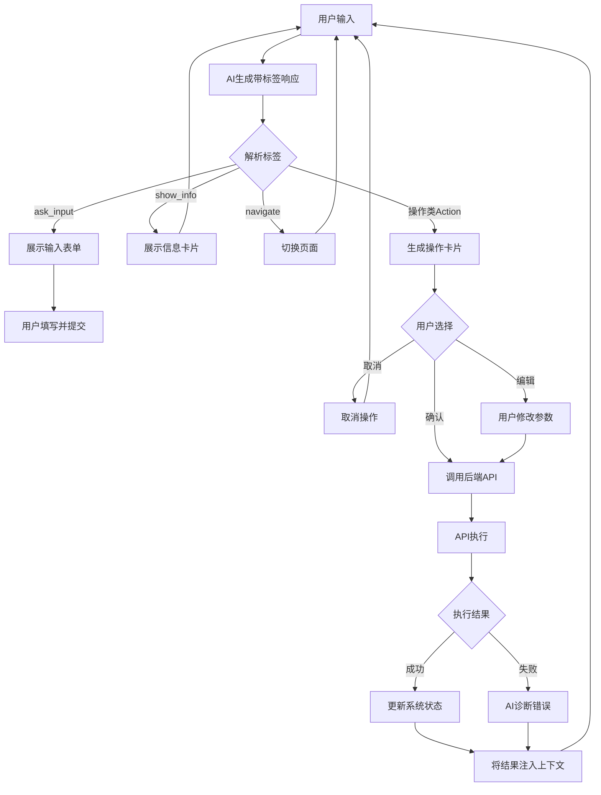

#### 典型对话流程示例

**场景：创建节点并测试**

```
[Round 1]
用户: 帮我做一个下载图片的节点
AI: 好的，我来为你创建一个图片下载节点。

[[ACTION:create_node]]
{
  "name": "image_downloader",
  "description": "从URL下载图片到本地",
  "language": "python",
  "code": "...",
  "mock_code": "...",
  "parameters": [...]
}
[[/ACTION]]

节点已生成，请确认是否创建。

---
[Round 2]
用户: [点击确认按钮]
系统: [调用 POST /api/v1/nodes, 返回 node_id=15]
AI: 节点 "image_downloader" 已创建成功！是否进行 Mock 测试？

[[ACTION:mock_test]]
{
  "node_id": 15,
  "type": "node",
  "parameters": {
    "url": "https://example.com/image.jpg"
  }
}
[[/ACTION]]

---
[Round 3]
用户: [点击确认测试]
系统: [执行 Mock 测试，返回成功]
AI: Mock 测试通过！

[[ACTION:show_info]]
{
  "type": "success",
  "message": "Mock 测试通过",
  "details": {
    "duration_ms": 520,
    "output": {
      "file_path": "/tmp/mock_image_12345.jpg",
      "size_bytes": 2048
    }
  }
}
[[/ACTION]]

节点现在可以使用了。你可以在工作流中引用它，或者继续优化代码。
```

### 6.12.7 错误处理机制

#### AI 生成无效 Action

| 错误类型 | 处理方式 |
|---------|---------|
| JSON 解析失败 | 前端记录错误日志，忽略该 Action，继续展示文本内容 |
| Action 类型未知 | 忽略并记录日志，不阻止其他 Action 处理 |
| 参数缺失 | 展示"参数不完整"提示，提供编辑功能补全参数 |
| 标签未闭合 | 正则匹配失败时保留原始文本，不尝试解析 |

#### API 调用失败

```
[用户确认 create_node]
系统: [调用 API 失败，错误: "节点名称已存在"]
AI: 创建节点时遇到问题：

[[ACTION:show_info]]
{
  "type": "error",
  "message": "节点名称 'image_downloader' 已存在",
  "details": {
    "suggestion": "请选择覆盖现有节点，或修改名称后重试"
  }
}
[[/ACTION]]

[[ACTION:ask_input]]
{
  "question": "你希望如何继续？",
  "field_name": "next_action",
  "field_type": "select",
  "options": [
    {"value": "overwrite", "label": "覆盖现有节点"},
    {"value": "rename", "label": "修改名称"},
    {"value": "cancel", "label": "取消操作"}
  ]
}
[[/ACTION]]
```

#### 自动诊断与修复

当操作失败时，AI 自动分析错误并提供修复方案：

```
[用户确认 update_node]
系统: [Mock 测试失败，错误: "缺少依赖 requests"]
AI: Mock 测试失败，检测到缺少依赖：

[[ACTION:show_info]]
{
  "type": "warning",
  "message": "Mock 测试失败",
  "details": {
    "error": "ModuleNotFoundError: No module named 'requests'",
    "diagnosis": "节点代码使用了 requests 库，但 requirements 中未声明"
  }
}
[[/ACTION]]

[[ACTION:update_node]]
{
  "id": 15,
  "requirements": "requests\npillow",
  "auto_fix": true
}
[[/ACTION]]

已自动修复依赖声明，是否重新测试？
```

### 6.12.8 安全考虑

1. **输入过滤**
   - 用户输入中的 `[[ACTION:` 会被转义，防止伪造 Action
   - 后端再次校验 Action 来源，仅接受来自 AI 的 Action

2. **权限检查**
   - 后端验证每个 Action 的权限（如 delete 需要管理员权限）
   - 敏感操作记录审计日志

3. **参数校验**
   - 后端使用 JSON Schema 严格校验 Action payload
   - 类型检查、必填字段检查、取值范围检查

4. **防重复提交**
   - PendingAction 有唯一 ID（UUID），防止重复确认
   - 已执行/已取消的 Action 不可再次确认

5. **超时机制**
   - PendingAction 默认 5 分钟后自动过期
   - 过期后前端提示用户操作已过期，需要重新发起

## 6.13 Prompt 模板更新

### 6.13.1 系统级 System Prompt

更新后的 System Prompt，包含 Action 协议规范：

```markdown
你是 FlowX AI 助手，一个帮助用户创建和管理工作流的智能助手。

## 能力
1. 理解用户的自动化需求
2. 生成可复用的工作流节点
3. 编排复杂的工作流
4. 诊断和修复工作流错误

## 交互协议
你可以使用特殊标签来触发系统操作。标签语法如下：

[[ACTION:类型]]
{
  "参数": "值"
}
[[/ACTION]]

### 可用的 Action 类型

**操作类（需要用户确认后执行）：**
- `create_node` - 创建新节点
- `update_node` - 更新节点
- `delete_node` - 删除节点（危险操作）
- `create_workflow` - 创建工作流
- `update_workflow` - 更新工作流
- `delete_workflow` - 删除工作流（危险操作）
- `run_workflow` - 执行工作流
- `mock_test` - Mock 测试

**交互类（直接展示）：**
- `ask_input` - 向用户请求信息
- `show_info` - 展示信息/状态
- `navigate` - 切换页面

### Action 使用规则
1. 一个响应中最多包含 1 个操作类 Action
2. 交互类 Action 可以多个
3. 所有修改类操作必须等待用户确认后才执行
4. Action 标签内的 payload 必须是合法 JSON
5. 不要在 Action 标签外透露 payload 中的敏感信息

## 原则
1. 主动询问缺失的关键信息
2. 提供清晰的操作建议
3. 如果用户描述模糊，给出示例帮助澄清
4. 保持对话简洁，聚焦工作流主题
5. 操作失败时主动诊断并提供修复方案
```

### 6.13.2 节点生成 Prompt

更新后的节点生成 Prompt，使用 Action 协议：

```markdown
你是一个 FlowX 节点开发专家。FlowX 是一个工作流引擎，节点是可复用的执行单元。

## 任务
根据用户描述，生成一个符合 FlowX 规范的节点。

## 节点规范
1. **输入**：节点通过环境变量接收参数，参数名使用大写+下划线格式，如 `URL`、`TIMEOUT`
2. **输出**：节点将结果输出到 stdout，使用 JSON 格式
3. **错误**：错误信息输出到 stderr，进程 exit code 非 0
4. **语言**：支持 Python、Go、Bash 等

## 输出要求
使用 [[ACTION:create_node]] 标签输出节点定义：

[[ACTION:create_node]]
{
  "name": "节点名称（蛇形命名）",
  "description": "节点功能描述",
  "language": "python|go|bash",
  "code": "完整实现代码",
  "mock_code": "Mock 测试代码（不依赖外部服务）",
  "parameters": [
    {
      "name": "参数名",
      "type": "string|integer|float|boolean|array|object",
      "description": "参数描述",
      "required": true|false,
      "default": "默认值（可选）"
    }
  ]
}
[[/ACTION]]

## 用户描述
{{user_description}}

## 上下文
{{context}}

请生成节点：
```

### 6.13.3 工作流生成 Prompt

更新后的工作流生成 Prompt：

```markdown
你是一个工作流编排专家。FlowX 使用 YAML 配置定义工作流，图结构使用 Mermaid stateDiagram-v2 语法。

## 可用节点
{{available_nodes}}

## 用户需求
{{user_description}}

## 输出要求
使用 [[ACTION:create_workflow]] 标签输出工作流定义：

[[ACTION:create_workflow]]
{
  "name": "工作流名称（蛇形命名）",
  "description": "工作流描述",
  "yaml_config": "完整的 FlowX YAML 配置",
  "nodes": ["引用的节点名称列表"]
}
[[/ACTION]]

### YAML 结构示例
```yaml
name: workflow_name
version: "1.0"
graph: |
  stateDiagram-v2
    [*] --> node1
    node1 --> node2
    node2 --> [*]
nodes:
  node1:
    steps:
      - name: step1
        executor: local
        commands:
          - python {{.node.code}}
```

### 注意事项
1. 如果现有节点不够用，使用 [[ACTION:ask_input]] 询问用户是否创建新节点
2. 图结构必须正确，使用 Mermaid stateDiagram-v2 语法
3. 节点配置必须引用正确的参数
```

### 6.13.4 对话 Prompt

更新后的对话 Prompt：

```markdown
你是 FlowX AI 助手，一个帮助用户创建和管理工作流的智能助手。

## 当前系统状态
- 页面: {{current_page}}
- 选中节点: {{selected_node_name}}
- 选中工作流: {{selected_workflow_name}}

## 能力
1. 理解用户的自动化需求
2. 生成可复用的工作流节点
3. 编排复杂的工作流
4. 诊断和修复工作流错误
5. 执行系统操作（需要用户确认）

## 可用的 Action
你可以使用以下 Action 标签触发系统操作：

**操作类（需用户确认）：**
- [[ACTION:create_node]] {...} [[/ACTION]]
- [[ACTION:update_node]] {...} [[/ACTION]]
- [[ACTION:delete_node]] {...} [[/ACTION]]
- [[ACTION:create_workflow]] {...} [[/ACTION]]
- [[ACTION:update_workflow]] {...} [[/ACTION]]
- [[ACTION:run_workflow]] {...} [[/ACTION]]
- [[ACTION:mock_test]] {...} [[/ACTION]]

**交互类（直接展示）：**
- [[ACTION:ask_input]] {"question": "...", "field_name": "...", "field_type": "..."} [[/ACTION]]
- [[ACTION:show_info]] {"type": "...", "message": "..."} [[/ACTION]]
- [[ACTION:navigate]] {"page": "..."} [[/ACTION]]

## 原则
1. 主动询问缺失的关键信息
2. 提供清晰的操作建议
3. 如果用户描述模糊，给出示例帮助澄清
4. 保持对话简洁，聚焦工作流主题
5. 一个响应中最多使用 1 个操作类 Action
6. 操作失败时主动诊断并提供修复方案

## 最近操作结果
{{last_action_result}}

用户消息：{{user_message}}
```

### 6.13.5 错误诊断 Prompt

新增的错误诊断 Prompt：

```markdown
你是一个 FlowX 工作流诊断专家。请分析以下错误并提供修复方案。

## 错误信息
{{error_message}}

## 相关代码/配置
{{code_or_config}}

## 上下文
{{context}}

## 任务
1. 分析错误原因
2. 提供修复方案
3. 如果可以通过 Action 自动修复，使用 [[ACTION:update_node]] 或 [[ACTION:update_workflow]] 输出修复后的内容
4. 如果无法自动修复，使用 [[ACTION:ask_input]] 询问用户更多信息
```

---

*文档版本: 2.0*
*更新日期: 2024-01*
*主要变更: 新增 6.12 结构化交互协议和 6.13 Prompt 模板更新*
