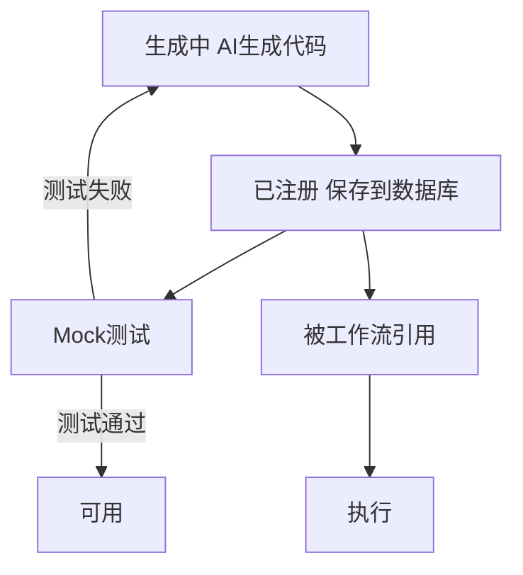
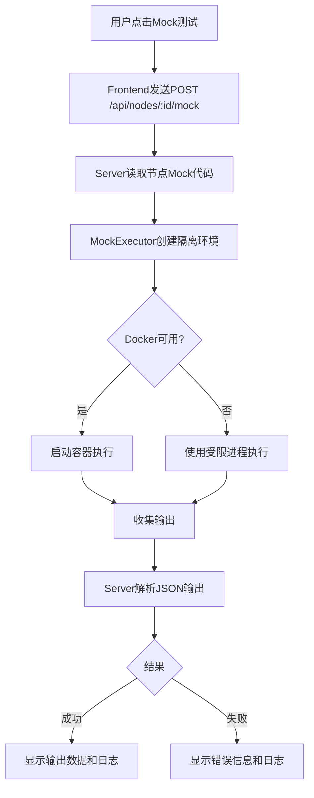
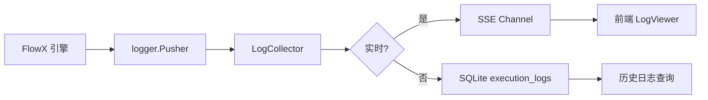

# 7. 节点系统与执行引擎

## 7.1 节点注册中心

### 7.1.1 节点定义

节点是 FlowX 工作流中的最小执行单元，每个节点包含：

```go
type Node struct {
    ID           int64
    Name         string            // 唯一标识（蛇形命名）
    Description  string            // 功能描述
    Language     string            // python | go | bash | node
    Code         string            // 实现代码
    MockCode     string            // Mock 测试代码
    Parameters   []Parameter       // 参数定义
    Dockerfile   string            // 可选：自定义 Dockerfile
    Requirements string            // 可选：依赖列表
    Tags         []string          // 标签
    CreatedAt    time.Time
    UpdatedAt    time.Time
}

type Parameter struct {
    Name        string      `json:"name"`
    Type        string      `json:"type"`        // string | integer | float | boolean | array | object
    Description string      `json:"description"`
    Required    bool        `json:"required"`
    Default     interface{} `json:"default,omitempty"`
}
```

### 7.1.2 节点生命周期



### 7.1.3 节点版本管理

V1 暂不支持版本管理，节点名称全局唯一。如果 AI 生成同名节点，提示用户选择覆盖或重命名。

## 7.2 节点代码规范

### 7.2.1 输入规范

节点通过**环境变量**接收输入参数：

```bash
# 参数名格式：FLOWX_PARAM_{大写参数名}
FLOWX_PARAM_URL=https://example.com/image.jpg
FLOWX_PARAM_TIMEOUT=30
```

不同语言的读取示例：

**Python**：
```python
import os
import json

url = os.environ.get('FLOWX_PARAM_URL')
timeout = int(os.environ.get('FLOWX_PARAM_TIMEOUT', '30'))
```

**Go**：
```go
package main

import (
    "os"
    "strconv"
)

func main() {
    url := os.Getenv("FLOWX_PARAM_URL")
    timeout, _ := strconv.Atoi(os.Getenv("FLOWX_PARAM_TIMEOUT"))
}
```

**Bash**：
```bash
URL="${FLOWX_PARAM_URL}"
TIMEOUT="${FLOWX_PARAM_TIMEOUT:-30}"
```

### 7.2.2 输出规范

节点将结果输出到 **stdout**，使用 JSON 格式：

```json
{
  "success": true,
  "data": {
    "file_path": "/tmp/image.jpg",
    "size_bytes": 2048
  },
  "metadata": {
    "duration_ms": 1500
  }
}
```

错误时输出到 **stderr** 并返回非 0 exit code：

```bash
# stderr
echo '{"success": false, "error": "下载失败：连接超时"}' >&2
exit 1
```

### 7.2.3 AI Prompt 中的代码规范要求

在生成节点的 Prompt 中，必须明确要求 AI：

1. 使用环境变量读取参数（`FLOWX_PARAM_*` 格式）
2. 输出 JSON 到 stdout
3. 错误时输出 JSON 到 stderr 并 exit 1
4. 包含基本的错误处理
5. 提供有意义的日志输出

## 7.3 Mock 模式

### 7.3.1 Mock 代码规范

每个节点必须包含 Mock 代码，Mock 代码的要求：

1. **不依赖外部服务**：不调用真实 API、不连接真实数据库
2. **返回合理数据**：返回与真实输出结构一致的模拟数据
3. **快速执行**：Mock 执行时间控制在 1-2 秒内
4. **验证逻辑**：验证输入参数的有效性

**Mock 代码示例（Python）**：

```python
import os
import json
import time

# 读取参数
url = os.environ.get('FLOWX_PARAM_URL', 'https://example.com/default.jpg')

# 验证参数
if not url.startswith(('http://', 'https://')):
    print(json.dumps({
        "success": False,
        "error": "Invalid URL format"
    }), file=sys.stderr)
    sys.exit(1)

# 模拟执行
print("Mock: 模拟下载图片...")
time.sleep(0.5)

# 返回模拟结果
result = {
    "success": True,
    "data": {
        "file_path": "/tmp/mock_image_12345.jpg",
        "size_bytes": 2048,
        "format": "JPEG",
        "width": 1920,
        "height": 1080
    },
    "metadata": {
        "duration_ms": 500,
        "mock": True
    }
}

print(json.dumps(result))
```

### 7.3.2 Mock 执行器

Mock 执行器负责在隔离环境中运行 Mock 代码：

```go
type MockExecutor interface {
    Execute(ctx context.Context, node *db.Node, params map[string]interface{}) (*MockResult, error)
}

type MockResult struct {
    Status      string                 // success | failed
    Duration    time.Duration
    Output      map[string]interface{}
    Logs        string
    Error       string
}
```

**执行策略**：

1. **优先 Docker**：如果系统有 Docker，使用轻量级容器运行
   - 使用对应语言的基础镜像（python:3.11-slim, golang:1.21-alpine 等）
   - 挂载只读文件系统，限制网络访问
   - 设置 CPU 和内存限制

2. **回退受限进程**：无 Docker 时使用操作系统进程隔离
   - Linux：使用 seccomp 和 cgroup 限制系统调用和资源
   - macOS：使用 sandbox-exec
   - Windows：使用 Job Objects

3. **超时控制**：默认 30 秒，可配置

```go
func (e *MockExecutor) Execute(ctx context.Context, node *db.Node, params map[string]interface{}) (*MockResult, error) {
    // 1. 构建环境变量
    envVars := e.buildEnvVars(node, params)
    
    // 2. 准备执行脚本
    script := e.prepareScript(node)
    
    // 3. 创建临时目录
    tempDir, err := os.MkdirTemp("", "flowx-mock-*")
    if err != nil {
        return nil, err
    }
    defer os.RemoveAll(tempDir)
    
    // 4. 写入脚本文件
    scriptPath := filepath.Join(tempDir, "mock_script")
    if err := os.WriteFile(scriptPath, []byte(script), 0755); err != nil {
        return nil, err
    }
    
    // 5. 执行（Docker 或受限进程）
    if e.hasDocker {
        return e.executeDocker(ctx, tempDir, envVars)
    }
    return e.executeSandbox(ctx, scriptPath, envVars)
}
```

### 7.3.3 Mock 测试流程



## 7.4 执行引擎集成

### 7.4.1 运行时适配器

运行时适配器将数据库存储的节点和工作流转换为 FlowX 引擎可执行的配置：

```go
type RuntimeAdapter struct {
    runtime flowx.Runtime
}

// BuildPipelineConfig 从工作流构建 PipelineConfig
func (a *RuntimeAdapter) BuildPipelineConfig(workflow *db.Workflow, nodes map[string]*db.Node) (*core.PipelineConfig, error) {
    config := &core.PipelineConfig{}
    
    // 解析 YAML
    if err := yaml.Unmarshal([]byte(workflow.YAMLConfig), config); err != nil {
        return nil, err
    }
    
    // 为每个节点注入代码
    for nodeName, node := range nodes {
        if nodeConfig, ok := config.Nodes[nodeName]; ok {
            // 将节点代码注入到节点配置中
            nodeConfig.Config = map[string]interface{}{
                "code": node.Code,
                "language": node.Language,
            }
        }
    }
    
    return config, nil
}
```

### 7.4.2 事件桥接

将 FlowX 引擎的事件桥接到 Web 层的 SSE：

```go
type EventBridge struct {
    executionID int64
    eventCh     chan SSEEvent
}

// OnNodeStart 节点开始执行
func (b *EventBridge) OnNodeStart(nodeID string) {
    b.eventCh <- SSEEvent{
        Type: "node_start",
        Data: map[string]interface{}{
            "execution_id": b.executionID,
            "node_id":      nodeID,
            "timestamp":    time.Now().UTC(),
        },
    }
}

// OnNodeComplete 节点执行完成
func (b *EventBridge) OnNodeComplete(nodeID string, result *executor.StepResult) {
    status := "success"
    if result.Error != nil {
        status = "failed"
    }
    
    b.eventCh <- SSEEvent{
        Type: "node_complete",
        Data: map[string]interface{}{
            "execution_id": b.executionID,
            "node_id":      nodeID,
            "status":       status,
            "duration_ms":  result.Duration.Milliseconds(),
            "timestamp":    time.Now().UTC(),
        },
    }
}

// OnLog 节点日志输出
func (b *EventBridge) OnLog(nodeID string, level string, message string) {
    b.eventCh <- SSEEvent{
        Type: "node_log",
        Data: map[string]interface{}{
            "execution_id": b.executionID,
            "node_id":      nodeID,
            "level":        level,
            "message":      message,
            "timestamp":    time.Now().UTC(),
        },
    }
}
```

### 7.4.3 执行状态持久化

执行过程中实时更新数据库：

```go
func (s *ExecutionService) StartExecution(ctx context.Context, workflowID int64) (*db.Execution, error) {
    // 1. 创建执行记录
    execution := &db.Execution{
        WorkflowID: workflowID,
        Status:     "pending",
    }
    if err := s.executionRepo.Create(ctx, execution); err != nil {
        return nil, err
    }
    
    // 2. 启动异步执行
    go s.runExecution(execution.ID)
    
    return execution, nil
}

func (s *ExecutionService) runExecution(executionID int64) {
    ctx := context.Background()
    
    // 3. 更新状态为运行中
    s.executionRepo.UpdateStatus(ctx, executionID, "running", time.Now())
    
    // 4. 获取工作流和节点
    execution, _ := s.executionRepo.Get(ctx, executionID)
    workflow, _ := s.workflowRepo.Get(ctx, execution.WorkflowID)
    
    // 5. 构建配置并执行
    config, _ := s.runtimeAdapter.BuildPipelineConfig(workflow, s.nodeRepo.GetByWorkflow(ctx, workflow.ID))
    
    // 6. 注册事件监听
    bridge := NewEventBridge(executionID, s.eventCh)
    s.runtime.OnNodeStart(bridge.OnNodeStart)
    s.runtime.OnNodeComplete(bridge.OnNodeComplete)
    s.runtime.OnLog(bridge.OnLog)
    
    // 7. 执行
    err := s.runtime.Run(ctx, config)
    
    // 8. 更新最终状态
    if err != nil {
        s.executionRepo.UpdateStatus(ctx, executionID, "failed", time.Now())
        s.executionRepo.UpdateError(ctx, executionID, err.Error())
    } else {
        s.executionRepo.UpdateStatus(ctx, executionID, "success", time.Now())
    }
}
```

## 7.5 执行日志管理

### 7.5.1 日志架构



### 7.5.2 日志收集

FlowX 引擎执行时产生的日志通过三层架构收集：

1. **Pusher 层**：FlowX 核心库的 `logger.Pusher` 接口推送日志
2. **Collector 层**：`LogCollector` 组件接收并分发日志
3. **存储层**：实时推送至前端 + 持久化到数据库

**日志来源**：
- **节点标准输出**：捕获 stdout/stderr（Python print、Go fmt 等）
- **引擎事件**：节点开始、完成、失败等状态变更
- **系统日志**：执行器生命周期、超时、资源限制触发等
- **AI 服务日志**：节点生成、工作流编排等操作记录

### 7.5.3 实时日志推送

通过 SSE 实时推送执行日志到前端：

```go
type LogCollector struct {
    sseClients map[int64][]chan LogEntry  // execution_id -> clients
    mu         sync.RWMutex
}

func (c *LogCollector) Collect(entry LogEntry) {
    // 1. 保存到数据库
    c.saveToDB(entry)
    
    // 2. 推送到 SSE 客户端
    c.pushToClients(entry.ExecutionID, entry)
}

func (c *LogCollector) pushToClients(executionID int64, entry LogEntry) {
    c.mu.RLock()
    clients := c.sseClients[executionID]
    c.mu.RUnlock()
    
    for _, ch := range clients {
        select {
        case ch <- entry:
        default: // 客户端消费慢，丢弃旧日志
        }
    }
}
```

### 7.5.4 日志存储

**实时日志**：
- 存储在内存环形缓冲区（每个执行最多 1000 条）
- 通过 SSE 实时推送到前端
- 执行完成后批量写入数据库

**历史日志**：
- 存储在 `execution_logs` 表（见 3.3.5 节）
- 支持按执行 ID、节点 ID、日志级别查询
- 分页加载，每页默认 100 条

**日志清理**：
- 自动清理：每天凌晨清理超过 30 天的日志
- 手动清理：提供 API 按执行 ID 清理
- 保留策略：可配置保留天数（默认 30 天）

### 7.5.5 日志格式

```json
{
  "id": 1024,
  "execution_id": 42,
  "node_id": "download",
  "node_name": "下载图片",
  "step_name": "download_image",
  "level": "info",
  "message": "开始下载图片: https://example.com/image.jpg",
  "output": "HTTP/1.1 200 OK\nContent-Length: 2048...",
  "timestamp": "2025-01-20T10:00:01.123Z"
}
```

**级别定义**：
| 级别 | 颜色 | 使用场景 |
|------|------|---------|
| `debug` | 灰色 | 开发调试、详细的执行跟踪 |
| `info` | 青色 | 节点开始/完成、正常操作 |
| `warn` | 黄色 | 超时、降级、资源限制触发 |
| `error` | 红色 | 节点执行失败、异常错误 |
| `fatal` | 深红 | 系统级致命错误 |

### 7.5.6 日志查询 API

后端提供日志查询接口（详见 4.5.4 节）：
- 按执行 ID 查询日志列表
- 按节点 ID 过滤
- 按日志级别过滤
- 关键词搜索（message 字段）
- 分页加载（limit/offset）
- 导出日志为 JSON / TXT / Markdown

## 7.6 执行超时与取消

### 7.6.1 超时控制

- **工作流级别**：默认 1 小时，可配置
- **节点级别**：默认 10 分钟，可在 YAML 中覆盖

```go
func (s *ExecutionService) runExecution(executionID int64) {
    // 获取超时配置
    timeout := s.getExecutionTimeout(executionID)
    ctx, cancel := context.WithTimeout(context.Background(), timeout)
    defer cancel()
    
    // 执行...
    err := s.runtime.Run(ctx, config)
    
    if ctx.Err() == context.DeadlineExceeded {
        s.executionRepo.UpdateStatus(ctx, executionID, "failed", time.Now())
        s.executionRepo.UpdateError(ctx, executionID, "Execution timeout")
    }
}
```

### 7.6.2 手动取消

用户可在前端点击"取消"按钮终止执行：

```http
POST /api/v1/executions/:id/cancel
```

实现方式：
- 通过 `context.Cancel()` 取消执行上下文
- FlowX Runtime 监听 context 取消信号，优雅停止

## 7.7 并发与资源限制

### 7.7.1 并发执行限制

防止同时运行过多工作流导致资源耗尽：

```go
type ExecutionLimiter struct {
    maxConcurrent int
    semaphore     chan struct{}
}

func (l *ExecutionLimiter) Acquire(ctx context.Context) error {
    select {
    case l.semaphore <- struct{}{}:
        return nil
    case <-ctx.Done():
        return ctx.Err()
    }
}

func (l *ExecutionLimiter) Release() {
    <-l.semaphore
}
```

默认并发限制：
- 同时执行的工作流数：5
- 可通过系统配置调整

### 7.7.2 资源隔离

Docker 执行器资源限制：

```go
type ResourceLimits struct {
    CPUQuota    int64  // CPU 配额（微秒）
    MemoryLimit int64  // 内存限制（字节）
    DiskLimit   int64  // 磁盘限制（字节）
}

// 默认限制
var defaultResourceLimits = ResourceLimits{
    CPUQuota:    100000,        // 0.1 CPU
    MemoryLimit: 512 * 1024 * 1024, // 512MB
    DiskLimit:   1 * 1024 * 1024 * 1024, // 1GB
}
```
