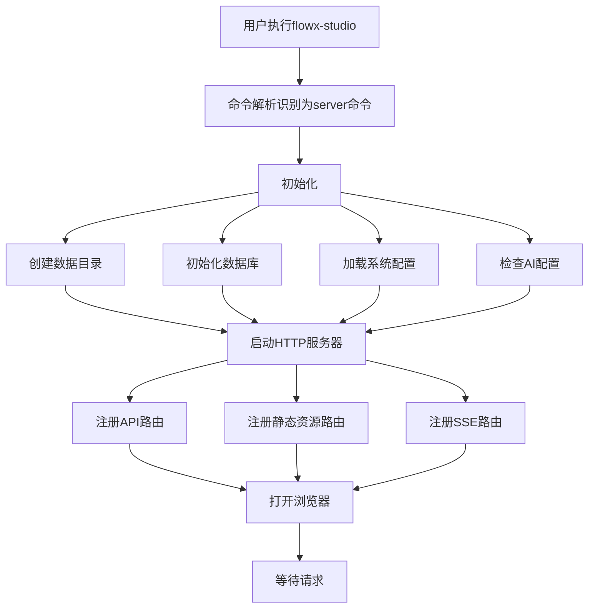

# 8. 运行时与部署设计

## 8.1 单二进制架构

### 8.1.1 设计目标

- **单个文件**：`flowx-studio` 一个二进制文件包含所有功能
- **零依赖**：无需安装 Node.js、Python 等运行时
- **自包含**：前端资源嵌入二进制，无需外部文件
- **快速启动**：3 秒内完成启动并打开浏览器
- **外部引擎**：FlowX 核心引擎通过 Go Module 编译进二进制

### 8.1.2 构建策略

```
┌─────────────────────────────────────────────────────────────┐
│                 flowx-studio binary                          │
│  ┌───────────────────────────────────────────────────────┐  │
│  │  Go 编译的 HTTP 服务器 + 业务逻辑                      │  │
│  │  ┌───────────────────────────────────────────────┐   │  │
│  │  │  前端静态资源 (go:embed web/dist/*)            │   │  │
│  │  │  - index.html                                  │   │  │
│  │  │  - *.js, *.css                                 │   │  │
│  │  │  - assets/                                     │   │  │
│  │  └───────────────────────────────────────────────┘   │  │
│  │  ┌───────────────────────────────────────────────┐   │  │
│  │  │  后端代码                                      │   │  │
│  │  │  - HTTP Server                                 │   │  │
│  │  │  - Business Logic                              │   │  │
│  │  │  - AI Service                                  │   │  │
│  │  │  - DB Layer (SQLite)                           │   │  │
│  │  └───────────────────────────────────────────────┘   │  │
│  └───────────────────────────────────────────────────────┘  │
│  ┌───────────────────────────────────────────────────────┐  │
│  │  FlowX 核心引擎 (通过 go.mod 编译进二进制)              │  │
│  │  github.com/LerkoX/flowx v1.x.x                       │  │
│  └───────────────────────────────────────────────────────┘  │
└─────────────────────────────────────────────────────────────┘
```

### 8.1.3 go:embed 嵌入前端资源

```go
package server

import (
    "embed"
    "io/fs"
    "net/http"
)

//go:embed all:web/dist
var webDist embed.FS

func NewStaticHandler() http.Handler {
    // 从嵌入的文件系统创建 http.FS
    distFS, err := fs.Sub(webDist, "web/dist")
    if err != nil {
        panic(err)
    }
    
    fileServer := http.FileServer(http.FS(distFS))
    
    return http.HandlerFunc(func(w http.ResponseWriter, r *http.Request) {
        // SPA 路由处理：所有非 API 请求返回 index.html
        if !strings.HasPrefix(r.URL.Path, "/api/") {
            // 检查文件是否存在
            _, err := distFS.Open(strings.TrimPrefix(r.URL.Path, "/"))
            if err != nil {
                // 文件不存在，返回 index.html（SPA 路由）
                r.URL.Path = "/"
            }
        }
        fileServer.ServeHTTP(w, r)
    })
}
```

### 8.1.4 构建流程

```bash
# 1. 构建前端
cd web
npm install
npm run build

# 2. 构建后端（嵌入前端）
cd ..
go build -o flowx-studio cmd/flowx-studio/main.go

# 最终产物：单个 flowx-studio 二进制文件
```

## 8.2 命令行接口（Cobra）

### 8.2.1 技术选型

使用 [spf13/cobra](https://github.com/spf13/cobra) 作为 CLI 框架，配合 [spf13/viper](https://github.com/spf13/viper) 处理配置加载。

**选择理由**：
- 业界标准的 Go CLI 框架，生态成熟
- 内置子命令、参数解析、帮助生成、自动补全
- 与 viper 无缝集成，支持配置文件和环境变量

### 8.2.2 命令设计

```bash
# 启动 Web UI（默认命令）
flowx-studio
flowx-studio server

# 查看版本
flowx-studio version

# 查看帮助
flowx-studio --help
flowx-studio server --help
```

**注意**：运行 YAML 工作流的 CLI 功能保留在 FlowX 核心库中（`flowx run workflow.yaml`），不在 flowx-studio 中提供。

### 8.2.3 启动参数

```bash
flowx-studio server [flags]

Flags:
  -p, --port int        HTTP 服务端口 (默认 8080)
  -H, --host string     监听地址 (默认 "0.0.0.0")
      --no-open         不自动打开浏览器
      --data-dir string 数据目录 (默认 "~/.flowx-studio")
      --debug           启用调试模式
```

### 8.2.4 Cobra 实现示例

```go
package main

import (
    "fmt"
    "os"

    "github.com/spf13/cobra"
    "github.com/spf13/viper"
)

var (
    cfgFile string
    rootCmd = &cobra.Command{
        Use:   "flowx-studio",
        Short: "AI 驱动的可视化工作流平台",
        Long: `FlowX Studio 是一个基于 FlowX 核心引擎的 AI 驱动可视化工作流平台。
用户通过自然语言描述需求，AI 自动完成节点生成、工作流编排和执行监控。`,
        Run: func(cmd *cobra.Command, args []string) {
            // 默认启动 server
            runServer()
        },
    }

    serverCmd = &cobra.Command{
        Use:   "server",
        Short: "启动 Web UI 服务",
        Long:  "启动 FlowX Studio 的 HTTP 服务器，提供 Web UI 和 API 服务",
        Run: func(cmd *cobra.Command, args []string) {
            runServer()
        },
    }

    versionCmd = &cobra.Command{
        Use:   "version",
        Short: "查看版本信息",
        Run: func(cmd *cobra.Command, args []string) {
            fmt.Printf("FlowX Studio %s (build %s)\n", version, commit)
            fmt.Printf("FlowX Engine %s\n", flowxVersion)
        },
    }
)

func init() {
    cobra.OnInitialize(initConfig)

    // 全局 flags
    rootCmd.PersistentFlags().StringVar(&cfgFile, "config", "", "配置文件路径")
    rootCmd.PersistentFlags().Bool("debug", false, "启用调试模式")
    viper.BindPFlag("debug", rootCmd.PersistentFlags().Lookup("debug"))

    // server 子命令 flags
    serverCmd.Flags().IntP("port", "p", 8080, "HTTP 服务端口")
    serverCmd.Flags().StringP("host", "H", "0.0.0.0", "监听地址")
    serverCmd.Flags().Bool("no-open", false, "不自动打开浏览器")
    serverCmd.Flags().String("data-dir", "~/.flowx-studio", "数据目录")

    // 绑定到 viper
    viper.BindPFlag("server.port", serverCmd.Flags().Lookup("port"))
    viper.BindPFlag("server.host", serverCmd.Flags().Lookup("host"))
    viper.BindPFlag("server.no_open", serverCmd.Flags().Lookup("no-open"))
    viper.BindPFlag("data.dir", serverCmd.Flags().Lookup("data-dir"))

    // 注册子命令
    rootCmd.AddCommand(serverCmd)
    rootCmd.AddCommand(versionCmd)
}

func initConfig() {
    if cfgFile != "" {
        viper.SetConfigFile(cfgFile)
    } else {
        home, _ := os.UserHomeDir()
        viper.AddConfigPath(home + "/.flowx-studio")
        viper.SetConfigName("config")
        viper.SetConfigType("yaml")
    }

    viper.SetEnvPrefix("FLOWX_STUDIO")
    viper.AutomaticEnv()

    if err := viper.ReadInConfig(); err == nil {
        fmt.Println("使用配置文件:", viper.ConfigFileUsed())
    }
}

func main() {
    if err := rootCmd.Execute(); err != nil {
        fmt.Fprintln(os.Stderr, err)
        os.Exit(1)
    }
}
```

### 8.2.5 配置加载优先级

Cobra + Viper 的配置优先级（高到低）：

1. **命令行参数**：`--port 9090`
2. **环境变量**：`FLOWX_STUDIO_PORT=9090`
3. **配置文件**：`~/.flowx-studio/config.yaml`
4. **默认值**：`8080`

```yaml
# ~/.flowx-studio/config.yaml 示例
server:
  port: 8080
  host: "0.0.0.0"
  auto_open_browser: true

data:
  dir: "~/.flowx-studio"
  db_path: "~/.flowx-studio/studio.db"

ai:
  default_provider: "openai"
  providers:
    - name: "OpenAI"
      provider: "openai"
      model: "gpt-4"
      api_key: "${OPENAI_API_KEY}"
      temperature: 0.7

execution:
  default_executor: "local"
  max_concurrent: 5
  timeout: "1h"

mock:
  timeout: "30s"
  use_docker: true
```

### 8.2.3 环境变量

| 变量名 | 说明 | 默认值 |
|--------|------|--------|
| `FLOWX_STUDIO_PORT` | HTTP 服务端口 | 8080 |
| `FLOWX_STUDIO_HOST` | 监听地址 | 0.0.0.0 |
| `FLOWX_STUDIO_DATA_DIR` | 数据目录 | ~/.flowx-studio |
| `FLOWX_STUDIO_DB_PATH` | 数据库文件路径 | ~/.flowx-studio/studio.db |
| `FLOWX_STUDIO_NO_OPEN` | 不自动打开浏览器 | false |
| `FLOWX_STUDIO_DEBUG` | 调试模式 | false |
| `FLOWX_STUDIO_ENCRYPTION_KEY` | API Key 加密密钥 | 自动生成 |

## 8.3 进程管理

### 8.3.1 启动流程



### 8.3.2 优雅关闭

```go
func main() {
    // 创建服务器
    server := NewServer(config)
    
    // 启动服务器（在 goroutine 中）
    go server.Start()
    
    // 监听系统信号
    sigCh := make(chan os.Signal, 1)
    signal.Notify(sigCh, syscall.SIGINT, syscall.SIGTERM)
    
    // 等待信号
    <-sigCh
    
    // 优雅关闭
    ctx, cancel := context.WithTimeout(context.Background(), 30*time.Second)
    defer cancel()
    
    if err := server.Shutdown(ctx); err != nil {
        log.Printf("Server shutdown error: %v", err)
    }
    
    // 关闭数据库连接
    db.Close()
    
    log.Println("Server stopped")
}
```

### 8.3.3 单实例机制

防止同时运行多个实例导致端口冲突：

```go
func ensureSingleInstance(dataDir string) (func(), error) {
    pidFile := filepath.Join(dataDir, "flowx-studio.pid")
    
    // 检查是否已有实例在运行
    if data, err := os.ReadFile(pidFile); err == nil {
        pid := string(data)
        if isProcessRunning(pid) {
            return nil, fmt.Errorf("FlowX Studio is already running (PID: %s)", pid)
        }
    }
    
    // 写入当前 PID
    if err := os.WriteFile(pidFile, []byte(strconv.Itoa(os.Getpid())), 0644); err != nil {
        return nil, err
    }
    
    // 返回清理函数
    return func() {
        os.Remove(pidFile)
    }, nil
}
```

## 8.4 数据目录结构

```
~/.flowx-studio/
├── studio.db              # SQLite 数据库
├── studio.db.backup       # 自动备份
├── studio.pid             # 进程 ID 文件
├── logs/
│   ├── studio.log         # 应用日志
│   └── executions/        # 执行日志（可选，大量时分离）
├── temp/
│   └── mock-*/            # Mock 测试临时文件
├── nodes/
│   └── {node_name}/       # 节点代码缓存
│       ├── main.py
│       ├── requirements.txt
│       └── Dockerfile
└── config.yaml            # 可选：外部配置文件
```

## 8.5 自动浏览器打开

### 8.5.1 实现机制

```go
func openBrowser(url string) error {
    var cmd string
    var args []string
    
    switch runtime.GOOS {
    case "darwin":
        cmd = "open"
        args = []string{url}
    case "windows":
        cmd = "rundll32"
        args = []string{"url.dll,FileProtocolHandler", url}
    default: // linux
        cmd = "xdg-open"
        args = []string{url}
    }
    
    return exec.Command(cmd, args...).Start()
}
```

### 8.5.2 启动时机

- 服务器成功启动后（端口监听就绪）
- 延迟 500ms 确保服务完全初始化
- 仅在桌面环境自动打开（检测 `DISPLAY` 环境变量等）
- 可通过 `--no-open` 或 `FLOWX_NO_OPEN=true` 禁用

## 8.6 日志系统

### 8.6.1 日志分级

| 级别 | 用途 | 输出位置 |
|------|------|---------|
| DEBUG | 开发调试信息 | 控制台（debug 模式） |
| INFO | 正常运行信息 | 控制台 + 文件 |
| WARN | 警告信息 | 控制台 + 文件 |
| ERROR | 错误信息 | 控制台 + 文件 |
| FATAL | 致命错误 | 控制台 + 文件，程序退出 |

### 8.6.2 日志格式

```
2025-01-20T10:00:00.123+0800 [INFO] [server] HTTP server started on :8080
2025-01-20T10:00:01.456+0800 [INFO] [browser] Opened browser at http://localhost:8080
2025-01-20T10:05:00.789+0800 [INFO] [execution] Execution 42 started for workflow 8
2025-01-20T10:05:02.012+0800 [INFO] [node] Node 'download' started
2025-01-20T10:05:32.345+0800 [INFO] [node] Node 'download' completed in 30.333s
```

### 8.6.3 日志轮转

- 日志文件最大 10MB
- 保留最近 5 个日志文件
- 使用 lumberjack 库实现

## 8.7 版本管理与核心库依赖

### 8.7.1 Go Module 依赖策略

flowx-studio 通过 Go Module 引入 FlowX 核心库：

```go
// go.mod
module github.com/LerkoX/flowx-studio

go 1.25

require (
    github.com/LerkoX/flowx v1.2.0
    // ... 其他依赖
)
```

**版本锁定原则**：
- flowx-studio 的 `go.mod` 中明确指定 FlowX 的版本 tag（如 `v1.2.0`）
- 不依赖 FlowX 的 `main` 分支或 `latest` 标签，确保构建可复现
- 每次升级 FlowX 版本前，先在开发环境验证兼容性

**版本升级流程**：
1. FlowX 核心库发布新 tag（如 `v1.3.0`）
2. flowx-studio 在 feature 分支升级依赖版本
3. 运行集成测试验证
4. 合并到 main 分支并发布 flowx-studio 新版本

### 8.7.2 核心库接口评估结论

经过对 FlowX 核心库代码的审阅，现有接口**基本满足** flowx-studio 的需求，但有以下**建议增强**：

| 能力 | 现有支持 | 评估结论 |
|------|---------|---------|
| 工作流执行 | `Runtime.RunAsync/RunSync` | 满足 |
| 执行取消 | `Runtime.Cancel` | 满足 |
| 暂停/恢复 | `Runtime.Pause/Resume` | 满足 |
| 状态查询 | `Runtime.Get(id)` + `Pipeline.Status()` | 满足 |
| 节点状态 | `Node.GetRuntimeStatus()` | 满足 |
| 事件监听 | `dag.Listener` 接口 | 基本满足，但缺少节点上下文 |
| 日志捕获 | `logger.Pusher` 接口 | 满足，`Entry` 包含 Node 字段 |
| 执行输出 | 通过 `NodeRuntimeStatus.Steps[].Output` | 满足 |

**主要不足**：`dag.Listener.Handle(p Pipeline, event Event)` 缺少节点上下文信息。当收到 `PipelineNodeStart`/`PipelineNodeFinish` 事件时，无法直接知道是哪个节点触发的事件。建议 FlowX 核心库在 `Pipeline` 接口中新增 `CurrentNode() Node` 方法，或在事件触发时临时记录当前节点。

详见 [10-core-deps.md](./10-core-deps.md) 完整评估报告。

## 8.8 配置加载优先级

配置来源按优先级排序（高优先级覆盖低优先级）：

1. **命令行参数**：`--port 9090`
2. **环境变量**：`FLOWX_PORT=9090`
3. **配置文件**：`~/.flowx/config.yaml`
4. **默认值**：`8080`

```yaml
# ~/.flowx-studio/config.yaml 示例
server:
  port: 8080
  host: "0.0.0.0"
  auto_open_browser: true

data:
  dir: "~/.flowx-studio"
  db_path: "~/.flowx-studio/studio.db"

ai:
  default_provider: "openai"
  providers:
    - name: "OpenAI"
      provider: "openai"
      model: "gpt-4"
      api_key: "${OPENAI_API_KEY}"  # 支持环境变量引用
      temperature: 0.7

execution:
  default_executor: "local"
  max_concurrent: 5
  timeout: "1h"

mock:
  timeout: "30s"
  use_docker: true
```

## 8.9 运行时事件与元数据

### 8.9.1 事件桥接（EventBridge）

`RuntimeAdapter` 实现了 `dag.Listener` 接口，把 FlowX 流水线事件转换为 `ExecutionEvent`，再通过事件总线持久化并转发到 SSE 客户端：

| 事件类型 | 来源 | 处理逻辑 |
|----------|------|----------|
| `execution_start` | `PipelineStart` | 记录执行开始，收集并保存渲染后参数 |
| `node_start` | `PipelineNodeStart` | 插入/更新 `execution_nodes` 为 `running` |
| `node_complete` | `PipelineNodeFinish/Failed` | 更新节点状态、耗时 |
| `execution_complete` | `PipelineFinish` | 更新执行状态、耗时，保存运行时元数据 |

### 8.9.2 运行时元数据

为了在前端“元数据”面板展示“执行时的真实信息”，`WorkflowService` 在执行生命周期中收集并持久化：

- **渲染后参数**：通过 `Pipeline.GetParam()` 从 FlowX 引擎获取（需要 FlowX 提供 `GetParam()` 方法）。
- **运行时 metadata**：通过 `Pipeline.Metadata()` 获取节点输出、中间结果等。
- **状态 / 错误 / 耗时**：从事件和 DB 中汇总。

这些数据在执行结束时合并为 JSON，保存到 `executions.metadata_json`。

示例结构：

```json
{
  "status": "success",
  "trigger": "manual",
  "params": {
    "env": "production",
    "appName": "myapp"
  },
  "metadata": {
    "Build.output": "build done",
    "Test.output": "all tests passed"
  },
  "error": ""
}
```

### 8.9.3 日志桥接（LogPusher）

`LogPusher` 实现 FlowX 的 `logger.Pusher` 接口，把日志 `Entry` 写入 `execution_logs` 表并推送到 SSE：

- 通过 `pipelineMap` 把 FlowX pipeline 内部 ID 映射到 execution ID。
- `Entry` 中的 `Node` 字段用于记录 `node_id` / `node_name`。
- SSE 客户端收到 `execution.log` 事件后追加到 `executionStore.executionLog`。

### 8.9.4 单例锁与优雅关闭

- 启动时写入 `~/.flowx-studio/flowx-studio.pid`，若已存在则优雅终止旧进程。
- 收到 `SIGINT`/`SIGTERM` 后：
  1. 调用 `http.Server.Shutdown()` 关闭 HTTP 服务。
  2. 停止 FlowX Runtime 后台循环。
  3. 删除 PID 文件并退出。
