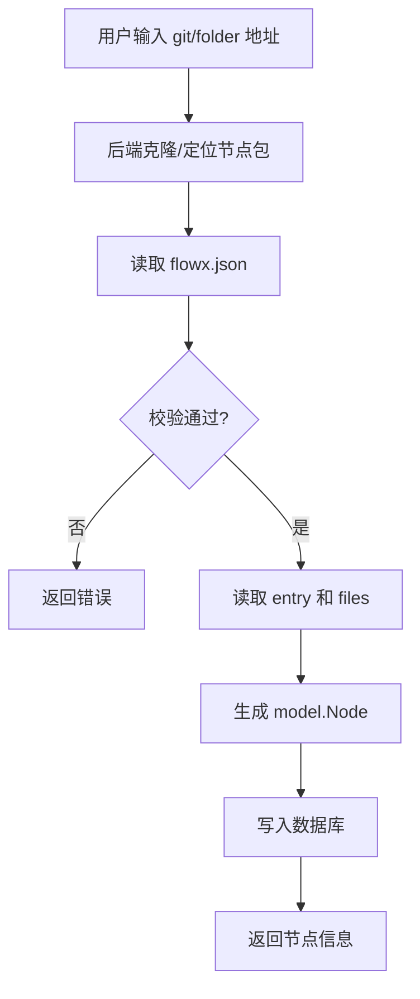

# 11. FlowX 节点包规范（flowx.json）

> 本文档定义 FlowX Studio 的节点包（Node Package）格式 `flowx.json`，以及节点导入、参数注入和运行时展开规则。

## 11.1 背景与目标

当前节点导入未真正打通：前端 `NodeManagerPage` 只是本地模拟，后端也只保存 `source_type/source_url/source_path`，不会解析来源。

为了把外部节点真正导入系统，需要一份标准的节点包清单。该清单应定义：

- 节点元信息（名称、描述、版本、作者等）
- 节点运行时（语言、入口、镜像、执行器）
- 节点所需参数及参数使用方式
- 节点输出及提取方式

同时明确以下约束：

- `flowx.json` 与代码文件**同级目录**，不做代码内联
- 参数注入同时支持 `env` 环境变量映射和 `run` 命令模板，但 **`env` 优先**
- 节点包格式使用 **JSON**（`flowx.json`），原因见 [11.10 节](#1110-为什么使用-json-而不是-flowxyaml)

## 11.2 设计原则

1. **包即目录**：一个节点包是一个目录，包含 `flowx.json` 和若干代码文件
2. **清单与代码分离**：`flowx.json` 只描述元信息，不内联代码
3. **可映射到现有模型**：导入后可直接生成 `model.Node`（`internal/model/model.go:34-67`）
4. **可展开到 FlowX 核心**：运行时能把节点包展开为 `flowx/core.NodeConfig`（`flowx/core/config.go:113-124`）
5. **参数注入统一**：优先使用环境变量，兼容命令行模板

## 11.3 文件布局

一个节点包目录示例：

```
image-downloader/
├── flowx.json
├── main.py
├── utils.py
├── requirements.txt
└── mock.py
```

- `flowx.json`：节点包清单（必需）
- `main.py`：入口文件（由 `entry` 指定）
- `utils.py`：其他依赖文件（由 `files` 列出）
- `requirements.txt`：依赖文件（可选，可被 `requirements` 字段覆盖）
- `mock.py`：Mock 测试入口（由 `mock.entry` 指定）

## 11.4 flowx.json Schema

### 11.4.1 完整示例

```json
{
  "name": "download-image",
  "displayName": "下载图片",
  "description": "从 URL 下载图片并返回文件路径",
  "version": "1.0.0",
  "author": "flowx-team",
  "tags": ["image", "download"],
  "icon": "🖼️",
  "language": "python",
  "entry": "main.py",
  "files": ["utils.py"],
  "image": "python:3.11-slim",
  "executor": {
    "type": "docker",
    "config": {
      "workdir": "/app",
      "volumes": ["/tmp:/tmp"]
    }
  },
  "requirements": ["requests"],
  "parameters": [
    {
      "name": "url",
      "type": "string",
      "description": "图片 URL",
      "required": true
    },
    {
      "name": "timeout",
      "type": "integer",
      "description": "超时秒数",
      "required": false,
      "default": 30
    }
  ],
  "env": {
    "URL": "{{ Param.url }}",
    "TIMEOUT": "{{ Param.timeout }}"
  },
  "run": "python3 main.py",
  "outputs": [
    { "name": "file_path", "type": "string", "description": "下载后的文件路径" },
    { "name": "size_bytes", "type": "integer", "description": "文件大小" }
  ],
  "extract": {
    "type": "codec-block"
  },
  "mock": {
    "enabled": true,
    "entry": "mock.py"
  },
  "timeout": 60
}
```

### 11.4.2 字段说明

| 字段 | 类型 | 必填 | 说明 |
|------|------|------|------|
| `name` | string | 是 | 节点唯一标识，使用 snake_case |
| `displayName` | string | 否 | 展示名称 |
| `description` | string | 否 | 功能描述 |
| `version` | string | 否 | 版本号，如 `1.0.0` |
| `author` | string | 否 | 作者 |
| `tags` | string[] | 否 | 标签 |
| `icon` | string | 否 | 图标，如 `🖼️` |
| `language` | string | 是 | 运行语言：`python` / `go` / `bash` / `node` 等 |
| `entry` | string | 是 | 入口文件，如 `main.py` |
| `files` | string[] | 否 | 需要一起拷贝的其他同级文件 |
| `image` | string | 否 | Docker 镜像；若指定，默认使用 `docker` 执行器 |
| `executor.type` | string | 否 | 执行器类型：`local` / `docker` / `k8s`；默认根据 `image` 推断 |
| `executor.config` | object | 否 | 执行器配置，透传给 FlowX 执行器（`flowx/executor/local/adapter.go:23-32`、`flowx/executor/docker/adapter.go:23-32`） |
| `requirements` | string[] | 否 | 依赖列表；若不填，可尝试读取 `requirements.txt` |
| `parameters` | Parameter[] | 是 | 参数定义 |
| `env` | map<string, string> | 否 | 参数 → 环境变量映射，值支持模板表达式 |
| `run` | string | 否 | 执行命令模板；不填则按 `language + entry` 生成默认命令 |
| `outputs` | Output[] | 否 | 输出字段声明 |
| `extract` | ExtractConfig | 否 | 输出提取方式：`codec-block` 或 `regex` |
| `mock` | MockConfig | 否 | Mock 测试配置 |
| `timeout` | int | 否 | 默认超时秒数 |

#### Parameter

```json
{
  "name": "url",
  "type": "string",
  "description": "图片 URL",
  "required": true,
  "default": "https://example.com/default.jpg"
}
```

- `name`：参数名，唯一
- `type`：`string` / `integer` / `float` / `boolean` / `array` / `object`
- `description`：描述
- `required`：是否必填
- `default`：默认值

#### Output

```json
{
  "name": "file_path",
  "type": "string",
  "description": "下载后的文件路径"
}
```

#### ExtractConfig

```json
{
  "type": "codec-block"
}
```

或

```json
{
  "type": "regex",
  "patterns": {
    "coverage": "coverage: (\\d+\\.\\d+)%"
  }
}
```

#### MockConfig

```json
{
  "enabled": true,
  "entry": "mock.py"
}
```

## 11.5 导入流程



后端导入服务建议放在 `internal/service/node_import.go`：

1. 接收 `source_type`（`git` / `folder`）和 `source_url` / `source_path`
2. 对于 `git`，使用临时目录 clone
3. 读取并解析 `flowx.json`
4. 校验必填字段、参数类型、文件存在性
5. 读取 `entry` 文件内容 → `Node.Code`
6. 读取 `files` 列表 → `Node.Files`（新增 JSON 字段）
7. 若 `requirements` 为空且存在 `requirements.txt`，读取其内容
8. 若 `mock.enabled` 为真，读取 `mock.entry` 内容 → `MockConfig`
9. 生成 `model.Node` 并调用 `NodeService.Create`
10. 清理临时目录

新增 API 接口：

```http
POST /api/v1/nodes/import
Content-Type: application/json

{
  "source_type": "git",
  "source_url": "https://github.com/xxx/image-downloader.git"
}
```

## 11.6 字段映射

### 11.6.1 映射到 model.Node

| flowx.json | model.Node 字段 |
|------------|-----------------|
| `name` | `Name` |
| `displayName` | `DisplayName` |
| `description` | `Description` |
| `version` | `Version` |
| `author` | `Author` |
| `tags` | `Tags` |
| `icon` | `Icon` |
| `language` | `Language` |
| `entry` | `Entry` |
| `entry` 文件内容 | `Code` |
| `files` 文件内容 | 新增 `Files`（JSON map） |
| `image` | `Image` / `DockerConfig.Image` |
| `executor.config` | `DockerConfig` |
| `requirements` | `Requirements` |
| `parameters` | `Parameters` |
| `outputs` | `Outputs` |
| `mock` | `MockConfig` |
| `source_type` | `SourceType` |
| `source_url` / `source_path` | `SourceURL` / `SourcePath` |

`NodeType` 规则：

- 如果 `entry` 存在，则 `NodeType = "code"`
- 如果 `entry` 不存在但 `image` 存在，则 `NodeType = "image"`
- 否则导入失败

### 11.6.2 运行时展开为 flowx/core.NodeConfig

节点包在运行时应展开为 FlowX 核心可识别的 `NodeConfig`：

```yaml
DownloadImage:
  name: "下载图片"
  executor: docker
  image: python:3.11-slim
  steps:
    - name: run
      run: |
        export URL="https://example.com/img.jpg"
        export TIMEOUT="30"
        python3 main.py
  extract:
    type: codec-block
```

展开规则：

1. 生成 `export` 环境变量注入行（见 [11.7 节](#117-参数注入规则)）
2. 追加 `run` 命令；若未指定 `run`，则按 `language + entry` 生成默认命令
3. 将 `entry` 和 `files` 写入执行器工作目录
4. 透传 `image` 和 `executor.config`
5. 透传 `extract` 配置

展开逻辑建议放在 `internal/runtime/adapter.go` 或新增 `internal/runtime/node_expander.go`。

## 11.7 参数注入规则

参数注入优先使用 `env`，其次使用 `run` 模板，最后回退到默认 `FLOWX_PARAM_*` 环境变量。

### 规则 1：env 优先

如果 `flowx.json` 中定义了 `env`，则按 env 生成环境变量注入：

```json
"env": {
  "URL": "{{ Param.url }}",
  "TIMEOUT": "{{ Param.timeout }}"
}
```

展开后：

```bash
export URL="<求值后的 Param.url>"
export TIMEOUT="<求值后的 Param.timeout>"
```

`env` 的值支持 FlowX 模板表达式，包括：

- `{{ Param.name }}`：工作流参数
- `{{ Metadata.UpNode.field }}`：上游节点输出（`flowx/dag/eval_context.go:94-115`）
- 常量字符串

### 规则 2：run 模板

如果定义了 `run`，则追加在 env 注入之后。`run` 中也支持 `{{ Param.name }}` 模板。

示例：

```json
"run": "python3 main.py --url '{{ Param.url }}'"
```

### 规则 3：默认 env 回退

如果 `env` 未定义，则为每个 `parameter` 自动生成默认环境变量：

```bash
export FLOWX_PARAM_URL="<值>"
export FLOWX_PARAM_TIMEOUT="<值>"
```

这符合 `NodeService.MockTest` 中按参数生成环境变量的现有逻辑（`internal/service/node.go:220-228`）。

### 规则 4：默认 run 命令

如果 `run` 未定义，则根据 `language` 和 `entry` 生成默认命令：

| language | 默认 run |
|----------|----------|
| `python` | `python3 <entry>` |
| `go` | `go run <entry>` |
| `bash` | `bash <entry>` |
| `node` | `node <entry>` |

## 11.8 Mock 测试

当 `mock.enabled` 为 `true` 时：

1. 读取 `mock.entry` 文件内容
2. 存入 `Node.MockConfig`（`enabled: true, entry: <文件名>`）
3. Mock 测试时复用与真实运行相同的参数注入逻辑
4. 运行的是 mock 入口文件而非 `entry`

Mock 测试入口 API 仍使用 `POST /api/v1/nodes/:id/mock`。

## 11.9 API 与前端改动

### 后端

1. 新增 `internal/service/node_import.go`：导入核心逻辑
2. 新增 `internal/handler/node_import_handler.go`：`POST /api/v1/nodes/import`
3. 扩展 `model.Node`：新增 `Files` JSON 字段
4. 扩展 `sandbox.Executor`：支持多文件写入/挂载
5. 扩展 `internal/runtime/adapter.go`：实现节点包 → `NodeConfig` 展开

### 前端

1. `NodeImportModal` 移除 `image` 类型，只保留 `git` / `folder`
2. `NodeManagerPage.handleAddNode` 改为调用 `POST /api/v1/nodes/import`
3. 导入完成后刷新节点列表

## 11.10 为什么使用 JSON 而不是 flowx.yaml

推荐 `flowx.json`，不推荐使用 `flowx.yaml` 作为节点包清单。

| 维度 | JSON | YAML |
|------|------|------|
| 解析与校验 | 原生支持，可配 JSON Schema | 需要额外解析器，易受缩进影响 |
| 版本控制 | 差异清晰，格式歧义少 | 多行字符串和注释差异较乱 |
| 代码分离 | 适合作为清单，代码放在独立文件 | 容易诱使内联代码 |
| 概念混淆 | 生态中 `flowx-yaml` 已表示“输出提取块” | `flowx.yaml` 容易与输出格式混淆 |
| 工具链对齐 | 与 `flowx-studio` JSON API 和 TS 类型天然对齐 | FlowX 核心流水线配置是 YAML，但那是 pipeline，不是 node package |

节点包是“清单 + 同级代码文件”的结构，JSON 是最自然的 manifest 格式。

## 11.11 校验规则

导入时必须校验：

1. `name` 必填且符合 snake_case
2. `language` 必填且在支持列表内（`python` / `go` / `bash` / `node` 等）
3. `entry` 必填且文件存在
4. `files` 中列出的文件必须存在
5. `parameters` 中 `name` 唯一，`type` 合法
6. 如果 `image` 为空且 `executor.type` 为 `docker`，导入失败
7. `mock.entry` 若存在，文件必须存在
8. 节点名称唯一（数据库唯一约束）

## 11.12 待实现任务

- [ ] 新增 `model.Node.Files` 字段并创建数据库迁移
- [ ] 实现 `internal/service/node_import.go` 导入服务
- [ ] 实现 `POST /api/v1/nodes/import` 接口
- [ ] 扩展 `sandbox.Executor` 支持多文件写入
- [ ] 实现节点包 → `flowx/core.NodeConfig` 展开逻辑
- [ ] 更新前端 `NodeImportModal` 和 `NodeManagerPage`
- [ ] 为导入流程编写单元测试和端到端测试

## 11.13 参考资料

- `flowx/core/config.go:113-124` — `NodeConfig` 结构定义
- `flowx/dag/eval_context.go:80-115` — 模板上下文（`Param` 与 `Metadata`）
- `flowx/executor/local/adapter.go:23-32` — local 执行器配置项
- `flowx/executor/docker/adapter.go:23-32` — docker 执行器配置项
- `flowx-studio/internal/model/model.go:34-67` — `Node` 数据模型
- `flowx-studio/internal/service/node.go:220-228` — `MockTest` 参数环境变量注入
